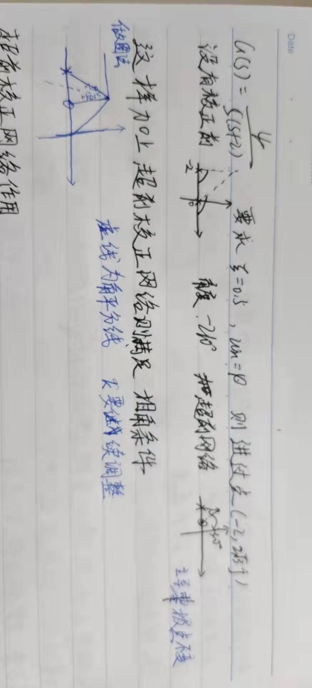

# 自动控制原理课程总结

## 自动控制原理课程综述

自动控制原理课程，总体上来说涉及到的是最基础、最简单的控制理论的部分。课程内容从整体上大致分为：

- 控制系统的概念和数学模型
- 控制系统的时域分析
- 控制系统的根轨迹分析
- 控制系统的频域分析
- 控制器设计，主要是校正环节设计

除此之外，自动控制原理的课本内容还包括非线性反馈控制系统、采样控制系统。但是这些内容自控原理课程不会讲授，感兴趣者可以自学。

其实“自动控制原理”这门课的称呼范围是非常大的。课程实际讲授的，只不过是经典控制理论中的线性控制理论的大部分内容。自动控制理论的大体框架如下（加粗部分为所学内容）：

- 经典控制理论
  - **线性控制理论**
    - **时域分析**
    - **频域分析**
    - **根轨迹**
  - 非线性控制理论
    - 相平面法
    - 描述函数法
    - 李雅普诺夫直接法
    - 波波夫法
  - 采样控制理论

- 现代控制理论
  - 状态空间
    - 最优控制
    - 系统辨识
    - 最佳估计

- 智能控制理论
  - 专家系统
  - 模糊控制
  - 学习控制

所以说，自动控制原理这门课只是一个开始。后续的控制课程更加丰富多彩。

## 自动控制系统的基本概念

这一部分主要明确控制系统的分类以及我们主要研究的系统对象。自动控制系统按照信号的传递路径，可以分为：开环控制系统、闭环控制系统（反馈控制系统）。

**反馈**：系统的输出量通过适当的测量装置，将测量信号的全部或者一部分返回输入端，使之与输入量进行比较。

**开环控制系统**的系统输出量对系统的输入量没有影响；**闭环控制系统**是基于负反馈的基础上的“检测误差，用以纠正误差”这一原理组成的系统。相应的信号通路称为反馈通路。本课程中重点研究的就是闭环控制系统。

接下来我们研究闭环控制系统的基本组成：

    

测量元件：用来测量被控量的实际值

比较元件：用来产生输入信号和主反馈信号的差值信号

放大元件：把误差信号放大并进行能量形式转换

执行元件：根据控制信号直接对控制对象进行操纵

被控对象：控制系统想要操作的对象

对系统的研究的内容：

1. 稳定性
2. 动态特性
3. 稳态特性

## 控制系统的数学模型

## 控制系统的时域分析

## 根轨迹法

## 频率响应法

## 控制系统设计

经典的控制系统理论设计中包含以下方法：串联校正、并联校正、前馈控制。本课程只涉及到串联校正，且不包含其中的T型网络。

### 相位超前校正

相位超前校正网络的表达式：
$$
G_{c}(s)=\frac{1}{a}\frac{1+aTs}{1+Ts}
$$
其中，$a\textgreater 1$。一般来说，前面的$\frac{1}{a}$都可以被控制器补偿掉。在进行分析的时候，往往是不考虑前面的系数的。

最大超前相位角所对应的频率以及和$a$的关系如下：
$$
\omega_{m}=\frac{1}{\sqrt{a}T} \\
\sin\phi_{m}=\frac{a-1}{a+1} \\
a = \frac{1+\sin\phi_{m}}{1-\sin\phi_{m}}
$$
一般来说，很少取$a\textgreater 15$，因为这之后随着$a$的增加，$\phi_{m}$几乎不增加。

#### 用Bode图设计

1. 求出满足稳态误差要求的开环增益$K$值。
2. 根据求得的$K$值，画出Bode图，并找出未校正系统的相位裕量$\gamma_{0}$。
3. 计算超前网络需要提供的相位超前量$\phi_{m}=\gamma_{1}-\gamma_{0}+\Delta{\phi}$，其中$\Delta{\phi}为$增益剪切频率增加导致的相位滞后，一般取$5\sim10^{\circ}$。
4. 利用$\phi_{m}$求出$a$值。
5. 利用$L(\omega_{m})=-20\lg\sqrt{a}$计算出$\omega_{m}$，也即新的增益剪切频率。
6. 再由$\omega_{m}=\frac{1}{\sqrt{a}T}$，求出$T$。
7. 得到校正网络的传递函数。别忘了前面有一个$\frac{1}{a}$的增益。所以需要一个放大器。
8. 检验

#### 用根轨迹法设计

在根轨迹法表示中，校正网络可以表示为：$G_{c}(s)=\frac{s+z_{c}}{s+p_{c}}$。也就是说，引入了一个实轴上的极点和一个实轴上的零点。

用根轨迹法设计，有两种思路：一种是课本上介绍的中规中矩的计算和画图，另一种是老师讲授的不拘一格的画图方法。首先是老师讲授的画图方法：

1. 通过系统的参数（一般是时域参数）求出$\xi$、$\omega_{n}$，进而求出期望主导极点。
2. 计算期望主导极点处的相角条件值，计算其与$(2\lambda+1)\pi$值的差距，作为引入校正网络可以补充的相角，记为$\theta$。因为引入超前校正网络，极点一定在零点的左侧，所以这个相角值一定要为正。

3. 过期望主导极点作实轴平行线，连接原点和期望主导极点。再作得到的钝角的角分线。在角分线两侧各取$\frac{\theta}{2}$，与实轴的交点左侧的为极点，右侧的为零点。路子够野！
4. 最后通过期望主导极点处要满足幅值条件，计算校正网络的增益应该是多少。也就是修正增益$K$。

    

#### 设计时考虑因素

1. 超前网络是拓展带宽的，会使上升时间减小。但是如果所期望的带宽要更窄，或者系统对于抗高频干扰有较高要求，则慎重使用。
2. 在增益剪切频率附近幅值下降过快（小于$-60\text{dB}/dec$）或者相频曲线下降速率大 ，超前校正通常无效。
3. $a$一般不大于15。

### 相位滞后校正

相位滞后校正的传递函数为：
$$
G_{c}(s)=\frac{1+bTs}{1+Ts}
$$
其中，$b\textless 1$。要注意相位滞后校正是为了改善系统的稳态特性，同时尽量不影响系统的动态特性才会使用的方法。这一点非常重要。

#### 用Bode图设计

1. 求出满足稳态特性指标的开环增益$K$。
2. 根据$K$画Bode图。判断是否满足要求。（也就是找一找相位裕量$\gamma_{0}$、增益裕量$GM$等等）
3. 选择新的增益剪切频率点$\omega_{c2}$，使得在$\omega=\omega_{c2}$处，**原系统的**相位滞后量为：$\phi(\omega_{c2})=-180^{\circ}+\gamma_{1}+5^{\circ}\sim 12^{\circ}$。注意其中的$\gamma_{1}$为期望的相位裕量。这里特别要注意，是在原系统的相位特性曲线上寻找：相位滞后校正无意大幅度改变系统的动态特性，因此会选择在原系统的相位特性曲线上寻找目标点。

4. 将$L(\omega_{c2})$拉到零分贝。也就是通过$20\lg b=L(\omega_{c2})$，计算得到$b$的值。
5. 选择校正网络的零点：$\frac{1}{bT}=\left(\frac{1}{4}\sim\frac{1}{10}\right)\omega_{c2}$。计算得到$T$。由此求得$\frac{1}{T}$。
6. 求得$G_{c}(s)$。

#### 用根轨迹法设计

用根轨迹法设计时，相位滞后网络和相位超前网络的差别更加明显。相位滞后网络要求并且保证期望主导极点在原根轨迹上，而相位超前网络恰恰要将期望主导极点放在原根轨迹之外。

1. 作出系统的未校正的根轨迹，根据动态特性指标，在根轨迹上确认期望闭环主导极点。

2. 通过计算根轨迹增益$K_{r}$，得到此时未校正的开环增益$K$。
   $$
   K=\frac{K_{r}\prod_{i=1}^{m}z_{i}}{\prod_{j=v+1}^{n}p_{j}}
   $$

3. 求出满足稳态特性指标的开环增益$K_{0}$。

4. 计算$b=\frac{K}{K_{0}}$。

5. 选择$\frac{1}{bT}$位于$0.x\sim0.0x$数量级。求出$T$。

6. 得到传递函数，并调整系统的增益，使闭环极点处于期望位置（幅值条件的使用）。

7. 检验稳态指标是否满足条件。

#### 设计时考虑因素

1. 增加稳态误差系数，提高准确性的。
2. 减小了系统的带宽，使得相应迟钝了，上升时间加长了。
3. 减小了谐振峰值、超调量等（这一点和超前网络相同），但是增大了上升时间和过渡时间（这一点相反）。
4. 注意期望主导极点一定要在原来的根轨迹上！如果不在，这个方法是不能使用的。

### 相位超前-滞后校正

