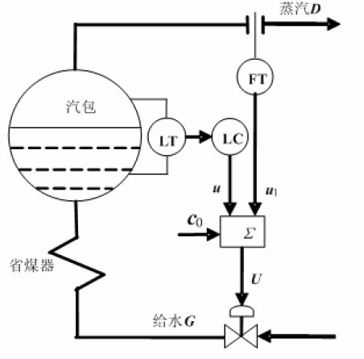

# 自动化仪表大纲

[toc]

**上图为本文档配套教材**

## 自动化仪表概述

自动化仪表定义：在工业生产中，特别是连续生产过程自动化中必须用到的一类专门仪器仪表。

单元组合式仪表： ⼀种积⽊式的仪表；在使用中可以根据需要，选择⼀定的单元，积木式地把仪表组合起来，构成各种复杂程度不同的控制系统。

DDZ-II型仪表的信号：电压0-2V，电流0-10mA。

DDZ-III型仪表的信号：电压1-5V，电流4-20mA。

DDZ-III型仪表的标准信号特点及其原因：

- 两线制的作用：节省电缆，安全防爆（减少一根通往现场的导线，就减少了一条窜进危险能量的通道）

仪表的技术指标

- 精确度：相对百分误差
  $$
  \delta=\frac{\text{最大绝对误差}}{\text{量程}}\times100\%
  $$
  去掉百分号就可以称为仪表的**精确度**。

- 基本误差和附加误差：仪表在正常工作条件下的最大相对百分误差称为仪表的基本误差，而不在规定的正常工作条件下工作而导致的额外误差称为附加误差。**仪表的精确度等级是根据其基本误差确定的**。

- 灵敏度和灵敏限

  灵敏度是个比值，表示仪表对被测参数变化的敏感程度；灵敏限是指仪表能感受并发生动作的输入量的最小值。

  灵敏度和精确度无关！

- 变差

  外界条件不变，同一仪表，对同一被测量反复测量产生的最大差值和量程之比。

## 第一章：检测仪表

### 温度检测仪表

目前测量温度的仪表共分为两大类：接触式和非接触式。常见的接触式测温仪表有：膨胀式温度计、压力式温度计、热电偶温度计、电阻式温度计；常见的非接触式测温仪表有：辐射温度计。

#### 热电偶温度计

- 热电偶的原理

  两种不同的导体或半导体连接成闭合回路时，若两个接点温度不同，回路中就会出现热电动势，并产生电流。这一热电动势包括接触电动势和温差电动势两部分，但是主要是接触电动势。

  

  

  在冷端插入第三方导体，只要接入的导体的两个连接点温度相等，它的接入对回路电动势毫无影响。

  工业上常用的热电偶：

  - 铂铑30-铂铑6
  - 铂铑10-铂

  - 镍铬-镍硅
  - 镍铬-康铜
  - 铜-康铜

- 两个指标

  热电偶的测温误差：在低温段为1-2.5℃；高温段相对误差0.25%-1%

  一般热电偶的时间常数：1.5-4分钟

- **分度号**：反应温度传感器在测量温度范围内，温度变化对应传感器电压或阻值变化的标准数列。

- 冷端补偿

  使用热电偶的时候要保持冷端的温度恒定；在工业仪表中，通常要在电路中**引入一个随冷端温度变化的附加电动势**，自动补偿冷端温度的变化，以保证测量精度。

- 补偿导线

  考虑到冷端恒温器或者电动势补偿装置通常离测量点较远，工业上常使用较低温度下与所用热电偶的热电特性相近的廉价金属，作为热偶丝在低温区的替代品，称为补偿导线。 

- 热电偶温度变送器的结构

  大部分都可以分为输入电路、放大电路、反馈电路三部分

  - 输入电路：热电偶的**冷端温度补偿**和**零点调整**。也可以称为输入电桥。

    

    冷端温度补偿原理：铜丝绕制的电阻$R_{\text{Cu}}$安装在热电偶的冷端接点处，当冷端温度变化时，利用铜丝电阻随温度变化的特性，向热电偶补充一个由冷端温度决定的电动势作为补偿。

    另一个高电阻确定的恒值电流流过可变电阻$R_{4}$，建立起电动势不仅可以抵消掉铜电阻上的起始压降，而且可以自由地改变桥路输出的零点。

    零点迁移可以和灵敏度调节共同作用，实现**量程压缩**。

  - 放大电路：将热电偶的电动势变换为高电平输出，必须经过多级放大。应该使用高增益、低漂移的直流放大器

    共模干扰和差模干扰：

    共模干扰是指两根信号线上共同存在的对地干扰电压；差模干扰是指两根信号线之间的电压差。共模干扰的原因往往是测量元件和传输线上经常会受到各种电磁干扰，导致工频交流电向热电偶的泄漏；差模干扰的原因经常是电磁感应、静电耦合、电阻泄漏。差模干扰常常会导致放大器饱和、灵敏度下降、零点偏移，甚至使放大器不能正常工作。可以从频率上把测量信号于干扰信号区别开来，或者在变送器的输入端用滤波器等加以抑制。

    放大器要有较强的抗干扰，特别是抗共模干扰的能力。抑制共模干扰的一个有效办法就是把仪表浮空，也就是把变送器内的零线和大地绝缘。这样可以使得共模干扰电压在$Z_{3}$和$Z_{4}$两个阻抗上的分压趋近于0，从而有效抑制共模干扰向差模干扰的转化。

    另外，共模干扰在一定条件下很容易转化为差模干扰。这个时候使用如下的电桥平衡可以使共模干扰不转化为差模干扰。

    
  
  - 反馈电路：为了克服放大电路的非线性及增益、负载变化等引起的误差，温度变送器都采用闭环方式构成。在放大电路增益足够高的时候，其闭环传递函数可以保证十分稳定。
  
    在反馈电路中采取非线性反馈电路，使得输出大小能直接与被测温度呈线性关系。

#### 热电阻温度计

- 为什么使用热电阻？

  温度低于150℃，热电偶的电动势太小，因此常使用金属电阻感温元件测量温度。热电阻**不像热电阻那样进行冷端温度补偿**，**测量精度高**，**在-200℃到+500℃的温度范围内**，获得极为广泛的应用。

- 热电阻感温器件的材料应该满足以下要求：

  - 电阻的温度系数大
  - 电阻与温度的关系线性度较好
  - 在测温范围内物理化学性质稳定

  目前市面上用的最多的就是铂和铜两种电阻。

  - 铂电阻：-200-500°C，精度高，性能稳定可靠，但线性度不好

  - 铜电阻： -50-100°C，价格便宜，线性度好，但温度高就易氧化

  热惯性大的，时间常数为4分钟左右；热惯性小的约为几秒

- 使用热电阻测温的注意事项

  - 电阻体外部的导线电阻是与热电阻串联的，如果导线电阻不确定，测温是无法进行的。因此，不管热电阻和测量仪表之间的距离远近；必须使导线电阻符合规定的数值。
  - 为了抵消环境温度变化的影响，常使用三根引出线的热电阻，使用平衡电桥法对热电阻进行测量。一根的电阻与电源E串联，不影响桥路的平衡，另外两根的电阻被分别置于电桥的两臂内，它们随着环境温度的变化对电桥影响可以大部分抵消。

  

### 压力检测仪表

压力本身：工程上的”压力“概念对应着物理上的”压强“。

各种不同压力的关系如下图所示：

#### 弹性式压力测量元件

- 弹簧管：又称波登管。位移量不大时，近似认为自由端的向外移动距离和压力大小成正比。为了增大自由端的位移，可以使用多圈弹簧管，其工作原理和单圈弹簧管相同。
- 波纹管：自由端伸缩变形。可以得到较大的直线位移，灵敏度较高，但是迟滞误差较大。经常和弹簧组合在一起使用，利用弹簧较好的线性特性。
- 膜片：受压力作用产生位移，可直接带动传动机构指示。膜片的位移较小，灵敏度低，指示精度不高。膜片更多的是和其他转换元件合起来使用，通过膜片和转换元件把压力转换成电信号。

#### 力平衡式压力变送器

- 工作原理：被测压力或压差介质导入变送器，弹性元件感受压力或压差后产生的力通过放大产生输出电流，经由反馈装置产生的反馈力在杠杆系统内形成力矩平衡，这时输出的电流值反映了被测压力的大小。
- 闭环的力平衡结构的优点：
  - 当弹性材料的弹性模数温度系数较大时可以**减小温度的影响**。因为这里的平衡状态不是靠弹性元件的弹性反力建立的。
  - 由于变换过程中位移量很小，弹性元件的受力面积能保持恒定，因而**线性度也比较好**。
  - 另外，还可以**减小弹性迟滞现象，减小仪表的变差**。
- 缺点：有静态误差。为使输出杠杆既能密封又能转动，使用了弹性密封膜片。但由于轴向位移和偏心，**膜片受力时会对杠杆造成附加的偏转力**，从而引起较大的静压误差。

#### 位移式差压变送器

位移式差压变送器是一种开环式变送器。

- 工作原理：被测压力$P_{1}\text{, }P_{2}$分别加于左右两个隔离膜片上，通过硅油将压力传送到测量膜片。该测量膜片由弹性温度稳定性好的平板金属薄片制成，作为差动可变电容的活动电极。当测量膜片向一边鼓起时，它与两个固定电极间的电容量一个增大，一个减小；通过引出线测量这**两个电容的变化**便可知道差压的数值。
- 影响精度的主要因素
  - 测量元件的非线性
  - 测量元件工作温度变化引起的温度漂移
  - 静压误差，指在相同的差压数值下，由于压力不同引起的误差。

#### 固态测压仪表

- 原理：利用某些元件固有的物理特性（例如压电效应、压磁效应、压阻效应等），直接将压力信号转化为电信号。因而其结构简单、工作可靠、频率响应范围较宽
- 例子：半导体扩散电阻，受到应力作用时，材料内部晶格之间的距离发生变化，导致半导体材料的电阻率发生变化。

### 流量检测仪表

流量的分类：体积流量和质量流量。前者为以体积表示单位时间内的物料通过量，后者以质量表示单位时间内的物料通过量。

#### 节流式流量计

在管道中放入一定的**节流元件**，使流体流过的时候流动状态发生变化。根据流体对节流元件的**推力**或在节流元件前后形成的**压差**等，可以测定流量的大小。

- 差压流量计

  

  - 根据节流元件前后的压差测量流量的流量计称为差压流量计，主要由节流装置及差压计两部分组成。例如，孔板流量计。当流体经过孔板时，流束截面缩小，流动速度加快，压力下降。经过推导我们可以得出：

  $$
  Q_{V}=\alpha F_{0}\sqrt{\frac{2}{\rho}(P_{1}-P_{2})}
  $$

  其中$Q_{V}$为体积流量；其中$\alpha$为流量系数，$F_{0}$为孔板的开孔面积；$\rho$为流体的密度；可以看出，流量与压力差$\Delta P$的平方根成正比。

  - 差压流量计在使用中要保证节流元件前后有足够长的直管段，一般要求前面有7-10倍的直径，后面有3-5被直径的直管段。
  - 测量精度好的情况下时0.5%-1%，常低于2%。

  优点：结构简单、制造方便

  缺点：精度差

- 靶式流量计

  - 结构：在管道中心，迎着流体流动的方向安装一个圆盘。

    

  - 测量原理：当流体流过管道时，对圆盘产生冲击，产生一作用力，即圆盘对流体的阻力，阻力的大小与流体的速度有关。

    当流速较小的时候，靶后不产生漩涡，靶对流体的阻力主要是摩擦阻力，大小与雷诺数相关；当流体的速度增加的时候，阻力主要是压差阻力，大小与流速的平方成正比，阻力系数不受雷诺数的影响。

  优点：结构简单，适于腐蚀性介质，脏污介质的流量测量，可以测量粘度较大（雷诺系数较小）和含有悬浮固体颗粒的介质

  缺点：压力损失比较大，精度大概在2%-3%。

- 转子流量计

  

  - 工作原理：节流现象；但是节流元件不是固定在管道中的，而是一个可以转动的转子；平衡的时候压力差必定为恒值。适合小流量的测量

#### 涡轮流量计

- 原理：在一定的流速范围内，涡轮的转动速度和流量成正比。转速的输出采用的是电磁感应装置。

  涡轮流量计很少用于气体，原因在于气体的密度低，推动力矩小，而且高速旋转的涡轮在气体环境中得不到润滑，容易损坏。

  

  其中1为涡轮，2为导流器，3为磁电感应转换器，4为外壳，5为前置放大器。

- 优点：反应快，测量精度高，可测脉冲流量。输出信号为电频率信号，便于远传，不受干扰

  缺点：易被流体中的颗粒以及污物堵住，只能用于清洁流体的流量测量。

#### 电磁流量计

- 原理和特点

  适于导电液体的流量测量，属非接触式测量，不受流体的温度、压力、密度和粘度的影响。测量原理是电磁感应定律。

- 优缺点

  优点：管道中不设任何的节流元件，可以测各种黏度的液体，特别宜于测量含各种纤维及固体污物的液体；对腐蚀性液体也很适用，工作可靠；测量精度0.5%-1%，刻度线性，反应速度快。

  缺点：只能用于导电液体的测量；被测液体中不能含有大量气泡；安装时注意远离电力电源。

### 液位检测仪表

#### 浮力式和静压式液位计

- 测量过程中浮力维持不变的，如浮球

- 测量过程中浮力变化的，如浮筒在液体中浸没程度不同、所受浮力不同，可以测定液位的高低

  

- 利用液体的静压测量液位
  - 在敞口容器中，储液底部压力与容器内的液面高度成正比，故可以用压力测量仪表在底部测量压力，来测定液位高低。
  - 在有压力的容器中，通过测量压差来消除液面上压力的影响。
  - 考虑到取压管处的气体冷凝出现附加液柱高度，加入冷凝器，同时用迁移装置平衡这一固定压力。
  - 可采用“法兰式”差压变送器防止液体腐蚀和堵塞引压管，用隔离膜片来感受压力，用硅油来传递。
  - 浮力和静压式液位计都和被测量液体密度相关，因此，当密度变化时，必须修正。

#### 电容式液位计

- 非导电式液体

  电容量和液面高度成线性关系。

  

- 导电式液体

  当无液体时，内外电极之间是空气和绝缘层，电容量很小。当液位为$H$时，相当于电极移动到绝缘层，电容大大增加。此时电容量和液位高度成线性关系。

  

#### 超声波液位计

利用回声测距法，测定超声波从发射到液面反射回来的时间， 确定液位高低。

## 第二章：调节器

### 调节器的作用以及调节规律

- 调节器的作用是把**测量值与输出值进行比较**，根据**偏差**大小，按照一定规律**产生输出信号**，推动执行器，对生产过程进行自动调节。

- 调节规律：输出量与输入量之间的函数关系。

### 比例调节

$$
u = K_{p}e_{o}
$$

输出量是偏差的倍数。传递函数$G(s)=K_{p}$。

- 比例度（又称比例带、比例带宽度）：输入量的相对变化与输出量的相对变化之比：
  $$
  \delta=\frac{\frac{e}{|e_{max}-e_{min}|}}{\frac{u}{|u_{max}-u_{min}|}}\times100\%
  $$
  $u$和$e$无量纲的时候，有：$\delta = \frac{1}{K_{p}}\times100\%$。

- 特点：对干扰有及时而有力的抑制作用；但是存在静态误差，不能做无静差调节。比例值$K_{p}$增大，稳态误差减小，但是系统的振荡加剧，甚至会导致系统的不稳定。存在控制饱和问题。相位没有滞后。

### 积分调节

$$
u=\frac{1}{T_{i}}\int e\text{d}t
$$

传递函数：$G(s)=\frac{1}{T_{i}s}$。

- 特点：只要被调量存在偏差，其输出作用将随时间不断增强，直到偏差为零。可以消除静差；但是动作过于迟缓，导致调节的动态品质变坏，过渡时间延长，甚至造成系统的不稳定。相位滞后。

### 微分调节

$$
u=T_{d}\frac{\text{d}e(t)}{\text{d}t}
$$

传递函数：$G(s)=T_{d}s$。

- 特点：能在偏差信号出现的瞬间，立即根据变化的趋势产生调节作用，使偏差尽快消除。但是对静态偏差无抑制能力，因此不能单独使用。联合P、I调节器使用，可以起到加快系统动作速度，减小超调，克服振荡的作用。相位提前。对噪声敏感。

### 比例积分调节器

$$
V_{o}=-\frac{C_{I}}{C_{M}}\left(V_{i}+\frac{1}{R_{I}C_{I}}\int_{0}^{t}V_{i}\text{d}t \right)
$$
其中积分时间$T_{i}=R_{I}C_{I}$。积分时间越大，积分作用越弱。

- 阶跃响应特性：

  

​		理想情况下，每经过一个积分时间$T_{i}$，输出的$-V_{o}$就会增加一个$\frac{C_{I}}{C_{M}}V_{i}$​。

​		实际情况下，由于放大器增益$A$有限，输出将趋于一个定值。

​		积分作用只能大大减小而不能完全消除消灭静差。因此定义**积分增益**$K_{i}$为**引入积分调节的作用之后，静差减小的倍数**。$K_{i}=\frac{C_{M}}{C_{I}}A$。
$$
\frac{V_{o}(s)}{V_{i}(s)}=-\frac{C_{I}}{C_{M}}\frac{1+\frac{1}{T_{i}s}}{1+\frac{1}{K_{i}T_{i}s}}
$$

### 比例微分调节器

PD调节器由两部分组成：无源比例微分电路和同相比例放大器（放大倍数$\alpha$）。两部分隔离良好，输出结果可以直接相乘。无源比例微分电路的阶跃响应如下：

为什么工程上不欢迎数学上理想的微分器？因为使用理想的微分器，在调节系统出现阶跃偏差的时候，调节器的输出将会出现阶跃式的变化，输出一下子冲到极限值，而一瞬间又完全消失。在**调节器后面的执行器和调节对象根本来不及反应**，得不到应有的效果。甚至可能会使放大器饱和而不能工作。

定义**微分增益**$K_{d}$为**阶跃输入作用下，比例微分调节器输出的最大跳变值与单纯由比例作用产生的输出变化值之比**。定义微分时间$T_{d}=nR_{D}C_{D}$。则电路的阶跃响应可以写为：
$$
V_{o}(s)=\frac{\alpha}{n}\frac{1+T_{d}s}{1+\frac{T_{d}}{K_{d}}s}V_{i}(s)
$$
微分增益越大，微分幅度与比例作用相比倍数越大。当$t=\frac{T_{d}}{K_{d}}$时，微分部分衰减掉$63\%$。

### 比例积分微分调节器

将比例积分电路和比例微分电路串联起来，可以得到比例积分微分调节器。其传递函数为：
$$
G(s)=-\frac{1}{P}\left(1+\frac{1}{T_{i}s}+T_{d}s\right)
$$
该函数为典型的PID调节器的传递函数。

#### 阶跃响应

PID控制中，P是最基本的控制作用，它在整个过程中均起作用；微分控制主要在前期起作用；积分控制主要在后期起作用。

#### 实际电路

- 输入电路的作用：
  - 输入和给定信号相减：得到误差信号
  - 电平移动：输入电压以零为起点，输出以10V为起点；输出比输入放大两倍
  - 干扰处理：差动处理；输出电压和公共底线的压降无关

- 输出电路作用：
  - 电压——电流转换：1-5V->4-20mA
  - 电平移动

- 自动——手动切换

为什么必须有自动/手动切换电路？

为了适应工艺过程启动、停车或发生事故等情况，需要能由操作人员切除PID运算电路，直接操纵调节器输出的手动工作状态。

如何实现自动/手动双向无扰切换？

自动切换到软手动时，当前调节器输出值将维持;软手动切换到硬手动时，若手动电位器与当前调节器输出值一致，也不会出现扰动。硬手动切换到软手动时，将保持切换前的硬手动输出值。软手动切换到自动时，输出电压也不会发生跳动。这样就实现了双向无扰切换。

### 数字PID

#### 位置式

$$
u(k)=K_{p}\left[e(k)+\frac{\Delta T}{T_{i}}\sum_{i=0}^{k}e(i)+\frac{T_{d}}{\Delta T}(e(k)-e(k-1))\right]
$$

位置式PID算法可能带来的问题：

- 对$e(k)$的累加增大了计算机的存储量和运算的工作量
- $u(k)$的直接输出易造成执行机构的大幅度动作
- 有些应用场合要求增量式$u(k)$

#### 增量式

$$
\Delta u(k)=K_{c}(e(k)-e(k-1)) + K_{i}e(k)+K_{d}[e(k)-2e(k-1)+e(k-2)]
$$

增量式PID算法的优点：

- 不累加误差，增量的确定仅与最近几次偏差采样值有关，计算精度对控制量的计算影响较小
- 得出的是控制量的增量，误动作影响小
- 增量型算法不对偏差做累加，因而也不易引起积分饱和
- 易实现手动到自动的无冲击切换

### 变形的PID算法

#### 微分先行PID算法

为什么要引入微分先行的PID算法？因为当设定值改变时，微分作用会使调节器输出产生急剧的跳动，即所谓微分冲击，影响工况的平稳。

$$
MV(s)=\frac{1}{P}\left[\left(\frac{1}{T_{i}s}+1\right)E(s)-T_{d}sPV(s)\right]
$$

#### 比例先行PID算法

理由类似于上文中的微分先行PID算法。只不过将微分作用换成了比例作用。

$$
MV(s)=\frac{1}{P}\left[\frac{1}{T_{i}s}E(s)-(1+T_{d}s)PV(s)\right]
$$

## 第四章：执行器和防爆栅

### 执行器

- 调节系统的四个基本组成部分之一（控制对象、检测仪表、调节器、**执行器**）

- 执行器的作用：根据调节器的命令，控制能量或者物料等被调介质的输送量，达到调节温度、压力、流量等工艺参数的目的。

- 执行器的影响：是调节系统中的薄弱环节，选择不当或者维护不善，可能导致不能正常工作或影响调节品质。
- 执行器的组成部分：
  - 执行机构：执行器的推动部分，按照调节器的信号产生推力或位移
  - 调节机构：执行器的调节部分，在执行机构的操纵下调节工艺介质的流量

- 执行器的分类：

  根据使用到的能源的种类，可以分为**气动、电动、液动**三种。

  - 气动：结构简单、工作可靠、价格便宜、维护方便、防火防爆等优点
  - 电动：能源取用方便，信号传输速度快和传输距离远，但是结构复杂、推力小、价格贵
  - 液动：推力最大，但是目前使用不多，本书不进行讨论

### 气动执行器

以压缩空气为动力的执行器，一般由**气动执行机构**和**调节阀**两部分组成。

#### 气动执行机构

目前分为**薄膜式**和**活塞式**两大类。

- 薄膜式，弹性膜片将输入气压转变为推力，结构简单、价格便宜、应用广。
- 活塞式，由气缸活塞输出推力，允许压力高、有较大推力、行程长。

#### 调节阀

下面重点是调节阀部分。调节阀可以分为以下类别：

- 单座调节阀：优点是易改装、结构简单、无同步问题。缺点是被调流体对阀芯有作用力，可能会影响到正常工作。
- 双座调节阀：优点是作用力可大致抵消，不平衡力小。缺点是两组阀芯不易同时关闭，关闭泄漏量比单座阀大。

另一种分类标准是：

- 气开式：气压增加阀趋于开
- 气闭式：气压增加阀趋于闭

选用气开式、气闭式阀门主要从安全角度考虑。事故状态下阀门打开危险性小，选气闭；反之选气开。

从自动控制的角度来看，调节阀的一个最重要的特性就是其**流量特性**，即**调节阀阀芯位移与流量之间的关系**。调节阀的**重要性**：调节阀的特性对整个自动控制系统的调节品质有很大的影响。

- 调节阀的流量特性：

  固有流量特性：

  在前后压差不变的情况下得出的流量特性称为固有流量特性，或理想流量特性。

  三种典型的固有流量特性：

  - 直线特性
  - 对数特性，也称为等百分比流量特性
  - 快开特性

工作流量特性：

在各种具体的使用条件下，阀芯位移对流量的控制特性，称为工作流量特性。

- 在同样的阀芯位移下，阀芯前后压差变化，非恒压差。

- 与恒压差相比，流量开始变化较缓慢，阀开始的反应较迟钝

如果以$s$表示存在管道阻力情况下的压差比，也即$\frac{\Delta P_{Tmin}}{P_{0}}$，那么当$s=1$的时候，工作流量特性即为固有流量特性；$s<1$时，流量特性会产生两个变化：

- 阀全开时的流量减小，阀的可调节范围变小；
- 阀在大开度时的控制灵敏度降低。

调节阀的选择方法：

- 根据工作流量特性推出固有流量特性

- 根据工业要求选择适当的口径和流通能力

  口径选择的目的：保证工艺操作正常进行，准确控制阀门的流通能力

  口径选择不当的结果：

  - 口径过大：经常工作在在小开度位置，调节质量不高
  - 口径过小：完全打开也不能满足最大流量的需要，无法满足正常生产的需求

- 根据安全性选择气开式或者气闭式

- 要求实际流量特性和对象互补
  $$
  Q = C \sqrt{\frac{10\Delta P}{\rho}}
  $$
  $C$是流通能力，与截面积$A$成正比，与阻力系数$\xi$的平方根成反比。

### 电—气转换器

- 作用：将调节器输出的标准电流信号转化为$20-100\text{k}Pa$的标准气压信号，从而使气动执行器能够接收电动调节器的命令。

- 全图：

- 工作过程：

  调节器输出电流$I$↑——电磁铁线圈吸力↑——杠杆左端↓——挡板压缩喷嘴—喷嘴间隙↓——气动功率放大器输出功率$P$↑——杠杆波纹管充气——杠杆左端↑——形成反馈力，其力矩与电磁力矩相平衡，构成闭环系统

- 核心部件：喷嘴挡板机构

  主要组成：背压室、恒节流孔、喷嘴、挡板、气压信号输出孔

  

  工作原理：当挡板与喷嘴间隙有微小位移将会被转换为气压信号*P*输出，作为气动功率放大器的输入信号。

  其他的注意事项：横节流孔当通过的气流为层流状态时，两端的压降与流量呈线性关系，成为一个固定的气阻，相当于电路中的固定电阻。由于喷嘴挡板机构中的横节流孔的气阻较大，因此从背压室输出的气量不大。一般来说，这种转换器的精度为0.5级。

### 阀门定位器

- 目的：与执行机构配合使用，确保调节阀能够按照输入信号精确地确定自己的开度。

- 方法：借助阀杆位移负反馈使调节阀能按照输入信号精确地确定开度。

- 作用：
  - 克服阀杆上的摩擦力，消除流体作用力对阀位的影响，提高执行器的静态工作精度，使调节阀能精准确定自己的开度。
  - 提高调节阀的动态性能，较快执行机构的动作速度
  - 可以改变反馈凸轮的形状，改变调节阀的流量特性，适应调节系统要求

### 电—气阀门定位器

工作原理：将正比于输入电流信号的电磁力矩与正比于阀杆行程的反馈力矩比较，建立力矩平衡关系，实现输入电路对阀杆位移的精确转换。

防爆要求：

### 防爆栅

#### 安全火花防爆系统

安全火花的概念：**能量有限**，不足以引爆爆炸性介质的火花

- 传统的防爆仪表包括充油型、充气型、隔爆型等，其基本思想是将可能产生火花的电路从结构上与爆炸性气体隔开。

  新型的安全火花防爆系统在电路设计上考虑防爆，将电路在短路、开断及误操作下产生的火花限制在爆炸性气体的点燃能量之下。属于本质安全防爆仪表。防爆等级比结构防爆仪表高一级。长期使用不降低防爆等级。

- 安全火花防爆系统和安全火花防爆仪表的区别：对一台安全火花防爆仪表来说，它只能保证自己内部不发生危险火花，对于从控制室引来的电线是否安全是无法保证的。

- 构成一个安全火花防爆系统的充分必要条件是：
  - 在危险现场使用的仪表都必须是安全火花型的
  - 现场仪表和非危险场所之间的电路连接必须经过防爆栅
  - 从现场仪表到防爆栅的连接线不得形成大的分布电容和电感

#### 安全火花的防爆等级

安全火花防爆本质上就是限制火花能量。当电路的电压限制在直流30V时，实验表明，各种爆炸物的最小引爆电流可以分为3级。安全火花型防爆仪表按照防爆适应场所引爆电流的等级分为三级。HⅢe，其中H表示防爆类型为安全火花型，Ⅲ表示适用最小引爆电流为Ⅲ级，e表示适用于周围气体自燃温度为e组。

#### 防爆栅基本原理

- 种类：**电阻式、齐纳式、隔离式**

  - 电阻式：电阻串联于电源线或信号线限制进入危险现场的电流。缺点是电源电压、信号受衰减。
  
  - 齐纳式：利用串联电阻限流、利用并联齐纳稳压管限压，用晶体管限流电路取代固定电阻，可以获得近乎理想的限流效果。普通的齐纳式的缺点和改进型齐纳式的结构。
  
  - 简单式齐纳防爆栅两个不完善的地方：
    - 固定电阻的限流达不到要求，
    - 负端需要接地
  
  - 隔离式防爆栅
  
    分为检测端防爆栅和执行端防爆栅。
  
    具体措施：变压器作为输入输出电源隔离；晶体管截止限压、限流截止式控制电路；两处隔离：变送器的检测端、执行器的执行端。
    
    如何实现限压、限流的？
    
    检测端将信号调制、变压器耦合、解调后原样送出，电路互相绝缘防止事故，也可通过电路限压限流；执行端将信号和电源都进行直流、转交流、转直流处理，有效限压限流。 

## 第五章：过程控制对象的动态特性及其数学模型

### 求得数学模型的两类方法

**数学模型的概念**：

指过程在各输入量的作用下，其相应输出量变化的函数关系数学表达式。工业过程的数学模型还可以分为动态数学模型和静态数学模型。

- 动态数学模型：输出变量和输入变量之间随时间而变化的动态关系的数学描述
- 静态数学模型：输出变量和输入变量之间的不随时间变化情况下的数学关系

在本课程中，处理的系统大多数都是含有纯滞后环节的一阶系统。

**建立被控过程的数学模型的方法**：

- 解析法（分析法）：即根据过程的内在机理，通过静态与动态物料平衡和能量平衡关系求取过程的数学模型。
- 实验测定法（过程辨识法）：即根据过程输入、输出数据，通过过程辨识与参数估计的方法建立被控过程的数学模型。

### 单容对象的动态特性

**液容和液阻的定义**

- 液容$C$：水槽的横截面积$A$。物理意义是，要使水位升高1$m$，水槽内应该充入多少体积的水。等效于电路中的电容。液容和水槽高度变化的关系是为：
  $$
  \frac{\text{d}h}{\text{d}t}=\frac{Q_{1}-Q_{2}}{A}
  $$

- 液阻$R_{s}$：阀门2的阻力。物理意义是，要使流出量增加$1m^{3}/s$，液位应该升高多少。与水位、流量的关系一般是非线性的。为了简化进行了线性化处理。表达式为：
  $$
  R_{s}=\frac{\Delta h}{\Delta Q_{2}}
  $$

**时间常数和放大系数的定义**

液位系统的平衡方程为：
$$
\Delta Q_{1}-\Delta Q_{2}=A\frac{\text{d}\Delta h}{\text{d}t}
$$
其中$\Delta Q_{1}=K_{\mu}\Delta\mu_{1}$，与开度正相关。将之前的关系式代入，整理可以得到：
$$
AR_{s}\frac{\text{d}\Delta h}{\text{d}t}+\Delta h=K_{\mu}R_{s}\Delta\mu_{1} \\
T\frac{\text{d}\Delta h}{\text{d}t}+\Delta h=K\Delta\mu_{1}
$$
也即传递函数：
$$
\frac{H(s)}{\mu_{1}(s)}=\frac{K}{Ts+1}
$$
其中$T$为对象的时间常数，$K$为对象的放大系数。

**飞升曲线**

对象的某一输入量作阶跃变化时，输出量对时间的变化曲线。下图为该对象的飞升曲线。

**对象的自衡特性**

- 定义：对象在扰动作用破坏其平衡工况后，在没有操作人员或调节器的干预下自动恢复平衡的特性，称为自衡特性。判断对象有无自衡特性的基本标志是被调量能否对破坏工况平衡的扰动作用施加反作用。
- 自衡率$\rho$：扰动量的变化与被调量的变化的比值。与放大系数$K$互为倒数（在这个系统中）。自衡率越大，自衡特性越好。
- 无自衡特性：只要对象的平衡工况被破坏，就再也无法自行重建平衡。

### 多容对象的特性、容量滞后与纯滞后

所谓滞后，是指被调量的变化落后于扰动的发生和变化。可以分为容量滞后、纯滞后。

图中的$\tau_{c}$即为**容量滞后**。其方法乃是找到拐点P，并作其切线。切线与横轴的交点也就是$\tau_{c}$。同时，用这种方法还可以找到时间常数$T$。储蓄容器的数目越多，容量滞后的值越大。

**纯滞后**：由于传输造成的被调量的变化落后于扰动的发生和变化的现象称为纯滞后，以$\tau_{0}$表示。滞后$\tau$为二者之和：
$$
\tau = \tau_{0} + \tau_{c}
$$

这样，对象的飞升特性，就可以用三个参量来描述：滞后$\tau$、放大系数$K$、时间常数$T$。

### 对象特性的实验测定

总共有三种方法可以测定对象的动态特性：

- **时域方法**

  主要是求取对象的飞升曲线或者方波响应曲线。

  优点：方法简单，测试工作量小，不需要特殊的信号源。

  缺点：测试精度不高，并且对生产有一定的影响。

- 频域方法

  在对象的输入端加入一种正弦波或者近似正弦波，测出输入量与输出量之幅值比和相位差，获得这个对象的频率特性。

  优点：对生产的影响较小，测试的精度比时域高。

  缺点：需要专门的测试设备，测试工作量大。

- 统计研究方法：

  在对象输入端加上某种随机信号或者直接利用对象输入端本身存在的随机噪声，观察和记录由于它们所引起的对象各参数的变化，从而研究对象的动特性。

  优点：对生产的影响很小，测试结果不受干扰影响、精度高。

  缺点：要求积累大量的数据。

本课程只学习时域方法和频域方法。重点掌握时域方法。

#### 飞升特性及方波响应的测定

飞升特性是指输入量为阶跃函数时输出量的变化曲线。让对象在某个稳态下**稳定一段时间**，**快速改变**它的输入量，使对象达到另一稳定状态。

测量飞升曲线时要注意的地方：

- 采取一切措施防止其他干扰发生
- 同一飞升曲线应重复测试多遍，以剔除显然的偶然误差，求出其中合理部分的平均值，据此平均曲线来分析对象的动态特性
- 在同一平衡工况下，使用反方向的阶跃信号测出飞升曲线，与正向的飞升特性比较，以检验对象的非线性特性
- 当对象稳定在其它平衡工况时重复试验，一般在最小、 平均、最大负荷下进行
- 特别注意被调量离开起始状态时的情况，准确记录加入阶跃作用的计时起点，以便计算对象滞后的大小

如果输入的阶跃值在正常的范围内时，输出的变化会达到不允许的数值，就可以改成输入宽度为$\Delta t$的方波，再通过方波响应求得飞升曲线。下图为两种方波响应特性：

**通过方波响应求出飞升曲线**：

将矩形脉冲看成正负等幅的两个阶跃信号。那么可以得到：
$$
y(t)=y_{1}(t)-y_{1}(t-\Delta t) \\
y_{1}(t)=y(t)+y_{1}(t-\Delta t)
$$
在$(0,\Delta t)$内，方波响应特性与飞升特性相同；之后的每一个$\Delta t$时间段的飞升曲线都是当前的方波响应曲线加上前一个$\Delta t$时间段的飞升曲线。这样就可以画出飞升曲线。

一些注意事项？

#### 实验数据处理

将实验所得的飞升曲线进行处理，得到系统的简单的微分方程描述，从而对系统近似表达。

多数工业对象的特性可以用具有纯滞后的一阶非周期环节来近似描述：
$$
G(s)=\frac{Ke^{-s\tau}}{Ts+1}
$$
方法一：作图法

设输入阶跃变化量为$X_{0}$，$y$的最终变化量为$y(\infty)$。最大斜率为$\left(\frac{\text{d}y}{\text{d}t}\right)_{m}$。$\tau$可以通过作图法直接得出。这种方法简单但是准确性不高。T的分母是m点的斜率。

$$
K = \frac{y(\infty)}{X_{0}} \\
T = \frac{y(\infty)}{\left(\frac{\text{d}y}{\text{d}t}\right)_{m}}
$$
方法二：方程法

首先是输出曲线修正为无因次的飞升曲线（归一化）：
$$
y^{*}(t) = \frac{y(t)}{y(\infty)}
$$

根据一阶非周期环节的阶跃解表达式，选择$y^{*}(t_{1}) = 0.39$，$y^{*}(t_{2}) = 0.63$的两个时间点$t_{1},t_{2}$。$\tau$和$T$的求解公式：
$$
\tau = 2t_{1}-t_{2}\\
T = 2(t_{1}-t_{2})
$$
$K$的计算和方法一相同。

#### 测定动态特性的频域方法

在输入端加上正弦波，让对象振荡过程建立起来并使其稳定，测出输入和输出的振荡幅度以及他们的相位差。逐点测量并绘出曲线，即得频率特性。

优点：

- 方法简单，并且容易在测试过程中发现干扰的作用，因为干扰会引起正弦波的变形。

缺点：

- 在过程控制环境，难得到正弦输入，需专门的功率信号源
- 一般测试时间较长，从而被调量会出现较大的零点漂移
- 常需要调谐式的带通滤波器

#### 闭路测定法

如果在开路状态下进行测量，不能消除零点漂移，输入振幅不能太大。利用带有调节器的闭路系统进行测定可以避免上述缺点。

优点：

- 精度高
- 安全

缺点：

- 只能对带有调节器的对象进行实验

## 第六章 单回路调节系统的设计及调节器参数整定方法

### 概述——单回路调节系统、调节器参数整定

#### 单回路调节系统的定义

在**一个**调节对象上用**一个**调节器保持**一个**参数恒定，而调节器只接收**一个**测量信号，其输出也只控制**一个**执行机构。

#### 控制方案的确定

1. 确定**被调参数**：最好能直接代表产品或者过程的质量；如果选用间接参量时，要求间接参量和产品质量之间有单值的关系，并且灵敏度高。
2. 确定**调节量**：着重考虑对象的静态特性、动态特性和工艺情况。找出最易控制的方法，掌握对象的特性与控制性能的关系。
3. 确定**调节规律和选择相应的调节器**：通常从定型生产的调节器中选择比较合适的调节规律和相应的调节器。

#### 调节参数的整定

- 参数整定的重要性：对于同一调节系统，不同的整定参数对应着不同的调节过程。
- 参数整定的目的：找出相对生产过程最佳的调节设定值。
- 调节系统的综合要求：调节方案好、整定参数最佳。

#### 评价调节系统品质的常用指标

- 稳态误差
- 最大动态偏差
- 超调度
- **衰减率**$\psi$：**每经过一个振荡周期，过程波动幅度衰减的百分数**。在过程控制系统中更多地采用衰减率$\psi$来表示调节系统的稳定度。
- 过渡过程时间

衡量调节过程的标准（最佳整定的标准）：**稳定性、准确性、快速性**。

一般情况下，可以根据调节系统在阶跃扰动作用下的调节过程来判断调节效果。一个典型的最佳调节过程的标准是：**在阶跃扰动作用下，在保证衰减率**$\psi=0.75$**的前提下，最大动态偏差、静态误差和调节时间最小**。

常用的评价方法是**误差绝对值的积分指标**

### 对象动态特性对调节质量的影响

#### 干扰通道动态特性对调节质量的影响

干扰通道：干扰量与输出量之间的信号联系（参考第五章PPT里的“通道”的概念：输入量与输出量之间的信号联系）。

- 放大系数$K_{f}$：影响系统幅值，对应于有差系统，系数愈大，静差也愈大。干扰幅值过大需另加调节系统稳定该干扰。

- 时间常数$T_{f}$：滤波动态分量使其幅值减小，提高调节质量。数值越大，最大动态偏差越小，调节质量越好。

- 纯滞后$\tau$：调节系统被调参数变化为纯滞后不影响调节质量。

- 干扰进入位置的影响：当干扰作用位置离测量点近，则动态偏差大；反之，干扰离测量点远，则动态偏差小，调节质量高。从这个意义上来说，如果干扰和调节作用一起进入系统，系统调节质量最好。

#### 调节通道动态特性对调节质量的影响

- 对象的平衡特性：
  - 有自衡性：通过加调节器提高控制性能
  - 无自衡性：控制性能较差。有一些调节器（如积分调节器）无法使用，例如锅炉汽包水位调节
  - 负自衡性：正反馈系统，无稳定点，控制性能最差

- 对象的滞后和时间常数的影响：
  - 纯滞后：调节器作用时间后移，超调量增加调节质量恶化
  - 时间常数：时间常数大，反应速度慢，需要较长的过渡时间，但是过程相对平稳；时间常数小，反应快，过渡过程时间相应减小，容易引起振荡和超调。

### 调节方案的确定

依据：

1. 干扰进入系统的位置远离被调量测量点
2. 调节系统的时间常数适当小
3. 尽量错开几个环节的时间常数
3. 工艺优先原则

参考示例：喷雾干燥设备，课本P230，调节对象动态特性和工艺的综合考量。

### 调节规律对系统动态特性的影响

- 调节量和被调量确定后，调节对象也就确定了。

- 自动调节系统的动态过程分为振荡的衰减和单调的衰减两种。
- 一个闭环调节系统的动态过程和一个二阶振荡环节十分相似（低中频部分）。这在过渡过程上反映为过程刚开始一个短暂阶段有些差别而已。可以参考自动控制原理中高阶系统的根轨迹分析部分。

#### 二阶调节系统特性受调节器的影响分析

以双容对象的在单位阶跃下的过渡过程为例：

通过计算可以得到：

- **稳态误差**$y(\infty)=\frac{K_{1}K_{2}}{1+K}$

  其中$K_{1}$和$K_{2}$为两个传递函数的放大系数，$K$为开环系统放大系数，也即$K=K_{c}K_{1}K_{2}$。

- **过渡过程振荡频率**$\omega_{z}=\omega_{0}\sqrt{1-\zeta^{2}}$，其中$\zeta=\frac{T_{1}+T_{2}}{2\sqrt{T_{1}T_{2}(K+1)}}$为系统的阻尼系数，$\omega_{0}=\sqrt{\frac{K+1}{T_{1}T_{2}}}$为二阶系统的自然频率。通过振荡频率可以计算出振荡周期，振荡周期也就是振荡过程中两个峰之间的时间间隔。
- **超调度**$M_{t}=\frac{y_{D}}{y_{\infty}}=1+e^{\frac{-\pi\zeta}{\sqrt{1-\zeta^{2}}}}$，其中$y_{D}$为第一个波峰高度。 

- **衰减率**$\psi = 1-e^{\frac{-2\pi\zeta}{\sqrt{1-\zeta^{2}}}}$，**衰减比**$\xi=\frac{y_{3}}{y_{1}}=e^{\frac{-2\pi\zeta}{\sqrt{1-\zeta^{2}}}}$。注意衰减率和衰减比的关系：$\psi=1-\xi$。

因此，调节器放大系数对二阶对象调节性能的影响：

1. 放大系数增大，系统的阻尼系数减小，衰减率减小，振荡加剧；
2. 放大系数增大，系统的过渡过程频率增大，调节过程加快；
3. 放大系数增大， 稳定误差减小；

总体来说，增大放大系数在一定程度上提高系统的准确度，减小偏差，使调节过程加快，但恶化了系统的稳定性。

扰动$F_{2}$对系统性能的影响：

扰动惯性小，较早地影响输出，相当于校正作用被推迟。

**系统调节性能指标**

- **衰减率**$\psi$

- **稳态误差**$y_{\infty}$

- **第一个波峰高度**$y_{D}$

- **波动频率**$\omega_{z}$

  其中，衰减率是必须满足的要求。最大动态偏差（第一个波峰高度）大致和稳态误差成正比例，与$1+K$成反比。调节过程的进行情况决定于$K$和$\omega_{z}$这两个参数值的大小：$K$愈大，偏差愈小；而$\omega_{z}$愈大，则过渡过程进行得愈快。

**PI调节作用分析**

引入积分的最大好处是消除了比例调节中的稳态误差，但是也带来了降低系统稳定性的不良后果。通过合理选择积分时间$T_{i}$来解决。积分时间的选择以既不显著降低系统的控制性能，又能较快地消除静差为原则。

**PD调节作用分析**

引入微分作用，使调节器产生了一个超前相位。微分作用可以减少超调量和过渡时间。

#### 调节规律的选择

- 纯比例调节器：对控制作用和扰动作用的响应都很迅速，整定简便。但是缺点是存在静差。
- 积分调节：没有静差。但是动态误差大，调节时间长。只能用于有自衡特性的简单对象，不能用于有积分特性而无自衡对象及有纯滞后多容对象。
- 比例积分调节：最常用的调节器。对于滞后较大的调节系统，比例积分调节效果不好。
- 比例微分调节：增进调节系统的稳定度，加快了响应速度，减小动态偏差和静差。但是对于干扰比较敏感。调解过程中存在频繁作用的高频干扰，以及周期性干扰时，应避免使用微分调节。
- 比例积分微分调节：相对最好，常用。对于对象滞后很大、负荷变化很大的系统，也无法满足需求。

### 调节器参数的实验整定过程

整定参数要获得最佳过渡过程以及对应的调节器的最佳整定参数。

“**典型最佳调节过程**”：保证调节过程衰减率$\psi=0.75$或者更高，使得过程的**最大动态偏差、静态误差和调节时间**最小。（前有论述）

#### 稳定边界法

当一个比例调节系统的被调量作等幅振荡时，按照经验公式求出调节器的整定参数。采用本法时，不需要单独对调节对象做动态特性试验，即可把调节器投入运行。

首先只留下比例调节作用（积分时间置于最大，微分时间置零），比例度$P$置较大数值，把系统投入闭环运行。然后调节器比例度$P$由大逐渐减小，得到**临界振荡**过程。此时的比例度称为临界比例度，振荡周期称为临界振荡周期。

不宜使用的场合：

- 临界比例度过小时，调节阀容易游移于全开或全关位置，对生产工艺不利或不容许。例如，一个用燃料油加热的炉子，如果阀门发生全关状态就要熄火。
- 工艺上的约束条件严格时，等幅振荡将影响生产的安全。

优缺点：

- 优点：

  不需要单独对调节对象做动态特性试验。被调量的波动幅度很小，一般生产过程是允许的。简单方便，容易掌握和判断。

- 缺点：

  **实验时间长**，**容易**出现被调量波动幅度越来越大的**发散**过程，且对于单容对象和双容对象，不论比例度多么小，调节过程都将是稳定的，达不到稳定边界。对比例度小的系统不适用，对比例度大的系统不适用。

#### 反应曲线法

以被控对象**控制通道的阶跃响应**为依据，通过经验公式求取调节器的最佳参数整定值。

根据实验得到的响应曲线，找出广义对象的特征参数$K_{0}=\frac{\Delta y}{\Delta x}$、$T_{0}$、$\tau_{0}$。

（表格里的$P_{0}$换成$K_{0}$）

使用场合：

此方法在不加控制作用的状态下进行，对于不允许工艺失控的生产过程，不能使用。这个方法适用于被调量允许变化较大的对象。

优缺点：

- 优点：

  原理简单，做实验所需时间短

- 缺点：

  对于某些工艺对象，**约束条件严格，测试有困难**。而另一些对象上，**干扰因素多**，且较频繁，**测试不易准确**。为了保证有一定的准确度，**被调量的变化较大**，影响生产。

#### 衰减曲线法

寻找最佳衰减振荡状态。常用$4:1$衰减曲线法。

先把调节器改成纯比例作用，放在某一比例度，达到稳定之后改变给定值观察调节过程的衰减比，并相应调整比例度直至衰减比为$4:1$为止。此时的比例度称为衰减比例度$P_{s}$，相邻波峰的距离称为衰减周期$T_{s}$。

使用场合：能适用于各种类型的调节系统。但是对于外界扰动频繁，以及记录曲线不规则的情况，不能应用此法。

优缺点：

- 优点：

  系统闭环，安全。被调量偏离工作点不大，也不需要把调节系统推进到稳定边界，

- 缺点：

  实验费时

需要注意的是，在生产进行的过程中，如果工艺操作条件改变，或负荷有很大变化，被控对象的特性就要改变，因此，控制器的参数必须重新整定。

如果希望衰减越快越好，则可以采用$10:1$衰减比。测取从施加给定值扰动开始至达到第一个波峰的上升时间$T_{r}$。记录此时的衰减比例度$P_{s}^{\prime}$。根据上面表格中的第二个来判断整定参数。

## 第七章：常用过程控制系统

### 串级调节系统

实例：注意，要特别注意P247-249中的两个例子！

**组成**：主调节器、副调节器，由主调节器和主信号形成的闭环，称为主环；由副调节器和相应信号形成的闭环称为副环。副环串联在主环之中，可以看成主环中的一个对象。

**副调节器的任务**：以快动作迅速抵消落在副环内的扰动。

**主调节器的任务**：克服落在副环以外的扰动，并准确保持被调量为给定值，符合生产要求。

**串级调节系统的主要目的**：克服落在副环中的扰动，这些扰动能在中间变量中反映出来，以便快速被副调节器抵消。

**特点和效果**

- 通常情况下，串级调节系统的主环惯性大、工作频率低；副环的惯性小、工作频率高。

- 中间变量的选择：既能快速反映扰动的影响，又能使副环包括更多的特别是幅度大而频繁的扰动。

- 副环的加入改善了对象动态特性（减小了时间常数），提高了系统工作频率，加快了过渡过程，改善了系统的动态性能。

**调节器的选型**

- 副调节器一般选用比例调节器
- 主调节器一般选用PI调节器；如果副环外面的对象容积数目较多，同时有主要扰动落在副环外面的情况，就可以考虑采用PID调节器
- 主、副环的频率要错开，最好相差三倍以上，以减少相互之间的影响，提高调节质量。

**调节器的整定**

- 第一种方法：先切除主调节器，使主环断开，按通常方法整定副调节器参数；然后投入副调节器，将副环看作弱阻尼的二阶环节等效对象，再加上副环外的部分对象，按照通常方法整定主调节器参数。这种方法在主环、副环波动频率相差较大的时候使用。

- 第二种方法：“二步整定法”。主环闭合，主调节器比例度（调节器放大倍数K的倒数）设为$100\%$，用衰减曲线法整定副回路，得到副环在衰减率为$0.75-0.9$之间的副环调节器的比例度$P_{2}$。接下来将副调节器置于这一比例度上，把副回路视作调节系统中的一个组成部分，用同样方法求出主调节器的参数。按照“先副环后主环”的原则，先放上副调节器参数，再放上主调节器参数。如果运行后不满意，再做适当调整。

### 前馈调节系统和复合调节系统

**前馈调节系统的作用过程**

当扰动发生后，经过过程的扰动通道引起被控量的变化时，前馈控制器根据扰动的性质和大小对过程通道施加抑制，使被控量发生与前者相反的变化，以抵消扰动对被控量的影响。

干扰在前馈调节系统中的两个通道：一个是通过对象扰动通道去影响输出量；另一个经过测量装置和扰动补偿器产生调节作用，经过对象的调节通道去影响输出量。控制作用和扰动作用对输出量的影响是相反的。

**前馈控制的特点**

1. 前馈控制属于开环控制，不存在稳定性问题；这一点与闭环控制系统不同。
2. 前馈控制器通过**补偿作用**及时抑制干扰对被控变量的影响，这一点与反馈控制器不同。反馈控制器是在当干扰引起被控变量产生偏差后才能产生控制作用。
3. 前馈控制器的控制规律取决于过程特性，是一个**专用控制器**。反馈控制器往往采取通用型控制策略。
4. 前馈控制只能抑制可测不可控的干扰对被控变量的影响。反馈控制可以对包含在其回路中的多种干扰起到抑制作用。

**前馈控制的局限性**

1. 只能克服可测不可控的干扰,实际生产过程中存在着很多干扰,每个干扰设置一套前馈控制器, 不现实。
2. 前馈控制器的调节规律取决于过程的干扰通道特性和控制通道特性。准确掌握上述特性是困难的，无法实现干扰的动态完全补偿。

因此，将前馈调节和反馈调节组合，形成了**复合调节系统**：选择对象中主要的一些干扰作为前馈信号。对其他引起被调参数变化的各种干扰则采用反馈调节系统来克服，从而充分地利用了这两种调节作用的优点，使调节质量进一步提高。

复合调节系统与开环的前馈调节系统具有**同一补偿条件**。并不因为引进偏差的反馈控制而有所改变。

## 第九章：自动调节系统在生产过程中的应用举例

### 锅炉自动调节系统

主要调节量：负荷、锅炉给水、燃料量、减温水流量、送风等

主要被控参数：汽包水位、过热蒸汽压力、过热蒸汽温度、炉膛负压、燃—空配比。

主要的调节系统：

1. 汽包水位调节系统

   水位控制系统使锅炉给水量与锅炉的蒸发量相适应，维持汽包中水位在工艺允许的范围内。调节量是给水流量，被调量是汽包水位。

2. 燃料调节系统

   使燃料燃烧产生热量适应锅炉负荷需要；使燃料量与空气量之间满足一定比例，以保证经济燃烧；使引风量与送风量相适应，以保持炉膛负压稳定。

3. 过热蒸汽温度调节系统

   将过热器出口蒸汽温度控制在在所要求的范围之内，并保证管壁温度不超过允许的温度上限。

本课程主要讲解**汽包水位调节系统**。

#### 调节对象的干扰分析

影响汽包水位变化的因素有：

- 给水量的干扰：**可以作为调节参数**。
- 蒸汽负荷的变化：按用户需求量改变的不可控因素。
- 燃料量的变化：燃料量的变化要经过燃烧系统变成热量后，才能为水吸收，继而影响汽化量并改变水位。**传递滞后和容量滞后**都比较大。
- 汽包压力变化：汽包压力变化通过汽包压力升高时的“自凝结”和压力降低时的“自蒸发”过程影响水位。

汽包水位的动态特性

- 蒸汽负荷对汽包水位的影响

  在其他条件不变的情况下，蒸汽用量突然增加，瞬时导致汽包压力的下降，汽包内水的沸腾加剧，水中气泡迅速增加，将整个水位抬高。形成了虚假的水位上升现象，即**虚假水位现象**。整体可以近似为一个积分环节和一个一阶惯性环节的加和。

- 给水流量对汽包水位的影响

  在给水流量增加时，刚开始，锅炉内水温下降，气泡含量减少，水位下降。过一段时间后，水位开始呈现无自衡单容过程。

可以近似为一个纯滞后环节和一个积分环节的乘积。

#### 单冲量调节系统

典型的**单回路调节系统**。无法处理蒸汽负荷变化的干扰。对于停留时间短，符合变动较大的情况，这样的系统不能适应，水位不能保证。对于小型锅炉可以满足生产要求（水在汽包中停留的时间长，假水位现象不显著，并且有连锁的报警装置）。

#### 双冲量调节系统

**前馈—反馈复合调节系统**。利用蒸汽流量变化信号对给水量进行补偿控制。但是有两个弱点：调节阀的工作特性不一定能成为线性特性，要做到静态补偿比较困难；对于给水系统的干扰不能克服。

#### 三冲量调节系统

**前馈—串级复合控制系统**。在双冲量水位控制系统的基础上，将给水流量信号作为副参数。汽包水位是主参数，也称主冲量；给水流量为副参数，蒸汽流量是前馈补偿的主要扰动，给水流量与蒸汽流量也称为辅助冲量。

## 补充：预测控制与软测量

### 预测控制

预测控制三要素：预测模型、滚动优化、反馈校正

### 软测量

定义：软测量技术也称为软仪表技术，就是利用**易测过程变量**（称为辅助变量或二次变量），依据这些易测过程变量与难以直接测量的待测过程变量（称为主导变量）之间的**数学关系**（软测量模型），通过各种**数学计算和估计方法**，从而实现对待测过程变量的测量。

软测量是在成熟的硬件传感器基础上，以计算机技术为核心，通过软测量模型运算处理完成的。软测量技术主要由辅助变量的选择、数据采集和处理、软测量模型及在线校正四个部分组成。

几个常用的软测量方法：

- 基于工艺机理分析的软测量
- 基于回归分析的软测量
- 基于状态估计的软测量
- 基于知识的软测量
- 基于回归支持向量机的软测量

### DCS系统

特点：分散控制，集中管理

组成：过程控制单元、通信系统、操作管理站
