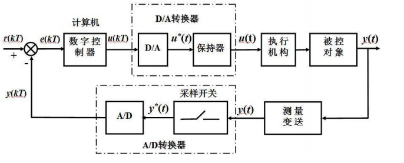

# 计算机控制技术

## 计算机控制系统概述

### 计算机控制系统的构成

计算机控制系统的硬件构成=过程装置+输入输出通道+计算机系统

- 过程装置=被控对象+执行机构+测量变送装置

- 输入输出通道=过程通道+总线接口

- 计算机系统=计算机+外部设备

计算机系统的软件构成=系统软件+应用软件+数据库系统

### 计算机控制系统典型结构

     
    计算机控制系统典型结构

模拟控制系统可以称为连续控制系统，而计算机控制系统称为离散控制系统或者数字控制系统。如果量化过程中的误差可以忽略，我们就得到了采样控制系统。

在这个框图里，**各个信号的特性**需要掌握：

- $u(t)$：时间连续、幅值离散
- $y(t)$：时间连续、幅值连续（可以称为模拟信号）
- $y^{\star}(t)$：时间离散、幅值连续（也称为离散模拟信号）
- $y(kT)$、$e(kT)$、$r(kT)$、$u(kT)$：时间离散、幅值离散（经过编码，可以称为数字信号）
- $u^{\star}(t)$：时间离散、幅值离散