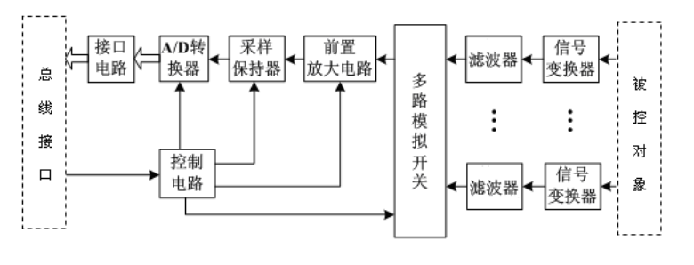
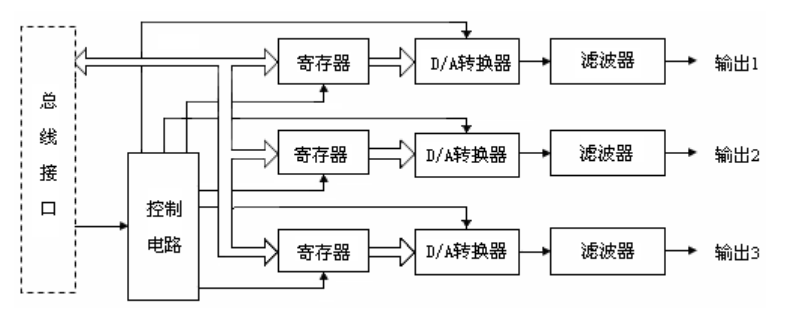
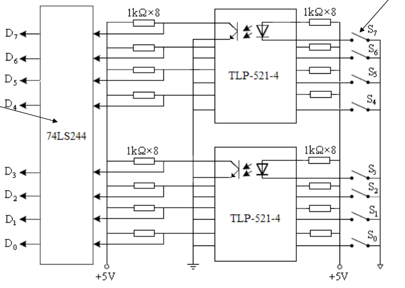
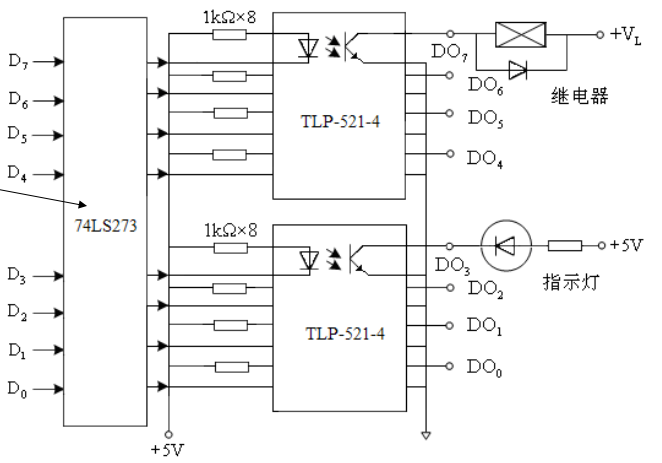
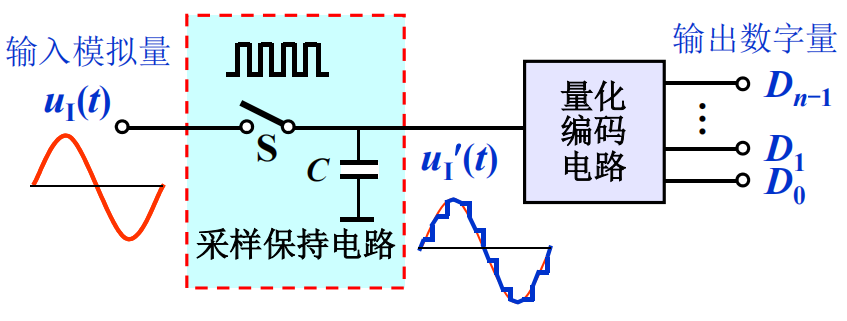
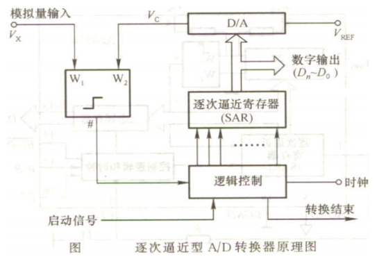

# 计算机控制技术

## 计算机控制系统概述

### 计算机控制系统的构成

计算机控制系统的硬件构成=过程装置+输入输出通道+计算机系统

- 过程装置=被控对象+执行机构+测量变送装置

- 输入输出通道=过程通道+总线接口

- 计算机系统=计算机+外部设备

计算机系统的软件构成=系统软件+应用软件+数据库系统

### 计算机控制系统典型结构

     
    计算机控制系统典型结构

模拟控制系统可以称为连续控制系统，而计算机控制系统称为离散控制系统或者数字控制系统。如果量化过程中的误差可以忽略，我们就得到了采样控制系统。

在这个框图里，**各个信号的特性**需要掌握：

- $u(t)$：时间连续、幅值离散
- $y(t)$：时间连续、幅值连续（可以称为模拟信号）
- $y^{\star}(t)$：时间离散、幅值连续（也称为离散模拟信号）
- $y(kT)$、$e(kT)$、$r(kT)$、$u(kT)$：时间离散、幅值离散（经过编码，可以称为数字信号）
- $u^{\star}(t)$：时间离散、幅值离散

### 计算机控制系统的性能指标

**稳定性**：指扰动作用消失之后，系统恢复平衡状态的能力。稳定性是控制系统最重要的性能指标。连续系统稳定的充要条件是闭环系统的极点位于s平面的左半平面；离散系统稳定的充要条件是闭环系统的极点位于z平面的单位圆内。

**稳态指标**：衡量控制系统的精度；用稳态误差表示。

**动态指标**：反映控制系统过渡过程特性。包括超调量、调节时间、峰值时间等等。

**综合指标**：例如积分型综合指标$J=\int_{0}^{t}e^{2}(t)\text{d}t$。

## 信号转换与Z变换

### 过程通道

过程通道是计算机和生产过程之间的信息传送和转换的通道。过程输入通道将生产对象的被控参数变换成计算机可以接收的数字代码；过程输出通道把计算机输出的控制命令和数据，变换成可以对工业对象进行控制的信号。如果细分，可以分为模拟量输入/输出通道、数字量输入/输出通道。

**模拟量输入通道**

     
    模拟量输入通道

**模拟量输出通道**

     
    模拟量输出通道

**数字量输入通道**

     
    数字量输入通道

利用光耦隔离，实现了信息的传递。损失率较小？

**数字量输出通道**

     
    数字量输出通道

这个似乎有点奇怪。输出为0，继电器工作；输出为1反而不工作。

### A/D转换

基本原理：$D=\left[\frac{u}{\Delta}\right]$。其中$\Delta$称为量化单位。

     
    A/D转换框图

**A/D转换器**

分为两大类：直接转换器和间接转换器。重点介绍SAR ADC

**逐次逼近式ADC原理**

     
    SAR ADC结构

逐次逼近ADC的工作过程是：从SAR的最高位开始，依次比较经过D/A转换之后的模拟值与模拟输入之间的大小关系，决定SAR各位的值。如果当前的值小于模拟量输入，则当前位置1，否则置0。

位数越多，误差越小。

逐次逼近式ADC的优点在于，转换时间固定，精度高、速度快。缺点是抗干扰能力不强。