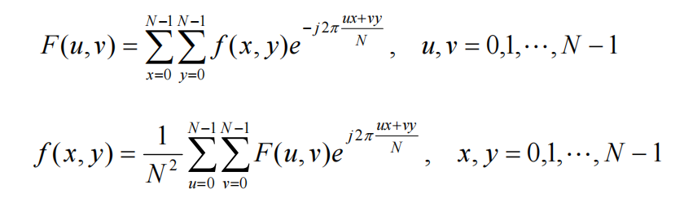

# DIP总结

总结完毕之后可以回头看看第一章PPT。

[TOC]

## 第一章

### 图像处理步骤：

1. 问题域确定，系统构建

2. 图像采集

3. 图像增强

4. 图像复原

5. 形态学处理

6. 特征表达

7. 图像识别（行为识别&分析）

分析典型案例：车牌识别系统

### 传感器成像：

1. 单色成像：光（能量源）->镜片（光学系统）->感光器（图像传感器）

2. RGB成像： 通过**拜耳滤镜->单传感器**或者分光棱镜->多传感器，获得的R、G、B通道的图像通过临近像素均值法（双线性插值）或者临近像素复制法进行插值，获得彩色图像。

### 图像：

- 黑白图像：非0即1

- 灰度图：0~255对应黑到白色，数字越小越黑

- RGB图：三通道

## 第二章：基础知识

### 彩色三要素：

1. 亮度，取决于光线的强弱（光强度，光度，照度，光通量）

2. 色调：取决于光的波长

3. 色饱和度：取决于某色光中掺入白光的比例。白光本身的色饱和度为0。

三基色：红绿蓝（显像三基色）

混色法：用三基色按照不同比例来混合获得彩色的方法

### 颜色模型

RGB模型

HSI模型： 色度(Hue)光强度(Intensity)和饱和度(Saturation)

**两种模型的非线性映射**

处理流程

### 采样和量化

采样：空间坐标的数字化

量化：取值的数字化

一般采用均匀采样

- 密采样：在灰度突变区，为了不丢失细节

- 稀采样：在灰度平缓区

- 密量化：在灰度平缓区，防止量化过稀产生虚假轮廓

- 稀量化：灰度剧变区，人眼对灰度剧变的边缘区灰度分辨力低

实际操作中一般都是均匀量化

### 像素的空间关系

#### 邻域：4-邻域，8-邻域，对角邻域（D-邻域）

#### 连接：邻接的同时像素灰度值相似

**判断两个像素是否连接：空间上邻接且像素灰度值相似（同属于一个集合）**

分为：4-连接，8-连接，m-连接

注意m-连接，是为了消除8-连接路径的歧义性。有4-连接就用4-连接，4-连接没有就看是否有8-连接。

#### 通路：由邻接得来的一组像素

4-通路；8-通路；m-通路

#### 连通：通路上的所有像素灰度值满足相似准则

#### 连通域：

**1.所有像素的灰度级别均小于或等于连通域的级别**。

**2.同一个连通域中的像素两两相连通，即在任意两个像素之间存在一条完全由这个集合的元素构成的通路**。

多连通域：**复平面上的一个区域B，如果在其中任作一条简单闭曲线，而曲线的内部不总属于B**。

个人理解：多连通域，像素之间存在在拓扑上不相同的路径。

边沿（缘）：**超过某个灰度阈值的所有像素点组成，是基于灰度级不连续性的测度。可把其看作图像强度的不连续性**。

注意区分**边沿**和**边界**这两个概念。**边界**是针对**区域**的。

一般来说，边沿是在图像的某个地方灰度值发生剧烈的变化。

#### 连通域的获取方法

个人想法：从一个像素点开始往外延伸至无符合的像素点，类似于种子填充法。

https://blog.csdn.net/icvpr/article/details/10259577

#### 像素的距离

距离的性质：非负，对称，三角不等式

- 欧氏距离：开方运算（圆形分布）

- 城区距离（曼哈顿距离）：横加纵（菱形分布）

- 棋盘距离：横纵差的最大值（方形分布）

- $D_4$距离 & $D_8$距离 ：不需要考虑它们之间是否真的存在一条通路。因为不论存在与否，距离都可以找得到；

- $D_m$距离：需要看它们之间是否真的存在m-连通的通路。其值取决于m-连通的通路长度。

### 像素的运算

#### 分类

点运算：输出图像中每个像素的灰度值仅由输入图像中相应位置的灰度值决定；

邻域运算（模板运算）：输出图像中每个像素的灰度值是由输入图像的一个邻域内的几个像素的灰度值共同决定的。

以上两种运算在图像增强中得到了应用。

#### 算术运算

- 加：叠加取均值，去除高斯加性噪声；拼接半透明图片

- 减：去除叠加图案，例如背景图案；检测同一场景两幅图像的变化

- 乘：局部显示图像，掩膜操作

- 除：校正由于照明或传感器的非均匀性造成的图像灰度阴影

#### 逻辑运算

与、或、异或、非。此处不再赘述

### 图像的坐标变换

平移

缩放：需要进行插值或者抽取

镜像，旋转，形变等

## 第三章 形态学处理

用指定的结构元素（structure element），与图像上的每个像素进行逻辑运算。

基本概念：

A为物体区域，B为结构元素

A与B的关系有三种：B包含于A，B击中A，B击不中A

### 基本运算

#### 腐蚀

用一个结构元素去探测图像的内部，找出可以放下该元素的区域，类似于收缩图像。准确来说，是指模板B平移过程中，所有可以添入A的内部的模板B的原点组成的图像。

#### 膨胀

腐蚀的对偶运算，可以定义成对补集的腐蚀。看例子会有直观的感受。

#### 开运算

先腐蚀再膨胀

**平滑图像的轮廓，削弱狭窄的部分，去掉细的突出毛刺和孤立斑点**

个人理解：平滑外凸的轮廓，去掉突出和孤立斑点

#### 闭运算

先膨胀再腐蚀

**熔合窄的缺口和细长的弯口，去掉小洞，填补轮廓上的缝隙**

个人理解：平滑内凹的轮廓，去掉内部的洞

#### 二值图像形态学运算的应用

##### 形态滤波

##### 平滑处理

##### 边缘提取

##### 击中击不中变换：

**探测区域中同时具有目标和目标背景的物体，即为寻找的特定目标**，这种方法需要定制特殊的结构元素。

用所需元素本身和它的背景去腐蚀图像和图像的补集，得到两个图像的交集对应的位置就是所需元素。

##### 细化

**把结构元素在图像中移动，子元素的阴影完全包含于物体中，而白色区域则完全包含于物体的背景中，则该子元素击中物体，从图像中取出该点**

是一个连续的过程

##### 粗化

细化的对偶

#### 灰值运算

**灰值腐蚀**：逐点计算该点局部范围内各点与结构元素中对应的点的灰度值的差，选取其中的最小值作为该点腐蚀的结果：“相减取最小”

如果所有结构元素是正的，输出图像会更暗，比结构元素小的区域，亮细节减弱。

**灰值膨胀**：与灰值腐蚀恰好相反，逐点计算该点局部范围内各店与结构元素中对应的点的灰度值之差，选择其中的最大值作为该点膨胀的结果：“相加取最大”

如果所有结构元素是正的，输出会更亮，如果暗细节的面积比较小，可能会被消除。

**灰值开闭运算**（用于滤波），其定义与形态学的开闭运算相近（开运算先腐蚀后膨胀，闭运算先膨胀后腐蚀）。

- 灰值开运算：去除椒盐噪声中的亮点（盐点），但是前提条件是噪声点小于结构元素

- 灰值闭运算：去除椒盐噪声中的暗点（椒点），但是前提条件是噪声点大于结构元素

**其他算法**：

- top-hat高帽变换：使用扁平结构元素，检测波峰，**在较暗的背景中求亮的像素聚集体**。

- bot-hat低帽变换：使用扁平结构元素，检测波谷，**在较亮的背景中求暗的像素点**。

- 灰度平滑：先开后闭或者先闭后开都可以在噪点比较小的情况下去噪。

## 第四章：图像增强

什么是图像增强？

对图像的某些特征，如边缘、轮廓、对比度等，进行强调或尖锐化，以便于显示、观察或进一步地分析与处理。分为平滑与锐化两种。增强**不增加图像数据中的相关信息**，但它增加所选择特征的动态范围**，** 从而使这些特征检测或识别更加容易。

### 点运算（灰度变换）

点运算的定义见上。因为点运算不使用除了当前位置的点以外的其他点，所以点运算不会改变图像内像素点之间的空间关系。基于点操作的增强方法称为灰度变换。基于运算性质，点运算也称为对比度增强、对比度拉伸。

#### 直接灰度变换：

- 线性
  - 求反
  - 对比度增强：增加某两个灰度值的灰度值范围
  - 阈值化
  - 灰度切分：将某个范围的灰度值突出，其他的保留

- 非线性

#### 灰度直方图

直方图是灰度级和出现这种灰度的概率之间的关系。用概率密度函数来表示原始图像的灰度分布

直方图给出了整体描述，但是没有位置信息。

##### 直方图均衡化27

目的：增加灰度值的动态范围

灰度变换函数应该满足：

1.函数在$0 \le s \le L-1$范围内是**单值单增**函数

2.保证动态范围的一致性

注意例题PPT31

计算：将原本不同灰度值的像素组就近分配为不同的新的灰度值

##### 直方图规定化40

将原来的直方图变成**规定形状**的直方图，以便增强图像中的某些灰度级。

目的：有些情况下需要特定形状的直方图

PPT44例题

##### 彩色直方图

在进行彩色图像的直方图处理时，要注意先将RGB转化为HSI，然后针对**I**分量进行均衡或者规定化。

### 邻域运算

用模板运算

#### 平滑52

实质上是低通滤波，会模糊边缘

1. 邻域平均：抑制随机噪声

2. 中值滤波：抑制椒盐噪声（噪声点不多），可以保护边缘，非线性，删除一些细节

3. k近邻：K取的小，细节保持较好，K取得大，平滑噪声较好

4. 梯度倒数加权：把梯度绝对值的倒数作为权重

5. 最小均方差滤波器：比较用不同的模板的均值和方差，使用最小方差的模板的灰度均值。

#### 锐化67

锐化的目的是加强图像中景物的边缘和轮廓；通过增加高频分量减小图片中的模糊，属于高通滤波，但同时会增加图片噪声。

1. **梯度处理**，如果直接选择坐标处的梯度，在比较平缓的区域，会很黑。最好选择一个门限值，分别计算，可以借此研究边界的位置。

   梯度的选取可以是水平，垂直，或者两个方向的平方平均值

2. **锐化算子**

   Sobel算子

   

​		Prewitt算子

​		二阶微分算子：拉普拉斯算子

### 彩色增强

#### 真彩色增强

1. RGB转换为HSI
2. 用灰度图增强的方法增强I分量
3. 转换回RGB

#### 伪彩色增强

把人无法分辨的灰度变换变成不同的彩色

1. 亮度切割

2. 灰度级到彩色的变换（安检，遥感）

3. 频率域滤波

## 第五章：图像变换与频域滤波

### 图像变换定义：

将图像从空域变到其他域（频域）的数学变换。主要是频域，也就是图像的灰度值随空间坐标的变化快慢。

### 傅里叶变换

#### Dirichlet条件：

1. 有限个间断点
2. 有限个极值点
3. 绝对可积

#### 傅里叶变换作用：

1. 得出信号在各个频率点上强度
2. 将卷积运算变换为乘法
3. 傅里叶变换和线性系统理论是进行图像恢复和重构的重要手段
4. 从频域角度来看待图像

### 离散余弦变换（DCT）

在视觉不敏感处进行有损压缩

为了减少数据量（相对于傅里叶变换），实际上是傅里叶变换的实数部分。

二维DCT是一种可分离的变换。也就是说，其变换核是可以分成两部分，将一个二维的变换拆分成两个一维的变换。

DCT系数的规律性：

1. 系数非零的频率由高到低
2. 系数绝对值由大到小
3. 非零系数间的间隔由小到大

**块内像素变化平缓，相关性越强，这种分布规律越明显，能量越集中； 反之纹理越清楚，相关性越弱，这种规律就越不明显，能量越分散**。

应用：

图像压缩（JPEG格式，静止图像压缩标准，使用到了DCT的能量特性）

JPEG的应用例子

    保留左上角低频（主要能量），舍弃高频（幅值近似0），图像在视觉上是基本不变的，而且清晰度比较高

### 沃尔什哈达玛变换（Walsh-Hadamard）

基函数是方波的变形

一维

二维沃尔什变换计算例题（PPT22），自行计算第二小问

沃尔什核矩阵的行和列都是正交的

沃尔什变换本质上把一个函数变为取值为+1或者-1的基向量构成的级数

原始数据越均匀，变换之后的数据越集中于边角。

哈达玛：沃尔什变换的矩阵重构形式，仍然满足行列的正交性

### 频域图像滤波与增强

#### 通带滤波

##### 低通滤波

1. 理想滤波(ILPF)，缺点：图像模糊，出现振铃效果
2. 巴特沃斯(BLPF)，它的带通与带阻之间无明显的不连续性，因此无振铃现象，模糊程度减少，它的尾部有较多的高频，通过下降它的截止频率达到一些平滑效果。
3. 指数低通(ELPF)，过渡带更平滑， 无振铃现象，比巴特沃斯衰减更快更模糊
4. 梯形低通（TLPF）

##### 高通滤波

对应上文的四种低通滤波器的名字

**带通或带阻滤波器**

对特定频段的信息进行增强或者抑制

#### 图像的同态增晰（对比度），也称同态滤波PPT46页

解决图像上**照明不均**的问题。同时将图像的**亮度范围，动态范围进行压缩**，将**对比度增强**。

增加了暗区的图像细节，不损失亮区的图像细节。

步骤：

1. 把图像分为高频区（反射分量）和低频区（照射分量）的乘积，取对数
2. 傅里叶变换
3. 使用同态滤波函数处理（压缩照度分量的灰度范围/在频域上削弱照度分量。增强反射分量的对比度/在频域上加强反射频谱部分），一般使用的是高通滤波器的变形。
4. 还原图像

## 第六章：图像分割

### 分割的基本概念和分类

#### 基本概念

从图像处理系统来看，图像分割是图像分析和理解系统的第一个环节。之前的一系列操作，都仅仅是对图像进行基本处理，方便得到更多的图像信息。在图像分割之后的操作，可以是图像的特征提取，以及图像的识别和分类。

一幅图像一般是由所关注的“物体”和物体周围的“背景”组成。图像分割的结果，可以是将物体部分的图像内容置“1”，背景部分置“0”，得到一幅二值图像。

图像分割可以分为两个类别：**不连续性分割，相似性分割**。不连续性分割通过检测图像中的不连续性来判断边界；相似性分割通过聚集相似灰度级的像素来划分区域，二者结合可以达到较好的分割效果。

#### 图像分割的方法种类

种类繁多，可成系统。下面是根据课程PPT梳理的图像分割算法树。

### 灰度阈值分割法

用一个特定的灰度阈值分割区域，阈值过高（太白）则很多目标点被归为背景，过低（太黑）则背景会被判定为目标。

模型：处于目标和背景处交界处的两边的像素在灰度值上有很大差别，但是目标和背景内部的相邻像素的灰度值是高度相关的。

阈值可以设置为全局阈值和自适应阈值。

#### 直方图分割法

##### 双峰法

灰度直方图呈现明显的双峰状，并且谷底较深，则谷底的灰度为阈值。

缺点：容易受到噪声影响，不适合双峰不明显或者谷比较宽的图像，不适合单峰直方图的情况。

##### 最佳阈值法

错误最小的阈值，基础是Bayesian最小误差分类法

假如图像的目标物和背景象素灰度级概率呈正态分布，且偏差相等（方差相等），背景和目标物象素总数也相等。最佳分割阈值就是目标物和背景象素灰度级两个均值的平均。

#### 迭代法

通过不断的迭代将阈值逼近两个区域的均值的平均。

步骤

1. 求出最大最小灰度值，初始灰度值是它们的平均
2. 分割图像
3. 求出两个区域的平均灰度值$\mu_1,\mu_2$
4. 计算新的阈值
5. 如果新的阈值和旧的阈值差小于临界值，则迭代结束

#### 最大类间方差法（大津法）

是在灰度直方图的基础上利用最小二乘原理推导得出的。

目标：两部分方差最大，即分离性最大

需要遍历最小到最大的灰度值。

#### 最大熵阈值分割法 

通过灰度分布密度函数定义信息熵，使用不同的熵准则，最后优化

##### 一维最大熵阈值分割

使阈值分割出的一阶灰度统计的**信息量**最大

优点：不需要先验知识，非理想的双峰图也可以用

缺点：只利用了点灰度信息，易受噪声影响，SNR降低时分割效果不理想

##### 二维最大熵阈值分割

利用了图像邻域的信息，抗噪能力强一些

一些结论：

1. 二维直方图在SNR较低时，双峰仍然明显
2. 点灰度-区域灰度均值的概率高峰主要出现在XOY平面的对角线附近：总体上双峰一谷，两个峰对应的是目标和背景；远离对角线处是噪声点，边缘点和杂散点
3. 在A区和B区用二维最大熵法确定最佳阈值，使目标和背景的信息量最大 （？）

#### 动态自适应阈值分割

不均匀亮度等成像因素导致单一门限值无法满足要求，需要将图像进一步划分为子图像，对不同的子图像使用不同的阈值。

一个考例：

##### 分水岭算法

分水岭算法可以看成是一种**自适应的多阈值分割算法**。对于比较复杂的、多区域多阈值的灰度图像，可以考虑使用分水岭算法。下面就是一个比较典型的例子。

    

1. 基于距离变换。是用每个像素到最近非零值像素的欧氏距离取代灰度。
2. 基于梯度，需要梯度平滑
3. 基于标记。添加标记符对梯度图像进行预处理，将对应内部标记符与外部标记符的区域置为最小值

### 边缘检测与连接

通俗来讲，边缘检测与连接的作用就是找到边缘点，并将边缘点连接起来形成连通边界。检测边缘通常使用边缘检测算子。**边缘检测算子**通过检查每一个像素点的邻域，并对其灰度变化进行量化来达到边界提取的目的，而且大部分的检测算子还可以确定边界变化的方向。

#### 高斯-拉普拉斯(LoG)算子 

把高斯平滑滤波器和拉普拉斯锐化滤波器结合起来，先平滑掉噪声，再进行边缘检测。其中，高斯算子可以将图像平滑，拉普拉斯算子具有各向同性，可以减少计算量。

#### 坎尼（Canny）算子

**最为优秀的边缘检测器。**

基于三个目标：

1. 低错误率
2. 边缘点被很好地定位
3. 单一边缘点响应

算法步骤：

1. 消除噪声（2D高斯滤波）

2. 通过导数算子，例如Sobel、Prewitt算子，找到图像灰度沿着两个方向的偏导数，以及梯度的大小和方向。

3. 由边缘梯度的方向将边缘梯度划分为4种八个方向

   

4. 非最大值抑制：遍历图像，若某个像素的梯度值与其梯度方向上前后两个像素的梯度值相比不是最大的，那么这个像素值置为0，即不是边缘

5. 取两个阈值：

   - 高阈值和低阈值的步比率应为$2:1$或者$3:1$。
   - 凡是大于高阈值的是边缘，小于低阈值的不是。
   - 在两个阈值之间的，看邻接像素有没有超过高阈值的像素，有就是边缘。

### 霍夫（Hough）检测

**一种线描述方法，将笛卡尔坐标空间的线变换为极坐标空间中的点**

实质：原始图像中给定形状的曲线和直线上的所有点都集中到变换空间的某个点上形成**峰值点**。这样，将原始图像中给定形状的曲线或直线的检测问题，变成**寻找变换空间中的峰值点问题**。

#### 笛卡尔空间

图像空间的线对应霍夫空间的一个点，图像空间的一个点对应霍夫空间的一条线。

**原理**：过点A$(x_0,y_0)$的所有直线均满足$y_0 = kx_0 +b$，那么在参数空间里面，$b = -k*x_0+y_0$这条直线就对应点A

Hough空间中两条线的交点用来表示过点$(x_0,y_0),(x_1,y_1)$的直线。

存在的问题：不能表示垂线，因为斜率为无穷大。

解决方法：极坐标表示

#### 极坐标表示

原理：参数空间$(\rho,\theta)$,垂线可以表示为$r=x_0$。参数具体形式为$r= x_0\cos{\theta} + y_0\sin{\theta}$。

把在图像空间中检测直线的问题转化为在极坐标参数空间中找通过点$(r,\theta)$的最多正弦曲线数的问题。

圆检测（二次曲线检测）和正弦曲线检测可以自学。

### 区域分割

区域分割是依据不同区域之间的特征来进行的。从总体上看，区域分割分为以下的三个步骤

- 确定区域分割的数目；
- 确定一个区域与其他区域相区别的特征；
- 产生有意义分割的相似性判据

区域分割共有四种方法：**区域生长法**、区域分裂法、区域合并法、**区域分裂合并法**。

#### 区域生长法

1. 选择一个种子像素
2. 从邻域中选出性质相同或者相似的像素进行合并
3. 新的像素作为种子像素，迭代直到没有满足条件的像素可以被包括进来。

**基本的生长准则和方法**

1. 基于区域灰度差方法（直接比较像素的灰度）
   - 找出没有归属的像素
   - 检查邻域像素，**如果灰度差小于预先确定的阈值T，将它们合并**
   - 以新的像素为种子，迭代

2. 基于区域内灰度分布统计性质（比较像素区域的灰度）

   - 把像素分为互不重叠的小区域

   - 比较邻接区域的累计灰度直方图，根据灰度分布相似性进行合并

     在进行比较时，有两种方法：K-S法和Smooth-Difference检测，如果检测结果小于给定的阈值，则合并两个区域。

   - **使用此方法，划分的小区域的尺寸对结果可能有较大影响。尺寸太小时检测可靠性降低，尺寸太大时得到的区域形状不理想，小的目标会被漏掉。**

   - **使用Smoothed-Difference方法检测直方图相似性时效果好于K-S检测，原因是考虑了所有的灰度值**

#### 区域分裂合并法

加入了分裂的检测。一致性测度可以选择基于灰度统计特征（例如方差）。

1. 如果区域的方差大于阈值$T$，则将区域四等分；
2. 相邻区域并集的方差小于阈值$T$，则合并两个区域；
3. 当没有办法进一步分裂和合并的时候，终止算法。

- 可以通过四叉树操作

- **由于噪声影响或者按照四叉树划分区域边缘未对准，进行上述操作后可能仍存在大量的小的区域，为了消除这些影响，可以将它们按照相似性准则归入邻近的大区域内。**

### 主动轮廓线模型(SNAKE模型) 

主动轮廓线模型通过曲线的内力和外部约束的共同作用，使得曲线变形到与目标边缘一致（能量最小化），进而提取感兴趣的目标的轮廓。

曲线包含内部能量（**弹性势能**和**弯曲势能**，弹性力使图像收缩为一个点，弯曲力使图像收缩为一个圆）以及外部能量（**由计算图像的灰度、边缘等特征获得，它用来吸引曲线的边缘轮廓**）。
$$
E_{snake}=E_{internal}+E_{external}
$$

$$
E_{internal}=E_{elastic}+E_{bending}
$$
对于外部能量来说，可以看作图像灰度值的连续函数，通常定义为：

**传统snake模型中，外力是吸引曲线到目标轮廓附近的关键因素，因此，目前大多数研究人员对snake模型的改进都是集中在如何设计一个好的外力上。** 

## 第七章：图像表示与描述

表达和描述的定义：第七章PPT第5页。好的描述要具有：**尺度**、**平移**、**旋转**不变性

### 灰度图描述

幅度、直方图、变换系数的描述

### 边界的描述：

#### 链码

4向和8向，直接分割会有的2个问题（尺度和旋转的问题）

1. 码串很长

2. 噪声会导致小的边界变化，进而使链码产生与目标整体形状无关的较大变动

   解决方法：用**较大的网格**重新采样

归一化：因为链码是循环的，所以使链码表示的自然数最小的码即为归一化

首差链码：目标旋转，链码不变

#### 形状数

最小链码的差分码，同样与方向无关

阶：形状数序列长度，闭合曲线的阶总是偶数

规整网格方向：

#### 傅里叶描述子（自学，仅知道干什么就可以了）

特点：

1. 较少的傅里叶描述子就可以获取整体轮廓

2. 可以区分明显不同的边界

优点：

1. 对于旋转，平移，放缩，和起始点的选取不敏感
2. 几何变换的描述子可以通过对函数简单变换获得

### 纹理描述

纹理特征：

1. 自然纹理：如草地，种子（无规则）
2. 人工纹理：砖墙，地毯（有规则）

三要素：

1. 某种局部的序列性在该序列更大的区域内不断重复
2. 序列基本元素是非随机排列的
3. 区域内任何地方都有大致相同的结构尺寸

纹理描述用统计方法（自然）和结构方法（人工）

矩分析法

均值，方差，扭曲度，峰度，熵

灰度差分统计，灰度共生矩阵（赋予纹理特征，常用特征：熵度量，角二阶矩，惯性矩）

### Shapecontext

**如何对物体形状进行有效表达，使得具有相似形状的图像中关键像素点（Key Points）之间能够匹配，从而达到形状相似度计算目的**

步骤：

1. 图像平滑（高斯滤波）
2. 提取图像边界信息：使用滤波算子（sobel，prewitt）得到梯度信息
3. 重置梯度模的值
4. 将极值点划分出方向
5. 与canny算子方法一样（非最大值抑制）

每个像素点都能找到信息（以此点为中心的极坐标系的区域中的像素点的个数），最优匹配即可确认特征点

### HOG描述子

首先提取X和Y的梯度（点的相邻点像素值的差，**不是点的本身**）

特征提取

幅值分配到不同的方向上得到方向梯度直方图，注意归一化（如果是RGB的彩色图像，需要对每个通道的像素都计算一遍）

光照不变性：归一化

平移，旋转不变性：原理上就已经解决

获得的方向梯度直方图可以用来作为特征，举例：SVM

### SIFT算法

基本原理：

特征向量具有**平移、缩放、旋转不变性**，同时对**光照变化、仿射及投影变换**也有一定不变性。 

三个工序

#### 提取关键点

特征点具有的三个特征

**尺度，方向，大小**，三大不变性：尺度旋转光照

高斯模糊降尺寸可以得到图像金字塔（**相邻两组的同一层尺度为2倍的关系**，**层级越高，则图像越小，分辨率越低**）

用DoG（高斯差分）金字塔局部极值检测来得到关键点，关键点满足在周围和上下两层中（26个点）值最大或者最小。

#### 高斯金字塔

高斯金字塔构建过程：

1. 先将原图像扩大一倍之后作为高斯金字塔的第1组第1层，将第1组第1层图像经高斯卷积（其实就是高斯平滑或称高斯滤波）之后作为第1组金字塔的第2层。
2. 将σ乘以一个比例系数k,等到一个新的平滑因子σ=k*σ，用它来平滑第1组第2层图像，结果图像作为第3层。
3.  如此这般重复，最后得到L层图像，在同一组中，每一层图像的尺寸都是一样的，只是平滑系数不一样。它们对应的平滑系数分别为：0，σ，kσ，k^2σ,k^3σ……k^(L-2)σ。
4.  将第1组倒数第三层图像作比例因子为2的降采样，得到的图像作为第2组的第1层，然后对第2组的第1层图像做平滑因子为σ的高斯平滑，得到第2组的第2层，就像步骤2中一样，如此得到第2组的L层图像，同组内它们的尺寸是一样的，对应的平滑系数分别为：0，σ，kσ，k^2σ,k^3σ……k^(L-2)σ。但是在尺寸方面第2组是第1组图像的一半。
5. 这样反复执行，就可以得到一共O组，每组L层，共计O*L个图像，这些图像一起就构成了高斯金字塔

在同一组内，不同层图像的尺寸是一样的，后一层图像的高斯平滑因子σ是前一层图像平滑因子的k倍；

在不同组内，后一组第一个图像是前一组倒数第三个图像的二分之一采样，图像大小是前一组的一半；

DOG金字塔是高斯金字塔做差分，组内层数少一，边**对这些DOG图像进行归一化，可有很明显的看到差分图像所蕴含的特征**，并且有一些特征是在不同模糊程度、不同尺度下都存在的，这些特征正是Sift所要提取的“稳定”特征

接着关键点精确定位（109页），去除边缘响应（111页）得到最终的关键点。

#### 关键点描述

描述的目的（118页）

用一组向量描述一个关键点，具有唯一性，不变性，描述完成后需要归一化

采用4*4\*8=128维向量描述，效果最优

#### 关键点匹配

关键点匹配采用穷举法，从模板图和实时图中建立关键点的集合，用欧氏距离来判断是否匹配。

关键点匹配需要满足：

RANSAC消除错配点

### HOG和SIFT的对比

HOG优点

1. 可以描述图像的局部形状信息
2. 位置和方向空间的量化一定程度上可以抑制平移和旋转带来的影响
3. 局部区域归一化直方图可以部分抵消光照变化带来的影响
4. 图像需要的数据维度降低了，因为忽略了光照颜色的影响
5. 图像局部像素点的关系有表征

HOG缺点

1. 速度慢，实时性差
2. 遮挡问题
3. 对噪声点很敏感

## 第八章 图像编码

### 图像数据冗余

1. 编码冗余
2. 像素冗余
3. 视觉心理冗余

### 行程编码

一维：相邻且相同的像素用个数加值代替

二维：不同的排列方式有不同的压缩率

定长行程编码：表示长度的二进制数的位数固定

变长行程编码：

**还原方法：从符号串左端开始往右搜索，遇到第一个0时停下来，计算这个0的前面有几个1。设1的个数为K，则在0后面读K+2个符号，这K+2个符号所表示的二进制数加上1的值就是第1个行程的长度**

### 哈夫曼编码（熵编码）

将出现频率高的像素值给一个短的编码，出现频率小的像素值给一个长的编码

基于哈夫曼树

步骤：

1. 首先求出图像中灰度分布的灰度直方图
2. 排列出概率顺序
3. 构造哈夫曼树
4. 编码

注意：全局哈夫曼树可能效率不高，甚至可能和等长编码是一样的

小块编码就可以

### 香农-范诺（二分法）

步骤：

1. 将字符按照出现的频率进行排序
2. 用递归的方法分成两部分，使得两部分的概率接近相等，然后继续递归
3. 从根节点开始编码

思想类似于哈夫曼，但是效率不如哈夫曼编码

### 预测编码

从过去的符号样本预测下一个符号样本的值

通过预测模型实现

### DCT编码

有损压缩，忽略视觉不敏感的部分（高频信息）

步骤：

1. 对原图像做DCT变换
2. 除以量化系数
3. 取整

解码步骤

1. 乘量化系数
2. DCT逆变换
3. 取整

### 混合编码

## 第九章 特征提取的深度网络

## 

### 卷积层11

局部感受野：卷积神经网络每一层输出的像素在原始图像上映射的区域大小

权值共享：从输入层到隐藏层的映射称为特征映射，其权重为共享权重（卷积核参数）。**卷积核可以改变特征图的尺寸大小**

### 非线性激活层18

卷积层处理后，经过非线性变换得到输出信号，输出具有$f(wx+b)$的形式。

**原因**：线性模型的表达能力是不够的，需要非线性变换来拟合更多的情况

常用函数

1. $Sigmoid(x) = \frac{1}{1+e^{-x}}$
2. 线性整流函数：$f(x) = \max{(x,0)}$。正的结果倾向于找到特征，负的结果说明未找到特征，舍弃。
3. Softmax函数：进行非负处理和归一化处理

### 池化层

目的：压缩图像，减少参数。**可以调整特征图的尺寸大小**

1. Max Pooling：取窗口的最大值
2. Average Polling：取平均值

进行MaxPooling之后可以真正提取到能识别特征的数值，减小计算量但是不损失效果

### 全连接层29

特征图展开为1维向量，从flatten层输入到全连接层（**减少特征位置对分类带来的影响**，增强鲁棒性）

### 反向传播算法

为了得到最佳的参数组合

避免了重复子表达式的梯度弥散和爆炸。

步骤：

1. 前向传播
2. 反向传播
3. 反向修正

### VGGNet

特点：

1. 卷积核为3\*3，极少使用1\*1
2. 全部使用2*2的池化核
3. 增加通道数
4. 增加非线性激活函数

### GoogleNet

特点：

1. inception结构**PPT60页**，使深度达到了22层。稀疏性，高计算性能的结构。
2. 使用40%的Dropout的操作（忽略一定的特征检测器）
3. 额外增加2个softmax层用于向前传导梯度
4. 使用局部响应归一化层对局部神经元的活动创建竞争机制，使得其中响应比较大的值变得相对更大，并抑制其他反馈较小的神经元，一定程度上增强了模型的泛化能力

### ResNet（残差网络）

**shortcut connection**，有效缓解深度增加带来的梯度弥散的问题

### 性能分析

提升网络性能的途径：加深网络，加宽网络

问题：1.参数过多（如果训练数据太少会出现过拟合） 2. 梯度弥散或梯度爆炸

#### 梯度弥散

反向传播时，浅层神经元（靠近输入层）的权重更新很慢，不能有效学习。

#### 梯度爆炸

开始时权重太大，梯度过大，浅层神经元的权重更新过大

方法：

1. 全连接$\rightarrow$稀疏连接，计算时间很难减少
2. 聚类思想：**将稀疏矩阵聚类为较为密集的子矩阵**

## 第十章：图像分割的深度网络

### 全卷积网络（FCN）：

没有向量，没有全连接层，都是卷积来替代

三个全连接层都替换为1*1卷积核所对应的等同向量长度的卷积层

#### 下采样：使图像尺寸越来越小**15**

#### 上采样：与下采样相反

转置卷积：使特征尺寸与输入的尺寸相同或者更大

#### 损失函数

#### 信息熵30

**全景分割76：在实例分割基础上，对同一标签下的不同目标继续分割**

**全景分割可以看做是同时实现对背景的语义分割和对前景的实例分割。**

注意区分语义分割和实例分割：递进关系

#### 分割思路51：

自上而下：先标记出实例所在区域（检测框），再在检测框内进行语义分割

自下而上：先进行语义分割，再对不同实例进行区分（聚类，度量学习）

#### **Panoptic FPN全景特征金字塔网络**78

#### **Panoptic Quality全景质量评价94**

## 第十一章：目标检测的深度网络

### 单阶段方法：

**计算速度较快，但是检测精度较低**

#### SSD

特征金字塔

先验框56

损失函数

数据增强65

SSD缺陷66

#### YOLO

缺陷79

**YOLOv2**

**Batch Normalization，批归一化**

**YOLOv3的改进95**

YOLOv4 97

**数据增强（Data Augmentation）100**

**Self-Adversarial Training（SAT,自对抗训练）** 

### 基于候选区域的目标检测方法（R-CNN)

**检测精度较高，但是计算速度较慢，实时性较差。**

R_CNN的调整：

1. 使用选择性搜索，**候选区域数量更少，有更大的概率包括有意义的图像内容**
2. 使用**AlexNet**，**更好的提取特征**
3. **迁移学习**，**缩短了模型的训练时间，也提高了模型的泛化性能**

缺陷15：2个

Fast-R-CNN16

缺陷27

Faster R-CNN28