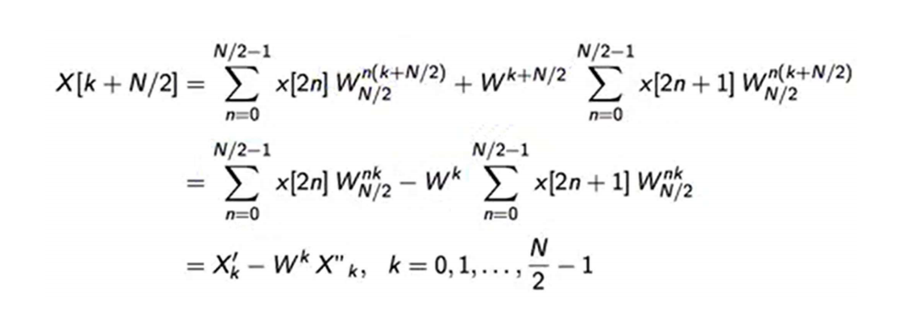

# 数字信号处理公式

## 信号的采样和重建

### 信号的基本概念

- 离散和连续

  信号从时间域上来说，可以分为两种：时域离散信号和时域连续信号。同样地，从频率域上来说，也可以分为：频域离散信号和频域连续信号。可以说，数字信号处理课程中对于离散信号和连续信号之间的关系，主要关注点是**采样**（sampling）、**重建**（reconstruction）以及这两种操作带来的频域上的变化。

- 采样过程和重建过程

  从离散信号到连续信号的**采样过程**可以通过以下的函数实现：
  $$
  x[n]=x_{c}(nT_{s})
  $$
  其中采样周期为$T_{s}$，采样频率$F_{s}=\frac{1}{T_{s}}$。

  从离散信号到连续信号的**重建过程**可以通过以下的函数实现：
  $$
  x_{c}(t)=\sum_{n=-\infty}^{\infty}x[n]sinc(\frac{t-nT_{s}}{T_{s}})=\sum_{n=-\infty}^{\infty}x[n]\frac{\sin(\pi(t-nT_{s}))}{\pi(t-nT_{s})}
  $$
  也就是所谓**sinc插值**。插值函数当然也可以是别的函数，例如零阶保持函数。但是使用sinc函数可以保证频带不泄漏以及信号不失真。因为sinc函数在频域上是一个门限函数。

引入了离散信号和连续信号的联系，二者之间的各种物理量的关系也随之而来。下面就频率论述两者之间的差别。

### 数字频率和物理频率的概念和关系

- 数字周期和物理周期

  对于离散信号来说，周期只是一个整数，设其为$N_{s}$。
  $$
  x[n+rN_{s}]=x[n] \quad r\in\mathbb{Z}
  $$
  对于连续信号，周期就是一个实数了，设其为$T$。

  同样地，存在数字频率和物理频率的概念。设数字频率为$\omega$；模拟频率为$F$，模拟角频率为$\Omega$。频率和角频率的关系不言自明：
  $$
  \Omega=2\pi F=2\pi \frac{1}{T}
  $$
  对于以周期$T_{s}$采样得到的离散信号，其数字频率和对应的连续信号的物理频率之间的关系为：
  $$
  \omega=\Omega T_{s}=\frac{\Omega}{F_{s}}=2\pi\frac{F}{F_{s}}
  $$
  **数字频率$\omega$是模拟角频率$\Omega$被抽样频率$F_{s}$归一化之后的弧度**。这一点一定要牢记。它是连接连续和离散两个体系的桥梁。这个结论是从哪里来的？是从对正弦序列的讨论中推广到一般意义上得来的。
  
  另外，关于数字周期和对应的物理频率，有以下关系：
  $$
  F=\frac{1}{N_{s}T_{s}}
  $$
  从而，根据上文的关系，我们可以得出这样的结论：
  $$
  \omega=\frac{2\pi}{N_{s}}
  $$
  当然，数字周期存在的条件是离散信号是一个无限长的周期序列。
  
- 采样对频域的影响——时域离散化导致频域周期化

  如果我们将经过采样后的信号仍旧视作连续信号$x_{s}(t)=\sum_{m=-\infty}^{\infty}x_{c}(mT_{s})\delta(t-mT_{s})$，则：
  $$
  X_{s}(j\Omega)=F_{s}\sum_{k=-\infty}^{\infty}X_{c}\left[j\left(\Omega-k\frac{2\pi}{T_{s}}\right)\right]= F_{s}\sum_{k=-\infty}^{\infty}X_{c}\left[j\left(\Omega-k\Omega_{s}\right)\right]\\
  X_{s}(F)=F_{s}\sum_{k=-\infty}^{\infty}X_{c}\left(F-k\frac{1}{T_{s}}\right)=F_{s}\sum_{k=-\infty}^{\infty}X_{c}\left(F-kF_{s}\right)
  $$
  
- 

也就是说，时域上的采样，导致频域上的频谱发生了幅值扩张以及周期延拓，对应的延拓周期为$F_{s}$，或者说周期是$\Omega_{s}$。当然，如果要延拓的横轴为数字频率$\omega$的话，延拓周期就是$2\pi$了，原因见下面的对应关系。

### 时域采样定理

对于一个频率有限的信号，如果想要保证采样重建之后的信号不发生混叠，采样频率$F_{s}\geqslant 2F_{h}$，其中$F_{h}$是连续信号频率的最高分量。称采样频率$F_{s}$的一半为折叠频率。

根据之前的抽样后的离散信号频率和连续信号频率之间的对应关系，我们可以得到（在$F_{s}=2F_{h}$情况下）：
$$
\omega_{s}=2\pi \\
\omega_{h}=\pi
$$
也就是说，模拟信号的最高频率对应于数字信号频率的$\omega=\pi$处。

如果一个信号是非带限信号，也即信号的带宽是无限的，那么直接采样会不可避免地带来混叠。这个时候需要使用sinc采样的方法。

     
    sinc采样框图

采样的表达式：
$$
x[n]=(\text{sinc}\left(\frac{t}{T_{s}}\right)\star x_{c}(t))(nT_{s})
$$
先将信号进行低通滤波，再进行时域采样。

### 带通信号时域采样

带通信号的频谱存在于某一频段范围，而不是在零频周围。如果使用时域采样定理，得到的采样频率将会很高。但是实际上想要实现无损采样并不需要使用这么高的采样频率。

首先需要明确，对于带通信号，**带宽**这个概念实际上指的是**有效正带宽**（*effective positive bandwidth*），也就是频率正轴上的幅值非零部分的频带宽度，这一点和其他地方的带宽是有一定区别的。

#### 程佩青《数字信号处理教程》给出的方法

给出如下的定义：

信号的最高频率为$F_{h}$，带宽为$B$。算术中心频率$F_{c}=F_{h}-\frac{1}{2}B$。最低频率$F_{l}=F_{h}-B$。

**情况一**：信号的最高频率是通带宽度的整数倍，也即$F_{h}=kB,k\in\mathbb{Z}$。取采样频率为$F_{s}=2B$。

**情况二**：信号的最高频率不是带同宽度的整数倍，也即$F_{h}=mB, m\notin\mathbb{Z}$。这个时候可以对通带宽度调整，再计算采样频率。

- 取$m^{\prime}=\lfloor m\rfloor$。
- 将通带下端延伸到$F_{l}^{\prime}$，保持$F_{h}$不变，使得$B^{\prime}=F_{h}-F_{l}^{\prime}$满足$F_{h}=m^{\prime}B^{\prime}$。
- 取采样频率为$F_{s}=2B^{\prime}$。

综合两种情况，采样频率可以写作
$$
F_{s}=2B\frac{m}{\lfloor m\rfloor}
$$
因此，带通信号的采样频率范围是：
$$
2B\leqslant F_{s}\leqslant 4B
$$
这时的采样频率为亚Nyquist采样频率。

#### 课堂上讲授的方法

还有一种计算带同采样频率的方法。采样频率依照以下的两个准则寻找：

- 带通信号条件：$F_{s} \textgreater B=2f_0$。
- 基带条件：$F_{s}=2\frac{F_{c}}{k}, k\in\mathbb{N}$。

按照以上两个条件寻找对应的$k$以及$F_{s}$。

当信号的最高频率不是带通宽度的整数倍，还有一个公式：

$\frac{2f_H}{k}\le F_s\le \frac{2f_L}{k-1}$

这两种方法得到的结果并不相同。*是非曲直，难以论说*。

### 正弦信号的采样问题

对于正弦信号来说，时域采样定理和其他信号略有不同。对于正弦信号，采样频率必须满足$F_{s}\textgreater 2F_{h}$。原因在于，假设有这样的一个正弦信号：$x_{c}(t)=A\sin (2\pi Ft)$，那么当采样频率为$F_{s}=2F$时，得到的采样结果为全零序列，是不可能恢复出原序列的。因此，采样频率必须大于$2F_{h}$。

另外，正弦信号的采样问题还需要注意以下几点：

- 两个模拟正弦信号频率之差为采样频率$F_{s}$的整数倍时，所得到的序列是相同的。

- 同一个模拟正弦型信号，如果用两个不同的采样频率进行采样，所得到的序列仍然可能是相同的。两个采样频率满足如下的关系：
  $$
  \left|\frac{F}{F_{s2}}-\frac{F}{F_{s1}}\right|=k,\quad k\in\mathbb{N}
  $$
  如果其中一个已知，则其他的也可以计算得到。

鉴于此，我们说，对于一个正线性序列只有明确了其采样频率，才能得到相应的模拟信号。

### 信号的插值重建

#### Lagrange插值

Lagrange插值函数：
$$
L_{n}^{(N)}(t)=\prod_{k=-N, k\neq n}^{N}\frac{t - k}{n-k}\quad n=-N,\dots,N \\
x_{c}(t)=\sum_{n=-N}^{N}x[n]L_{n}^{(N)}(t)
$$
Lagrange插值方法是一个局部插值方法。Lagrange多项式是一个2N维的多项式。

     
    Lagrange插值法

#### 核函数插值

零阶插值、一阶插值、三阶插值

#### sinc插值

通过推导可知，局部插值在$N\to\infty$的时候，与全局插值相同。
$$
\lim_{N\to\infty}L_{n}^{(N)}(t)=\text{sinc}(t-n)
$$
从而：
$$
x(t)=\sum_{n=-\infty}^{\infty}x[n]\text{sinc}\left(\frac{t-nT_{s}}{T_{s}}\right)
$$

## 信号的频域变换

### 信号的时频域关系

简单来说，**任何一个域是连续的，对应的另一个域一定是非周期的；任何一个域是离散的，对应的另一个域一定是周期的**。

### 傅里叶变换（FT）

这里不再介绍傅里叶变换的详细定义和性质，仅仅介绍一些常用的傅里叶变换对。这些变换对在其他的信号变换的推导中发挥重要的作用。
$$
\phi(t)=G\text{sinc}(t) \\
\Phi(f)=G\text{rect}(f)
$$
上面是常用的一对变换，时域的sinc函数对应频域的门限函数。

### 离散时间傅里叶变换（DTFT）

#### DTFT的定义

离散时间傅里叶变换将离散序列$x[n]$变换到连续频域$X\left(e^{j\omega}\right)$。离散序列一般来说是无限长序列，对周期序列和非周期序列均有变换。

DTFT：
$$
X\left(e^{j\omega}\right)=\sum_{n=-\infty}^{\infty}x[n]e^{-j\omega n}
$$
IDTFT：
$$
x[n]=\frac{1}{2\pi}\int_{-\pi}^{\pi}X\left(e^{j\omega}\right)e^{j\omega n}\text{d}\omega
$$
注意，频域$X\left(e^{j\omega}\right)$以$2\pi$为周期，其傅里叶系数为$x[n]$。

#### DTFT的性质

Parseval公式：
$$
\sum_{n=-\infty}^{\infty}\left|x[n]\right|^{2}=\frac{1}{2\pi}\int_{-\pi}^{\pi}\left |X\left(e^{j\omega}\right)\right|^{2}\text{d}\omega
$$
接下来重点关注一下**对称性**的问题。

探讨对称性问题之前，首先要明确几个变换对：
$$
x[n]\leftrightarrow X(e^{j\omega}) \\
x[-n]\leftrightarrow X(e^{-j\omega}) \\
x^{\star}[n]\leftrightarrow X^{\star}(e^{-j\omega})
$$
通过这三个关系可以推导出后续的变换对之间的对偶性。

接下来是时频域之间的实部虚部、共轭对称分量和共轭反对称分量之间的对应关系。
$$
x[n]=\text{Re}(x[n])+j\text{Im}(x[n]) \\
X\left(e^{j\omega}\right)=X_{e}\left(e^{j\omega}\right)+X_{o}\left(e^{j\omega}\right)
$$
对应项是一一对应的关系。

同样地，有：
$$
x[n]=x_{e}[n]+x_{o}[n] \\
X\left(e^{j\omega}\right)=\text{Re}(X\left(e^{j\omega}\right))+j\text{Im}(X\left(e^{j\omega}\right))
$$
对应项是一一对应的关系。

特别地，当$x[n]$是实序列的时候，其DTFT满足共轭对称性，即实部满足偶对称，虚部满足奇对称。模满足偶对称，相角满足奇对称。

| $x[n]$                      | 实偶 | 实奇 | 虚偶 | 虚奇 |
| --------------------------- | ---- | ---- | ---- | ---- |
| $X\left(e^{j\omega}\right)$ | 实偶 | 虚奇 | 虚偶 | 虚奇 |

以上对称性可以通过前述的几个变换对推导而来。如果想要做简单的记忆，可以这么记：**奇偶性不变，偶则实虚不变，奇则实虚颠倒**。

#### 周期性序列的DTFT

周期性序列的DTFT，实际上可以看成把一个有限长的序列周期延拓，变成无限长的序列后，再做DTFT。

首先是周期序列：
$$
\tilde{x}[n]=x[n\mod N]
$$
定义好了这样的周期序列之后，对其进行DTFT：
$$
\tilde{X}\left(e^{j\omega}\right)=\sum_{n=-\infty}^{\infty}\tilde{x}[n]e^{-j\omega n} 
$$
代入DFS：$\tilde{x}[n]=\frac{1}{N}\sum_{k=0}^{N-1}\tilde{X}[k]e^{j\frac{2\pi}{N}nk}$，利用重要的DTFT变换对：$e^{j\omega_{0}n}\leftrightarrow \sum_{k=-\infty}^{\infty}2\pi\delta(\omega-\omega_{0}-2\pi k)$，可以得到：
$$
\tilde{X}\left(e^{j\omega}\right)=\frac{2\pi}{N}\sum_{k=0}^{N-1}X[k]\tilde{\delta}(\omega-\frac{2\pi}{N}k)
$$
即为周期性序列的DTFT。如你所料，这样的DTFT实际上就是一堆冲激串的叠加而已。

#### 有限支持序列的DTFT

将有限长度的序列变为无限长度序列的第二个方法就是将其变为有限支持信号。

同样地，我们定义：
$$
\bar{x}[n]=\left\{
	\begin{array}{ll}
	x[n]& 0\leqslant n\leqslant N-1 \\
	0 & \text{otherwise}
	\end{array}
\right.
$$
则：
$$
\bar{X}\left(e^{j\omega}\right)=\frac{1}{N}\sum_{k=0}^{N-1}X[k]\left(\sum_{n=0}^{N-1}e^{j\frac{2\pi}{N}nk}e^{-j\omega n}\right)
$$
注意这里的公式和周期性序列的DTFT公式的区别。一个为无限求和，另一个是有限和。

因此，我们定义：
$$
\Lambda(\omega)=\frac{1}{N}\sum_{n=0}^{N-1}e^{-j\omega n}
$$
这样，我们就有：
$$
\bar{X}\left(e^{j\omega}\right)=\sum_{k=0}^{N-1}X[k]\Lambda(\omega-\frac{2\pi}{N}k)
$$
得到的是一个DFT的平滑插值。

#### 一些离谱的DTFT变换对摘抄

| 序列                                   | 离散时间傅里叶变换                                           |
| -------------------------------------- | ------------------------------------------------------------ |
| $u[n]$                                 | $\frac{1}{1-e^{-j\omega}}+\sum_{k=-\infty}^{\infty}\pi\delta(\omega-2\pi k)$ |
| $e^{j\omega_{0}n}$                     | $2\pi \sum_{k=-\infty}^{\infty}\delta(\omega-\omega_{0}-2\pi k)$ |
| $x[n]=\frac{\sin(\omega_{c}n)}{\pi n}$ | $X\left(e^{j\omega}\right)=\left\{\begin{array}{ll}1&|\omega|\leqslant\omega_{c} \\0&\omega_{c}\leqslant|\omega|\leqslant\pi\end{array}\right.$ |
| $R_{N}[n]$                             | $\frac{\sin\left(\frac{N\omega}{2}\right)}{\frac{\omega}{2}}e^{-j\left(\frac{N-1}{2}\right)\omega}$ |

这些傅里叶变换对过于离谱，难以推导，摘录之。

### 离散傅里叶变换（DFT）

假设$x[n]$为$M$点长的有限长序列，可以定义其$N$点DFT。注意一定要满足$N\geqslant M$。这个是频域采样定理得到的结果，可以无混叠地恢复原有序列。

DFT：
$$
X(k)=\sum_{n=0}^{N-1}x[n]e^{-j\frac{2\pi}{N}nk}
$$
IDFT：
$$
x[n]=\frac{1}{N}\sum_{k=0}^{N-1}X(k)e^{j\frac{2\pi}{N}nk}
$$
为了表达方便，引入符号$W_{N}=e^{-j\frac{2\pi}{N}}$。为了表达简便，同时也是为了下面的FFT做铺垫，我们引入DFT的矩阵表示法：
$$
W_{N}=
\begin{bmatrix}
1 & 1 & \cdots & 1 \\
1 & W_{N}^{1} & \cdots & W_{N}^{N-1} \\
1 & W_{N}^{2} & \cdots & W_{N}^{2(N-1)} \\
\vdots & \vdots & \ddots & \vdots \\
1 & W_{N}^{N-1} & \cdots & W_{N}^{(N-1)^{2}} 
\end{bmatrix}
$$
则：
$$
\mathrm{X}=W_{N}\mathrm{x}
$$
DFT是内涵周期性的。这一点在后面的DFS和DFT的关系中可以体现。这里简要说明，**在DFT的讨论中，有限长序列都是作为周期序列的一个周期来表示的**。对DFT的任何处理，都是先把序列周期延拓后，再做相应的处理，然后取主值序列后，就是处理的结果。

DFT结果中，第k个采样点的频率为：
$$
\omega_{k}=\frac{2\pi}{N}k=2\pi\frac{F_{k}}{F_{s}}
$$
从而我们有：$F_{k}=\frac{kF_{s}}{N}$。这一结果可以帮助我们根据采样频率直接得到第k个采样点所对应的物理频率。

**DFT的时频域关系**：

1. 时域相邻两采样点的时间间距$T_{s}=\frac{1}{F_{s}}$。

2. 频域相邻两个采样点的频率间距$F_{0}=\frac{F_{s}}{N}$（称为频域分辨力）等于时域的时间长度$T_{0}=NT_{s}$的倒数。也就是说：
   $$
   \frac{1}{NT_{s}}=\frac{F_{s}}{N}
   $$

### 离散傅里叶级数（DFS）

离散傅里叶级数专门用来解决周期序列的变换问题。对于一个周期序列：
$$
\tilde{x}[n]=\tilde{x}[n+kN]\quad k\in\mathbb{Z}
$$
其不是绝对可和的，因而不能使用Z变换。不过可以定义其离散傅里叶级数：

DFS：
$$
\tilde{X}[k]=\sum_{n=0}^{N-1}\tilde{x}[n]e^{-j\frac{2\pi}{N}nk}=\sum_{n=0}^{N-1}\tilde{x}[n]W_{N}^{nk}
$$
IDFS：
$$
\tilde{x}[n]=\frac{1}{N}\sum_{k=0}^{N-1}\tilde{X}[k]e^{j\frac{2\pi}{N}nk}=\frac{1}{N}\sum_{k=0}^{N-1}\tilde{X}[k]W_{N}^{-nk}
$$
如何理解DFS？可以通过DFS和其他变换之间的关系来理解：

**DFS与DTFT之间的关系**：
$$
\tilde{X}[k]=X\left(e^{j\omega}\right)|_{\omega=\frac{2\pi k}{N}}
$$
$\tilde{x}[n]$的离散傅里叶级数系数，等于其一个周期$x[n]$的离散时间傅里叶变换$X\left(e^{j\omega}\right)$在$\omega=\frac{2\pi k}{N}$处的采样值。其实，这就是频率采样了。在频域上进行采样，会导致时域的周期性延拓。

**DFS和Z变换之间的关系**：
$$
\tilde{X}[k]=X(z)|_{z=e^{j\frac{2\pi}{N}k}}
$$
$\tilde{X}[k]$是在z平面单位圆上的N个等间隔角点上对Z变换$X(Z)$的采样。

**DFS和DFT之间的关系**：

定义于第一个周期$(0\leqslant n\leqslant N-1)$的DFS对，就是DFT对。$X[k]$是$\tilde{X}[k]$的主值序列，$\tilde{X}[k]$是$X[k]$的以N为周期的**周期延拓序列**。

**DFS具有的对偶性**：
$$
\text{DFS}(\tilde{x}[n])=\tilde{X}[k] \\
\text{DFS}(\tilde{X}[n])=N\tilde{x}[-k]
$$
这种对偶性只有在时频域都是相同性质的序列的前体下才可能存在。在连续时间的傅里叶变换对之间，存在这种性质；在离散时间序列以及其离散傅里叶级数之间，存在这种性质；但是诸如DTFT这种离散序列对应连续频谱的变换就不存在这种性质。

### 快速傅里叶变换（FFT）

快速傅里叶变换是DFT的一种快速算法。算法的思想是分治法。课程里涉及到的是比较简单的**按时间抽选（DIT）的基-2FFT算法**，称为*Cooley-Tukey*算法。适用于$N=2^{k}$型的序列。对于每一种不同长度的序列，都有一个适合的FFT算法。

前半部分：$X(k)=X_1(k)+W_N^kX_2(k),\quad k=0,1...\frac{N}{2}-1$

后半部分：$X(k)=X_1(k)-W_N^kX_2(k),\quad k=0,1...\frac{N}{2}-1$

以上式来理解蝶形图

简单来说，FFT算法就是将原来的序列通过奇偶性区分开来，分别做低阶FFT，再将结果合并。算法的具体步骤不详述，仅仅通过两张图片来展示FFT的过程：

     
    FFT蝶形运算图

     
    FFT矩阵运算

FFT原理可以通过以下的两组公式来说明：

     
    FFT公式1

     
    FFT公式2

上面两组公式可以解释蝶形运算的含义。

FFT还有一个重要的问题就是运算的次数问题。

- FFT复数加法次数：$Nlog_2N$

- FFT复数乘法次数：$\frac{N}{2}log_2N$

其中，$N$为DFT点数。

注意实际计算时：$W_N^{\frac{N}{2}}=-1$，是不需要计入计算次数的。

### 频域采样定理

#### 频域采样

频域采样实际上是对z变换之后的单位圆上的点进行采样。采样得到的结果是周期序列$\tilde{X}[k]$，利用这个采样结果进行IDFS变换得到的$\tilde{x}[n]$是否和原来的相同？
$$
\tilde{x}[n]=\sum_{k=-\infty}^{\infty}x[n+kN]
$$
是为IDFS变换得到的结果。也就是说，频域采样是的原来的序列发生了周期延拓，延拓周期为$N$的整数倍。那么，我们可以迅速得到如下的结论：

（**频域采样定理**）如果序列的长度为M点，在$X\left(e^{j\omega}\right)$的$[0,2\pi]$上做N点采样得到$\tilde{X}[k]$，只有当采样点数$N\geqslant M$时，才能通过$\tilde{X}[k]$恢复出$\tilde{x}[n]$，否则将会产生时域的混叠失真。

#### DFT的插值重构

通过$X[k]$的插值重构，得到$X(z)$或者$X\left(e^{j\omega}\right)$。插值重构是设计FIR滤波器的频率采样方法的依据。

- 通过$X[k]$插值重构$X(z)$
  $$
  X(z)=\sum_{k=0}^{N-1}X(k)\Phi_{k}(z) \\
  \Phi_{k}(z)=\frac{z^{N}-1}{Nz^{N-1}\left(z-e^{j\frac{2\pi}{N}k}\right)}
  $$

- 通过$X[k]$插值重构$X\left(e^{j\omega}\right)$
  $$
  X\left(e^{j\omega}\right)=\sum_{k=0}^{N-1}X(k)\Phi_{k}\left(e^{j\omega}\right) \\
  \Phi_{k}\left(e^{j\omega}\right)=\Phi\left(\omega-\frac{2\pi k}{N}\right) \\
  \Phi(\omega)=\frac{1}{N}\frac{\sin\left(\frac{\omega N}{2}\right)}{\sin\left(\frac{\omega}{2}\right)}e^{-j\frac{N-1}{2}\omega}
  $$
  

## 信号空间

### 基本的线性空间的概念

关于基本的线性空间的概念，诸如加法运算、数乘运算、基向量、内积等不予赘述。这里仅介绍两个极为关键的概念：

- 向量空间的完备性：向量空间内的所有运算结果必须在向量空间内（内积这种不算）。
- 希尔伯特空间（Hilbert space）：一个定义了内积的完备空间。表示为$H(V, \mathbb{C})$。这一概念在控制论中的状态空间理论中也有所体现。

### 离散信号的空间表达

信号的限制条件是平方可加。这是为了无限信号能够加入空间之中。这样定义出来的空间称为$l_{2}(\mathbb{Z})$空间。否则会引起内积发散问题。内积定义如下：
$$
<x[n], y[n]>=\sum_{n=0}^{N-1}x^{\star}[n]y[n] \\
<x(t), y(t)>=\int_{-\infty}^{\infty}x^{\star}(t)y(t)\text{d}t
$$
既可以定义连续信号的内积，又可以定义离散信号的内积。

### 信号的基向量分解

对于DFT来说，基向量就是$\omega^{k}[n]$。将一个有限长的信号分解为这些基向量的线性组合，就完成了DFT。所以对于一些可以拆分为这些基向量的信号来说，DFT结果就是几个$\delta$函数的加和，例如正弦型函数。

## 数字滤波器基本结构

## 滤波器结构图

### IIR

不能用卷积和实现

全极点型IIR滤波器[自回归(AR)系统]：只有$b_0\neq0$ 

零极点型IIR滤波器[回归滑动平均(ARMA)系统]：不少于两个$b_k\neq0$.

直接I型

1. 对频率响应的控制作用不明显
2. 零极点对系数量化敏感（修改零极点需要动很多器件）

直接II型（典范型）

1. 对频率响应的控制作用不明显
2. 零极点对系数量化敏感（修改零极点需要动很多器件）
3. 节约延时器件

级联型

1. 可以独立调整每个二阶子系统的零极点
2. 系数量化的敏感度弱于直接结构
3. 量化误差逐级积累

并联型

1. 调整极点方便，但是不能调整零点
2. 量化误差积累少
3. 运算快
4. 分式展开困难

### FIR

直接型、横截型、卷积型

级联型

满足严格的线性相位时：

N分为奇数和偶数，注意画图

## 滤波器设计

### 模拟IIR

低通的指标

阶数N:

$N \ge lg[\frac{10^{0.1A_{st}}-1}{10^{0.1R_p}-1}]/2lg(\frac{\Omega_{st}}{\Omega_p})$

截止频率$\Omega_c$

$\Omega_c = \Omega_p/\sqrt{10^{0.1R_p}-1}$

#### 四种滤波器的步骤

##### 模拟低通

给定：$f_p,f_{st},A_{st},R_p$

1. $\Omega_p=2\pi f_p,\Omega_{st} = 2\pi f_{st}$
2. 算N，算$\Omega_c$
3. 查表得$H_{an}(s)$
4. $H_{a}(s) = H_{an}(\frac{s}{\Omega_c})$

##### 模拟高通

给定：$f_p,f_{st},A_{st},R_p$

1. $\Omega_p=2\pi f_p,\Omega_{st} = 2\pi f_{st}$
2. $\bar{\Omega}_p = 1,\bar{\Omega}_{st}=-\frac{\Omega_p}{\Omega_{st}}$
3. 算N，算$\bar{\Omega}_c$
4. 查表得出$H_{an}(\bar{s})$
5. $H_a(\bar{s})=H_{an}(\frac{\bar{s}}{\bar{\Omega}_c})$
6. $H_{a}(\bar{s}) = H_a(\bar{s})|_{\bar{s}=\frac{\Omega_p}{s}}$

##### 模拟带通

给定：$f_{p1},f_{p2},f_{st1},f_{st2},R_{p},A_{st}$

1. 计算$\Omega_{p1},\Omega_{p2},\Omega_{st1},\Omega_{st2}$
2. $\bar{\Omega}_p=1$，归一化，计算$\bar{\Omega}_{st}$。$B_p=|\Omega_{st1}-\Omega_{st2}|$,$\Omega_{p0}=\sqrt{\Omega_{p1}\Omega_{p2}}$

$\bar{\Omega}_{st1}=\frac{\Omega_{st1}^2-\Omega_{p0}^2}{\Omega_{st1}B_p}$，$\bar{\Omega}_{st2}$同理，$\bar{\Omega}_{st} = min\{\bar{\Omega}_{st1},\bar{\Omega}_{st2}\}$

3. 用$\bar{\Omega}_{st},\bar{\Omega}_{p}$算$N$和$\bar{\Omega}_{c}$
4. 查表得$H_{an}(\bar{s})$
5. $H_a(\bar{s})=H_{an}(\frac{\bar{s}}{\bar{\Omega}_c})$
6. 频带变换：$H_{bp}(s)= H_a(\bar{s})|_{\bar{s}=\frac{s^2+\Omega_{p0}^2}{s*B_p}}$

##### 模拟带阻

给定：$f_{p1},f_{p2},f_{st1},f_{st2},R_{p},A_{st}$

1. 计算$\Omega_{p1},\Omega_{p2},\Omega_{st1},\Omega_{st2}$
2. $\bar{\Omega}_p=1$，归一化，计算$\bar{\Omega}_{st}$。$B_s=|\Omega_{p1}-\Omega_{p2}|$,$\Omega_{st0}=\sqrt{\Omega_{st1}\Omega_{st2}}$

$\bar{\Omega}_{p1}=\frac{\bar{\Omega}_{st}B_s\Omega_{p1}}{\Omega_{st0}^2-\Omega_{p1}^2}$，$\bar{\Omega}_{p2}$同理，此处得到关于$\bar{\Omega}_{st}$的表达式，$\bar{\Omega}_{p} = max\{\bar{\Omega}_{p1},\bar{\Omega}_{p2}\}$

令$\bar{\Omega}_p=1$，解出$\bar{\Omega}_{st}$

以上，得到归一低通指标

3. 用$\bar{\Omega}_{st},\bar{\Omega}_{p}$算$N$和$\bar{\Omega}_{c}$
4. 查表得$H_{an}(\bar{s})$
5. $H_a(\bar{s})=H_{an}(\frac{\bar{s}}{\bar{\Omega}_c})$
6. 频带变换：$H_{bs}(s)= H_a(\bar{s})|_{\bar{s}=\frac{s*B_s*\bar{\Omega}_{st}}{s^2+\Omega_{st0}^2}}$

### 数字IIR

#### 冲击响应不变法

不能设计高通和带阻

需要频率响应严格带限于$\frac{f_s}{2}$

步骤：

1. 前面步骤和模拟相同，得到$H_a(s)$
2. 将$H_a(s)$展开为部分分式$\sum_{k=1}^{N}\frac{A_kT}{s-s_k}$
3. 代入公式$H(z)=L[T*h_a(nT)]=L[h(n)]=\sum_{k=1}^{N}\frac{A_kT}{1-e^{s_kT}z^{-1}}$。其中sk为系数

#### 双线性变换法

需要预畸$\Omega=\frac{2}{T}tan(\frac{\omega}{2})$

T随便取，一般取2

$s=\frac{1-z^{-1}}{1+z^{-1}}*\frac{2}{T}$

步骤

1. 获取数字频率 $\omega_p=\frac{\Omega_p}{f_s},\omega_{st}=\frac{\Omega_{st}}{f_s}$
2. 预畸得到模拟的频率：$\Omega_p'=tan\frac{\omega_p}{2},\Omega_{st}'=tan\frac{\omega_{st}}{2}$，注意说明 $T=2$
3. 求出N和截止频率$\Omega_c'$
4. 得到对应的模拟滤波器
5. 双线性变换：$H(z)=H(s)|_{s=\frac{1-z^{-1}}{1+z^{-1}}}$
6. 对于带通带阻滤波器，所有角频率都需要预畸

#### 直接变换法

用双线性变换法直接将模拟低通变到其他的滤波器

##### 数字低通

与双线性变换法一致

##### 数字高通

$s=\frac{1+z^{-1}}{1-z^{-1}}$

$\Omega=cot\frac{\omega}{2}$

给定$f_{st},f_p,f_s,A_{st},R_p$

步骤：

1. 计算$\omega_p=\frac{2\pi f_p}{f_s},\omega_{st}=\frac{2\pi f_{st}}{f_s}$
2. 预畸 $\Omega_p=cot\frac{\omega_p}{2},\Omega_{st}=cot\frac{\omega_{st}}{2}$
3. 计算N和截止频率
4. 去归一化得到$H_{hp}(z)=H_a(s)|_{s=\frac{1+z^{-1}}{1-z^{-1}}}$

##### 数字带通

$cos\omega_0=\frac{cos(\frac{\omega_{p1} + \omega_{p2}}{2})}{cos(\frac{\omega_{p1} - \omega_{p2}}{2})}$ 注意大减小

$s=\frac{1-2z^{-1}cos\omega_0+z^{-2}}{1-z^{-2}}$

$\Omega=\frac{cos\omega_0-cos\omega}{sin\omega}$

给定$f_{st1},f_{st2},f_{p1},f_{p2},f_s,A_{st},R_p$

步骤：

1. 获得 $\omega_{p1},\omega_{p2},\omega_{st1},\omega_{st2},$
2. 获取中心频率 $cos\omega_0=\frac{cos(\frac{\omega_{p1} + \omega_{p2}}{2})}{cos(\frac{\omega_{p1} - \omega_{p2}}{2})}$
3. 获得模拟频率：

$\Omega_p=\frac{cos\omega_0-cos\omega_{p2}}{sin\omega_{p2}}$注意选择更远的频率$\omega_{p2}$

$\Omega_{st1}=\frac{cos\omega_0-cos\omega_{st1}}{sin\omega_{st1}}$

$\Omega_{st2}=\frac{cos\omega_0-cos\omega_{st2}}{sin\omega_{st2}}$

$\Omega_{st}=min(|\Omega_{st1}|,|\Omega_{st2}|)$

4. 计算N和截止频率
5. 去归一化获得$H_a(s)$
6. 直接转换：$H_{bp}(z)=H_a(s)|_{s=\frac{1-2z^{-1}cos\omega_0+z^{-2}}{1-z^{-2}}}$

##### 数字带阻

$cos\omega_0=\frac{cos(\frac{\omega_{p1} + \omega_{p2}}{2})}{cos(\frac{\omega_{p1} - \omega_{p2}}{2})}$ 注意大减小，和带通是一样的

$s=\frac{1-z^{-2}}{1-2z^{-1}cos\omega_0+z^{-2}}$

$\Omega=\frac{sin\omega}{cos\omega_0-cos\omega}$

给定$f_{st1},f_{st2},f_{p1},f_{p2},f_s,A_{st},R_p$

步骤：

1. 获得 $\omega_{p1},\omega_{p2},\omega_{st1},\omega_{st2},$
2. 获取中心频率 $cos\omega_0=\frac{cos(\frac{\omega_{p1} + \omega_{p2}}{2})}{cos(\frac{\omega_{p1} - \omega_{p2}}{2})}$
3. 获得模拟频率：

$\Omega_{st}=\frac{sin\omega_{st1}}{cos\omega_0-cos\omega_{st1}}$注意选择更近的频率 $\omega_{st1}$

$\Omega_{p1}=\frac{sin\omega_{p1}}{cos\omega_{p1}-cos\omega_0}$

$\Omega_{p2}=\frac{cos\omega_0-cos\omega_{p2}}{sin\omega_{p2}}$

$\Omega_{p}=max(|\Omega_{p1}|,|\Omega_{p2}|)$

4. 计算N和截止频率
5. 去归一化获得$H_a(s)$
6. 直接转换：$H_{bs}(z)=H_a(s)|_{s=\frac{1-z^{-2}}{1-2z^{-1}cos\omega_0+z^{-2}}}$

### 数字FIR

单位冲击响应奇偶对称，范围N奇数偶数，有4种组合方式

窗函数设计

N奇对偶

可以设计任意滤波器

N奇对奇

N偶对偶

N偶对奇

单位抽样响应：

低通

$h_d(n)=\frac{sin[\omega_c(n-\tau)]}{\pi(n-\tau)}, n\neq\tau$

$h_d(n)=\frac{\omega_c}{\pi}n=\tau$

高通

$h_d(n)=-\frac{sin[\omega_c(n-\tau)]}{\pi(n-\tau)},\quad n\neq\tau$

$h_d(n)=1-\frac{\omega_c}{\pi},\quad n=\tau$

带通

$h_d(n)=\frac{1}{\pi(n-\tau)}\{ sin[\omega_2(n-\tau)]-sin[\omega_1(n-\tau)]\},\quad n\neq \tau$

$\frac{\omega_2-\omega_1}{\pi},\quad n=\tau$

带阻

$h_d(n)=\frac{1}{\pi(n-\tau)}\{sin[\pi(n-\tau)]- sin[\omega_2(n-\tau)]+sin[\omega_1(n-\tau)]\},\quad n\neq \tau$

$1-\frac{\omega_2-\omega_1}{\pi},\quad n=\tau$

窗函数设计法步骤：

给定 $\omega_p,\omega_{st},R_p,A_{st}$

1. 计算理想线性相位滤波器

2. 根据$A_s$选择相应的窗，由窗的长度表达式计算N，得到w（n）
3. $h(n)=h_d(n)w(n)$，$h_d(n)$由滤波器类型得到。
4. 检验是否符合要求（一般都是符合的）

