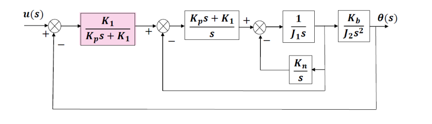
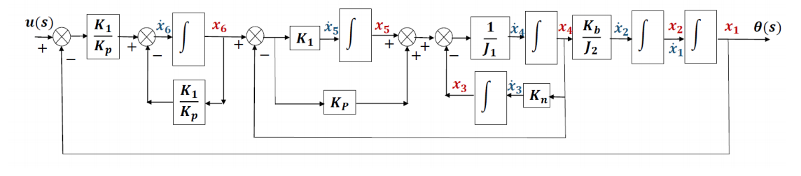
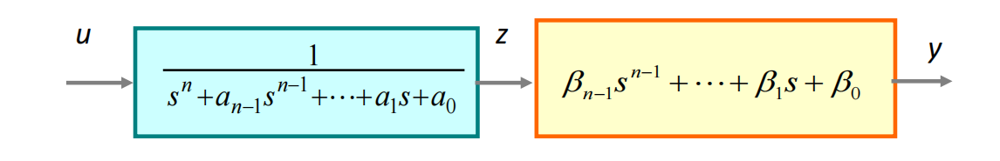
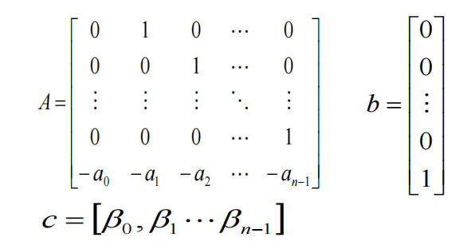

# 现代控制理论

该文档为现代控制理论的知识总结，方便期末总复习以及日后之用。

## 现代控制理论综述

现代控制理论是一门依赖于状态变量的理论，以矩阵理论为主要工具，研究深入到了系统的内部变量。相较于经典控制理论的对变换域的研究，现代控制理论的研究聚焦在时域上。现代控制理论中的非常重要的方程组如下：
$$
\dot{x}=Ax+Bu \\
y=Cx+Du
$$
其中$x$表示系统内部的状态变量。$u$为系统输入，$y$​为系统输出；第一个方程称为状态方程，第二个方程称为输出方程。上述方程组是现代控制理论的重要研究内容。

## 状态空间模型

### 系统变量(System variables)与状态变量(State variables)

系统变量：Any variable that responds to inputs and initial conditions

状态变量：The smallest set of linearly independent system variables, such that the initial condition set and applied inputs completely determine the future behavior of the system。注意：smallest linearly independent completely determine

状态变量的个数取决于：

- 描述系统的微分方程的阶数
- 传递函数分母多项式的阶数
- 系统中独立的储能元件个数（什么是独立的储能元件？）

### 如何建立系统的状态空间模型

#### 方块图法

使用方块图法的步骤：

1. 将方块图等效为只含有比例、积分、加和的方块图。
2. 选择状态变量：将积分器的输出作为状态变量。
3. 根据方块图，写出系统的微分方程。
4. 将微分方程转化为矩阵形式。

例子：

如下图所示，上面的是原方块图，下面的是经过变换的方块图。这里要特别注意一阶惯性环节（粉色框）的变换。

     
    原方块图(Original Block Diagram) 
     
    变换后的方块图

#### 机理分析

机理分析是指，根据物理学规律列出方程，并变换为状态空间方程的方法。

使用机理分析的过程：

1. 根据要求选择合适的物理量作为状态变量。一般来说，对于实际物理系统，每一个独立的储能元件对应一个状态变量。 
2. 根据物理学规律列出合适的微分方程。
3. 将微分方程转化为矩阵形式。

常见的对象有电路和力学系统。应用的分别是电路的基本定律以及牛顿定律。

#### 传递函数

传递函数方法是指，实现传递函数到状态空间方程的转换。

转换条件：传递函数是正则的。也就是说，传递函数的分母阶次$m$大于分子阶次$n$（实际上等于也可以）。从输入输出关系确定状态空间的描述的问题称为实现问题。

当$m=n$的时候，可以提取出$D=b_{n}$。

因此我们只需要考虑传递函数中满足正则性的部分。不妨写成如下的形式：
$$
g(s)=\frac{\beta_{n-1}s^{n-1}+\dots+\beta_{0}}{s^{n}+\alpha_{n-1}s^{n-1}+\dots+\alpha_{0}}
$$
通过如下的变换：

    

分两步建立状态空间方程。其中矩阵A和B通过前一个变换过程（从u到z）得到，输出矩阵C通过后一个变换过程（从z到y）得到。

状态变量的定义方式如下：
$$
\left\{
	\begin{matrix}
	x_{1}=z \\
	x_{2}=\dot{z}\\
	\vdots \\
	x_{n}=-a_{0}z-a_{1}\dot{z}-\dots-a_{n-1}z^{(n-1)}+u
	\end{matrix}
\right.
$$
这样得到的矩阵有两种：能控型和能观型。能控型矩阵如下：

    

