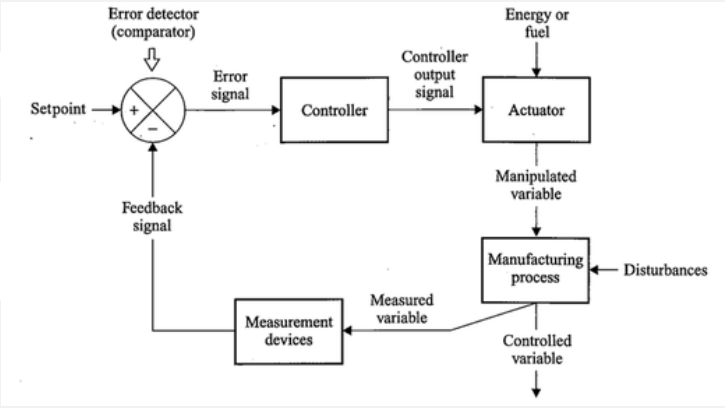

# 运动控制系统（英文班）

本文档是运动控制系统英文班的课程总结。英文班的教学以讲师提供的PPT为准。

## Industrial Control Systems

- Process control systems:
  - Regulate temperature, pressure, flow rate, liquid and solid level, pH, humidity, etc.
  - Usually in batch and continous
  - The control speed is **slow, usually in seconds to minutes**
- Motion control systems
  - Regulate speed, position, acceleration, deceleration of a mechanical object
  - Usually seen in robots, CNC and conveyor
  - The control speed is **fast, usually in milliseconds**

### Elements of open-loop and closed-loop systems

The **Motion Control Principal: Minimize the error signal**

    

Some important elements:

- Error detector: compares the setpoint to the feedback signal and produces an output signal that is **proportional to** the difference between them
- Actuator: A device that alters some type of energy or fuel supply, causing the controlled variable to match the desired setpoint
- Manipulated variable: the amout of fuel or energy is alterd by the actuator

The major difference between open-loop and closed-loop system is that there is no feedback loop in open-loop systems. We should use feedback control for motion control systems. In closed-loop motion control systems, we need to use negative feedback.

### Dynamic response

$$
Dynamic~response = Response~time + Time~ duration + Dead~ time
$$

### Feed-forward Control

Large magnitude disturbances and long delays in dynamic responses can minimize the effectiveness of feedback control. The feed-forward control is used to prevent errors from occurring. Usually they can only minimize. By adding feed-forward control to the system, corrections can be made if the controlled variable deviates from the setpoint due to unmeasurable distances.

## Controllers

Input is always error signal, but differ in speed and accuracy.

Five types of controller introduced here: On-off controller, PID controller, Time_proportion controller, FOC, SVM.

### On-off controller

Fully on or off, rise above and below the system, not suitable for tiny objects.

Deadband. The differential gap forces the controlled variable to move above or below the setpoint by a specified amount before the controlled action will change again. Differential gap is defined as the smallest change in the controlled variable that causes the value to shift from on to off, or off to on.
$$
Differential~ gap=\frac{Differential~ Gap}{Total~ Control~ Range}
$$

###  Proportional Control

Output changes proportionally to the input error signal. Two quantities: proportional gain or proportional band.
$$
Gain=\frac{percentage~ of~ output~ change}{Percentage~ of~ input~ change}
$$
Proportional Band:

$PB=\frac{Cain}{Hesuan}$

There exists high dimensional vector thata:
$$
PB=\frac{1}{Gain}*100
$$

### Proportional-Derivate Control

A derivative controller produces an output that is proportional to the rate that the error signal changes.