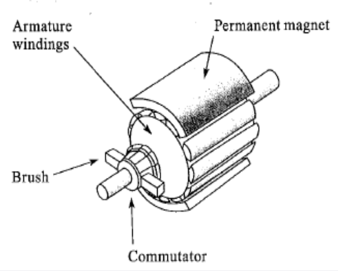
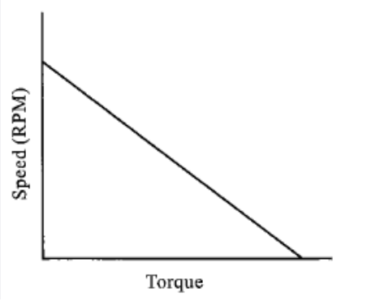
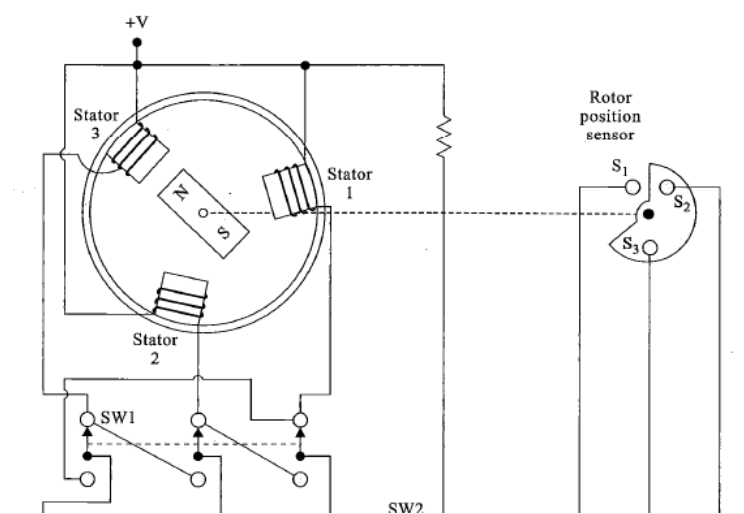
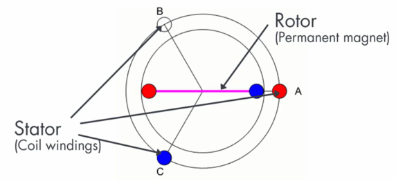
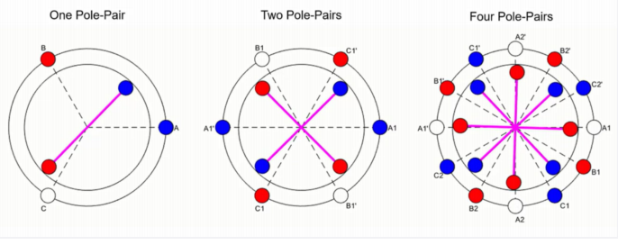
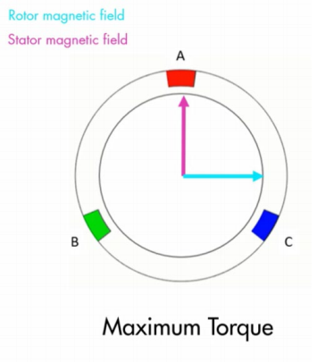
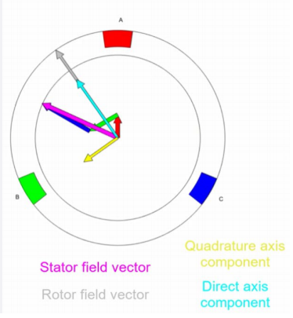
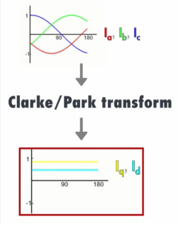
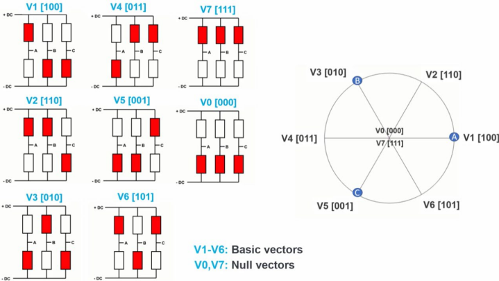

# 运动控制系统（英文班）

本文档是运动控制系统英文班的课程总结。英文班的教学以讲师提供的PPT为准。

## Industrial Control Systems

- Process control systems:
  - Regulate temperature, pressure, flow rate, liquid and solid level, pH, humidity, etc.
  - Usually in batch and continous
  - The control speed is **slow, usually in seconds to minutes**
- Motion control systems
  - Regulate speed, position, acceleration, deceleration of a mechanical object
  - Usually seen in robots, CNC and conveyor
  - The control speed is **fast, usually in milliseconds**

### Elements of open-loop and closed-loop systems

The **Motion Control Principal: Minimize the error signal**

    

Some important elements:

- Error detector: compares the setpoint to the feedback signal and produces an output signal that is **proportional to** the difference between them
- Actuator: A device that alters some type of energy or fuel supply, causing the controlled variable to match the desired setpoint
- Manipulated variable: the amout of fuel or energy is alterd by the actuator

The major difference between open-loop and closed-loop system is that there is no feedback loop in open-loop systems. We should use feedback control for motion control systems. In closed-loop motion control systems, we need to use negative feedback.

### Dynamic response

$$
Dynamic~response = Response~time + Time~ duration + Dead~ time
$$

### Feed-forward Control

Large magnitude disturbances and long delays in dynamic responses can minimize the effectiveness of feedback control. The feed-forward control is used to prevent errors from occurring. Usually they can only minimize. By adding feed-forward control to the system, corrections can be made if the controlled variable deviates from the setpoint due to unmeasurable distances.

## Controllers

Input is always error signal, but differ in speed and accuracy.

Five types of controller introduced here: On-off controller, PID controller, Time_proportion controller, FOC, SVM.

### On-off controller

Fully on or off, rise above and below the system, not suitable for tiny objects.

Deadband. The differential gap forces the controlled variable to move above or below the setpoint by a specified amount before the controlled action will change again. Differential gap is defined as the smallest change in the controlled variable that causes the value to shift from on to off, or off to on.
$$
Differential~ gap=\frac{Differential~ Gap}{Total~ Control~ Range}
$$

###  Proportional Control

Output changes proportionally to the input error signal. Two quantities: proportional gain or proportional band.
$$
Gain=\frac{percentage~ of~ output~ change}{Percentage~ of~ input~ change}
$$
Proportional Band:

$PB=\frac{Cain}{Hesuan}$

There exists high dimensional vector thata:
$$
PB=\frac{1}{Gain}*100
$$

### Proportional-Derivate Control

A derivative controller produces an output that is proportional to the rate that the error signal changes.

## DC Motors

## AC Motors

## Servo Motors

### 伺服电机的分类

伺服电机分为交流伺服和直流伺服。交流伺服电机的转速由交流频率和磁极数量决定；直流伺服电机的转速由直流电压直接决定，在负载一定的情况下，直流伺服电机的转速和电压的大小呈正比。注意，这里的直流伺服电机是带有永磁体（*Permanent magnet*）的。

直流伺服电机又分为有刷以及无刷两种。交流电机可以分为同步和异步两种。

### 有刷直流电机

有刷直流电机使用绕线式电枢（*wound armature*），定子为永磁体，置于电机的外侧。转子为线圈构成的电磁铁，一端连接电刷和换流器。一般来说，定子多为two-pole或者four-pole。

     
    有刷直流电机以及速度-力矩关系图

鉴于定子采用了永磁体，定子产生的磁场保持稳定，因此电机的速度-力矩关系具有线性性。

速度改变方式：改变电枢电压，增加电流，增强转子磁场。

反转方式：改变电流流向即可。

缺点：散热效果差，电刷和换流器需要及时更换。

### 无刷直流电机

#### 结构原理

无刷直流电机（*Brushless DC Motor, BDCM*）使用线圈缠绕成的定子，使用永磁体作为转子。一般来说，定子有三个（称三相，*three phase*），通三路直流电。一般来说，BDCM还包含一个转子的位置传感器。通过控制三路直流电流信号的通断来控制定子产生的磁场，进而控制永磁体转子的转动。

     
    无刷直流电机的结构

当三相直流电都导通时，转子不动，而且由于磁极的相互作用会和其中一个定子磁极并行排列。此时电机具有锁定力矩（*Holding torque*）。

     
    BDCM静止状态

上图所示为BDCM的*one pole-pair*（也就是转子只有一对磁极）情况。实际上BDCM还可以有多个转子磁极的情况。见下图。

     
    BDCM的不同配置

#### PWM控制方式

#### FOC控制方式

FOC（*Field-Oriented Control*）的控制目标：使得定子产生的磁场和转自产生的磁场角度保持在90°。

    

为了实现这一控制目标，FOC的控制分为以下三步进行：

1. 测量转子磁场的角度；
2. 计算对应的定子磁场的角度；
3. 控制三相磁场的电流以实现相应的定子磁场。

需要注意的是，以上所讲述的方案都是基于*one-pole pair*的情景进行的。

为了更加方便地控制定子磁场，可以将定子磁场沿着两个方向拆分：直轴（direct axis）以及交轴（quadrature axis）。其中直轴方向和转子磁场方向同向，而交轴方向和直轴方向垂直，也就是和转子磁场方向垂直。

     
    FOC中磁场的分解

如何建立三相磁场的电流和两个相互垂直的“磁场”的电流$i_{q}$和$i_{d}$之间的关系呢？使用Clarke/Park变换，可以将$i_{a}$、$i_{b}$、$i_{c}$变换为$i_{q}$、$i_{d}$。

下面简单介绍一下**Clarke/Park变换**。参考链接：[Link]([FOC中的Clarke变换和Park变换详解（动图+推导+仿真+附件代码） - 知乎 (zhihu.com)](https://zhuanlan.zhihu.com/p/172484981))。

首先是**Clarke变换**。这个变换是将一个在三相坐标系（不妨设为$ABC$）下的向量变换到静止二维正交坐标系（不妨设为$\alpha\beta$）上。表达式如下：
$$
\left[
\begin{array}{c}
f_{\alpha} \\
f_{\beta} \\
f_{0}
\end{array}
\right] = T_{Clarke}*
\left[
\begin{array}{c}
f_{A} \\
f_{B} \\
f_{C}
\end{array}
\right]
$$
其中矩阵$T_{Clarke}$表达式如下：
$$
T_{Clarke}=N*\left[
\begin{array}{ccc}
1 & -\frac{1}{2} & -\frac{1}{2} \\
0 & -\frac{\sqrt{3}}{2} & \frac{\sqrt{3}}{2} \\
\frac{\sqrt{2}}{2} & \frac{\sqrt{2}}{2} & \frac{\sqrt{2}}{2} 
\end{array}
\right]
$$
其中$N$系数在等幅值变换的时候为$\frac{2}{3}$，等功率变换的时候为$\sqrt{\frac{2}{3}}$。

应用到上面的FOC，三项坐标系下的电流为$(i_{A},i_{B},i_{C})$，变换后成为二维静止坐标系下的$(i_{\alpha},i_{\beta})$。使用到的变换就是Clarke变换。

接下来是**Park变换**。这个变换是将静止不动的二维正交坐标系$\alpha\beta$变成一个可以旋转的动态坐标系$dq$，也就是上面提到的$i_{q}$、$i_{d}$所处的坐标系。这个坐标系与转子相对静止，自然和定子相对运动。
$$
T_{Park}=\left[
\begin{array}{ccc}
\cos\theta & \sin\theta & 0 \\
-\sin\theta & \cos\theta & 0 \\
0 & 0 & 1 
\end{array}
\right]
$$
经过Park变换之后的$i_{q}$与$i_{d}$是恒定值。

综上，将Clarke变换和Park变换综合起来，就可以从三相坐标系变换为二维正交动态坐标系。

     
    Clarke/Park变换的综合效果

FOC控制方式的优劣：

1. 减小了速度和力矩的纹波
2. 操作更顺滑
3. 工作频率可以提升
4. 控制极其复杂

#### SVM控制方式

空间矢量调制（*Space Vector Modulation, SVM*）的控制目标是：通过对基本空间矢量的时间控制，近似模拟旋转矢量的效果。

参考链接：[Link]([空间矢量调制 - MATLAB & Simulink (mathworks.cn)](https://ww2.mathworks.cn/solutions/power-electronics-control/space-vector-modulation.html))。

在SVM中，基本空间矢量分为以下八种：

     
    SVM基本空间矢量

通过控制不同的空间矢量的作用时间，可以近似模拟出其他位置的矢量信号。这与PWM的原理类似。通过对开关序列的控制，实现模拟矢量的旋转。

需要注意的是，零矢量（*NULL vectors*）的运用可以减小逆变器里的损耗。

#### 无刷直流电机相比于有刷直流电机的优势

1. 基本无需维护，并且有更高的转速。
2. 电磁噪声更少。
3. 体积小，质量轻，惯性小，可以更快地加速或者反向。
4. 散热性能更好，可以承受更大地负载。
