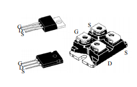
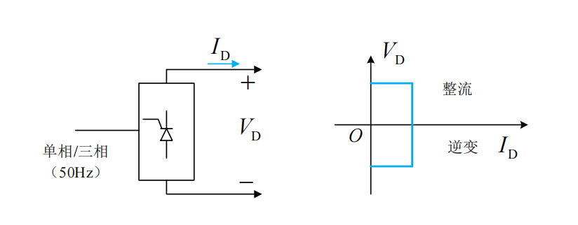

# 电力电子技术

## 第一章 电力电子技术综述

### 何为电力电子技术

电力电子技术是有效地使用电力半导体的器件、应用电路和设计理论以及分析开发工具，实现对电能的高效变换和控制的技术，包括电压、电流、频率和波形等方面的变换。

### 电力电子技术的三个要素

器件、拓扑、控制。开关模式是现代电力电子的核心特征。

### 电力电子的四大基本变换

- AC-DC：整流

- DC-AC：逆变

- AC-AC：交流调压和交-交变频

- DC-DC：斩波

### 电力电子技术的应用方向

电源、电力系统、新能源发电

## 第二章 电力电子器件

### 概念和特征

#### 概念

电力电子器件是主电路中可以直接用于处理电能、实现电能的变换或控制的电子器件。

#### 特征

- 处理功率大
- 总是工作于开关模式
- 需要控制电路：信息电子电路
- 需要驱动电路：驱动电路是电力电子主电路与控制电路的接口，放大来自控制电路的信号功率来达到开通和关断功率器件的目的
- 功率损耗大：一般需要散热器

#### 损耗

- 通态损耗：通态电压乘以电流产生的损耗
- 开关损耗：分为开通损耗和关断损耗。器件开通一次和关断一次所消耗的能量
- 断态损耗：器件关断并承受反压时由于漏电流造成的损耗，一般很小

#### 分类

- 不可控器件：不能用信号控制器通断
- 半控型器件：可以控制其开通但是不能控制其关断的器件。器件的关断完全由其在主电路中承受的电压和电流决定。
- 全控型器件：既可以控制其开通也可以控制其关断的器件。

其中全控型器件又可以分为**电流型**和**电压型**。电流型器件通过从基极注入和抽出电流来实现器件的通断，因而有限的电流增益值导致大功率器件的开通需要较大的控制或驱动功率。电压型器件则是在控制极上施加正向控制电压或者反向电压，通过电场来控制器件的通断。

常见的电流型器件：

- GTO
- GTR
- SCR（普通晶闸管）

常见的电压型器件：

- Power MOSFET
- IGBT

根据器件内部导电的粒子性质，全控器件又可分为**单极型**、**双极型**和**复合型**三类。器件内部只有一种带电粒子的称为单极型器件（多子导电器件），速度快；器件内部有电子和空穴两种带电粒子参与导电的称为双极型器件。由双极型器件和单极型器件复合成的器件称为复合型器件。

常见的多子导电器件：

- Power MOSFET
- Schottky Barrier Diode（SBD）

常见的双极型器件：

- GTR
- GTO
- Power Diode
- SCR

常见的复合型器件：

- IGBT

### 电力电子器件基础：PN结

#### PN结的掺杂、扩散、漂移、空间电荷区

- PN结的P区掺杂负离子（如硼），多子为空穴，少子为电子；N区掺杂正离子（如磷），多子为自由电子，少子为空穴。

- P区空穴向N区运动，N区自由电子向P区运动，称为扩散运动。留下的杂质离子在P区和N区的交界面形成了空间电荷区（耗尽层、势垒层、阻挡层），区内的内电场方向从N区指向P区。内电场使得P区的少子电子向N区运动，N区的少子空穴向P区运动，称为漂移运动。扩散运动和漂移运动达到动态平衡，系统稳定。

#### PN结的正偏

PN结P端正电压N端负电压导致PN结发生正偏现象。正偏导致：

- 正向电流的形成，利于扩散，抑制漂移。

- 空间电荷区变窄，多数载流子扩散进入空间电荷区。

- 少子存储效应

  因为外电场作用，内电场对扩散运动的阻挡减弱，多数载流子在扩散进入无阴影区域后，部分将继续越过空间电荷区到达PN结另外一侧成为少数载流子，这些载流子在越过空间电荷区以后，部分会很快与多数载流子复合消失，少数来不及复合的过剩少子存储在空间电荷区外两侧，其浓度随着与空间电荷区的距离增长呈指数衰减，而浓度的峰值则与外电场的电势差呈指数关系，这种现象叫做少子的存储。

#### PN结的反偏

在反偏的情况下：

- 反向漏电流：载流子的漂移运动大于扩散运动，少数载流子越过空间电荷区形成反向漏电流。由于少数载流子浓度低，因而漏电流一般较小。

- 空间电荷区变宽，多数载流子被电场推走。

- 少数载流子抽取

  空间电荷区的内电场与外电场同向，电场强度被加强，所以，漂移运动得到加强，少子在空间电荷区加速运动，少子因为漂移运动越过空间电荷区到达另外一侧成为多子，而空间电荷区外两侧迁移的少子被抽取而来不及被补充，其密度接近于零。

#### PN结的反向击穿

分为雪崩击穿、齐纳击穿、热击穿

高电压为雪崩击穿（价电子撞价电子），低电压为齐纳击穿（高掺杂浓度中加反向电压导致电场把电子拉出来）

注意雪崩击穿和齐纳击穿都是可逆的。若反向电压和反向电流的乘积过大，超过了PN结容许的耗散功率，导致热量无法散发，PN结温度上升直至过热而烧毁。热击穿不可逆。

#### PN结的结电容$C_{J}$

PN结的电容效应是指PN结中的电荷量随外加电压变化而变化。频率越高，PN结的电容效应越明显。分为势垒电容和扩散电容。由于高速开关的状态下，结电容会使二极管的单向导电性变差，因此结电容决定了PN结可以工作的最高频率。

- 势垒电容$C_{B}$：PN结正偏时，多数载流子注入空间电荷区无阴影部分，使得空间电荷区变窄，反偏时，多数载流子从空间电荷区两侧移出，使得空间电荷区变宽。外电压的变化使得空间电荷区未被中和的离子数量发生变化，产生电容效应，PN结仿佛是电容的极板。需注意，**正向偏置和反向偏置都会引起势垒电容效应**。
- 扩散电容$C_{D}$：少数载流子在空间电荷区外的两侧因外电压（正偏或反偏）变化而发生的存储与抽取，产生电容效应。扩散电容**主要与正向偏压有关**。因为扩散电容**主要是少数载流子存储**引起，所以也叫存储电容。注意，**扩散电容和正偏、反偏都有关系，但是反偏时不明显**。

总结起来，势垒电容主要与正向、反向电压的变化有关。扩散电容和通过PN结的电流大小相关。正向电压较低和反向偏置时，都以势垒电容为主，正向电压较高，电流增大，以扩散电容为主。

### 不控器件：功率二极管

#### 能够承受高电压、大电流的原因

**大电流**

- 功率二极管的体积较大，具有更多的PN结单元，以并联方式承担电流
- 功率二极管大多是垂直导电结构，使得硅片中通过的电流有效面积增大，提高二极管的通流能力。以上两点为可以通过大电流的原因。

**高电压**

- 功率二极管在P区和N区之间多了一层低掺杂N-区，形成了**P-i-N结构**，掺杂浓度低的N-区可以承受很高的电压。

#### 功率二极管的应用与分类

- 整流、续流、钳位
- 分类：
  - 普通二极管：亦称整流二极管，多用于开关频率不高的整流电路中，开关频率在$1kHz$以下。反向恢复时间较长，一般在$5\mu s$以上。正向压降小。
  - 快恢复二极管：反向恢复时间短，恢复过程非常短。一般在$5\mu s$以下。
  - 肖特基二极管（Schottky Barrier Diode）：恢复过程非常短，一般$10-40ns$。

#### 电导调制效应

电导调制效应可以解释在存在低掺杂N-区这种高电阻率的区域时，正向压降没有显著增加的原因。

由于低掺杂N-区的存在，当电流增大的时候，从P区注入并积累在N-区的空穴浓度增加，为了维持半导体的电中性，其多子浓度也将大幅度增加，使得电阻率明显下降，电导率大大增加。这样，功率二极管在正向电流较大的时候压降不会线性上升，而是仍然维持在一个较低的水平，2V左右。

#### 功率二极管的静态特性

单向导电性，注意结合前面提到的电导调制效应来理解。

#### 功率二极管的动态特性——开通和关断过程

从反向偏置（或零）转为正向偏置，电压出现过冲$V_{FP}$：

- 电导调制效应起作用需要一段时间，因此在到达稳态导通之前，管压降较大
- 正向电流的上升会因器件自身的电感产生较大的压降。所以电流上升率越大，压降$V_{FP}$越高。 

从正偏转为反偏：

- $t_{3}$期间：在反向电压的作用下正向电压下降到零。

- 延迟时间$t_{4}$：抽取空间电荷区两侧（特别是多掺杂N区）存储的少子，形成反向电流。
- 电流下降时间$t_{5}$：抽取空间电荷区两侧较远的少子，因为浓度较低，因此反向电流下降，加上外电路的寄生电感的作用，产生很大的反向电压$V_{rr}$。

定义反向恢复时间为$t_{rr}=t_{4}+t_{5}$。定义恢复特性的软度$S_{r}=\frac{t_{5}}{t_{4}}$，也称恢复系数。恢复系数越大，恢复性能越软，则尖峰、振荡越小。

#### 肖特基二极管（Schottky Barrier Diode）

利用金属和N型半导体的表面接触形成势垒的非线性特性制成的二极管。

SBD是多子导电的单极型器件，没有少子存储效应，反向恢复时就没有了抽取少子的过程，理论上$t_{rr}$为零。开通损耗很低。

### 半控器件：晶闸管

#### 结构、符号及等效电路

三端四层结构以及符号

     
    三端四层结构以及符号

其等效电路如图：

     
    晶闸管的等效电路以及获得方法

#### 工作原理

开通条件：

- 正常的开通

  - 正向偏置；
  - 施加门极触发电流$I_{G}$；

  正常开通的过程描述：门级施加触发电流$I_{G}$，导致$T_{2}$晶体管的集电极电流$I_{C2}$增加。$I_{C2}$的增加导致$T_{1}$晶体管的集电极电流$I_{C1}$增加，进而导致$T_{2}$晶体管的门极电流继续增加，形成正反馈。此时即使将$I_{G}$撤销，晶闸管也会继续导通。

- 非正常的开通

  - $v_{AK}$过高，雪崩击穿；
  - $\frac{\text{d}v}{\text{d}t}$过高，寄生电容触发；
  - 过高的结温，通过漏电流触发；

饱和导通的边界条件：
$$
I_{A}=\frac{\alpha_{2}I_{G}+I_{CBO1}+I_{CBO2}}{1-(\alpha_{1}+\alpha_{2})}
$$
可以将$\alpha_{1}+\alpha_{2}\approx 1$作为晶闸管饱和导通的边界条件。导通后上式不再成立，$\alpha_{1}+\alpha_{2}\textgreater1$，约为$1.15$。关断时，外电路条件变化使得$\alpha_{1}+\alpha_{2}\textless1$，器件退出饱和而关断。

关断条件：

反偏+电流过零。通过外加反向电压和外电路的作用使得流过晶闸管的电流降低到维持电流以下。

#### 静态特性

明显$I_{G2} > I_{G1} > I_G$

注意，即使没有门极触发电流晶闸管也可以导通，但是“硬开通”对晶闸管不利。晶闸管开通后即可撤除$I_{G}$。晶闸管本身压降比较小，在$1V$左右。

另，图中的$I_{H}$称为**维持电流**，是指使晶闸管维持导通所必须的最小电流。另一个概念是$I_{L}$，**擎住电流**，是晶闸管刚从断态转入通态并移除触发信号时能维持导通所需要的最小电流。$I_{L}$约为$I_{H}$的2~4倍。

#### 动态特性

开通时间：

- 延迟时间$t_{d}$：从门极电流阶跃开始，到阳极电流上升到稳态值的$10\%$所需的时间；
- 上升时间$t_{r}$：阳极电流从稳态值的$10\%$上升到$90\%$所需的时间。

- 开通时间$t_{on}=t_{d}+t_{r}$。

关断时间：

- 反向阻断恢复时间$t_{rr}$：同前功率二极管，注意分为两个阶段。
- 正向阻断恢复时间$t_{gr}$：和门极相关的PN结的少子，难以通过外电路抽取，只能通过自身来复合，过程较慢，因此晶闸管恢复其对正向电压的阻断能力还有一段时间。在正向阻断恢复时间里，如果重新对晶闸管施加正向电压，晶闸管会重新导通。
- 关断时间$t_{off}=t_{rr}+t_{gr}$。

#### 晶闸管的重要参数

额定电压$V_{TM}$：一般为实际正常最大工作电压的$2\sim3$倍。

额定通态平均电压$V_{T(AV)}$：规定的环境温度下，晶闸管通以正弦半波额定电流时，阳极与阴极间的电压降的平均值。

额定通态平均电流$I_{T(AV)}$：晶闸管所允许的最大工频正弦半波电流的平均值，称为额定值。选用晶闸管时，额定电流通常要选到实际最大电流的$1.5\sim2$倍。

维持电流$I_{H}$和擎住电流$I_{L}$：见前。

以上参数会在后续的**晶闸管整流电路**分析里有重要作用。

#### 晶闸管派生器件

快速晶闸管（FST）：关断时间大约数十微秒。

双向晶闸管（TRIAC）：同一门极控制正反两个方向的导通（正负电压信号）。

逆导晶闸管（RCT）：不具有承受反压的能力，符号是晶闸管符号末端有勾。

光控晶闸管（LTT）：特定波长的光照射会导通，可以绝缘。

### 全控器件

我们希望全控器件具有的特性：

- 低漏电流
- 低导通电压
- 开通、关断速度快
- 要求器件的$\frac{\text{d}v}{\text{d}t}$和$\frac{\text{d}i}{\text{d}t}$的承受能力强
- 正温度系数
- 控制功率低（触发功率小）

#### GTR(BJT)，电流驱动

特点：

- 基极很宽，电流增益有限（5~10倍），适合于按照达林顿法连接，低导通电压
- 低掺杂N-区，耐受高电压

静态特性：

GTR工作在**截止区**或者**饱和区**，呈现开关状态。

动态特性：

- 延迟时间$t_{d}$：从基极电流稳态值的$10\%$开始到集电极电流上升到其稳态值的$10\%$的时间。上升时间：老定义。

- 关断时间包括了存储时间$t_{s}$以及电流下降时间$t_{f}$，前者用来去除饱和导通时存储在基区的载流子的。BJT的存储时间长，一般用基极反向电流来加速关断。GTR可以快速关断，时间大约为几个微秒，快于晶闸管和GTO，其原因在于没有残存的少数载流子复合时间。

     
    GTR动态特性

GTR具有**负的温度系数**，不易并联，这也导致它具有**二次击穿**现象。

#### GTO，电流驱动

结构和晶闸管一样，时PNPN四层半导体结构。但是GTO是一种多元的功率集成器件。

特点：

- 在门极施加负的电流脉冲进行关断，关断时也会产生正反馈。
- GTO具有以下的特点，使之能够自主关断：
  - 设计的$\alpha_{2}$比较大，使得晶体管$T_{2}$控制灵敏，易于关断
  
  - 导通后$\alpha_{1}+\alpha_{2}$更接近于1（1.05），接近临界饱和，有利门极控制关断（但是同时也导致导通时管压降增大，约为$2\sim 3V$）。

    关断增益公式如下。相比于晶闸管，GTO的关断增益要大很多，但是绝对值并不很大，这也是晶闸管的一个问题。
    $$
    \beta_{off}=\frac{I_{A}}{I_{G}}=\frac{\alpha_{2}+\frac{I_{CBO1}+I_{CBO2}}{I_{G}}}{(\alpha_{1}+\alpha_{2})-1}
    $$
  
  - 多元集成结构使得每个GTO元阴极面积很小，门极和阴极的距离大为缩短，使得$P_{2}$基区横向电阻很小，从门极抽取出较大电流成为可能。
  
- 通常GTO用在**低频大功率**场合。虽然可以自主关断，但是需要精巧、复杂的**门极控制电路**以及**开通关断吸收电路**。

动态特性：

- 开通过程与晶闸管相同
- 关断过程：

存储时间$t_{s}$、电流下降时间$t_{f}$以及**尾部时间**$t_{t}$。其中尾部时间用于残存的载流子复合。通常$t_{f}\ll t_{s}< t_{t}$。

#### 功率MOSFET，电压驱动

     
    MOSFET封装与符号

- 按照导电沟道，MOSFET可以分为：P沟道和N沟道；

- 栅极电压为零，存在导电沟道：耗尽型；栅极电压为正，存在导电沟道：增强型。

应用最多的是N沟道增强型。D漏极，G门极，S源极

**特点**：

- N沟道增强型具有N+PN-N+四层垂直结构，采用垂直导电结构，提高了耐压和通流能力
- 电压型器件，输入阻抗极高，输入电流非常小，驱动功率远小于电流型器件
- MOSFET具有体内的寄生二极管，但是其性能并不好，与IGBT特意植入的二极管是有区别的。
- 多子导电，实现快速开关，没有少数载流子抽取、复合时间。
- 减小门极电阻$R_{G}$可以增加开关速度
- 工作频率最高，可达$100kHz$以上。
- 正温度系数，易并联

**工作状态**：(题目可能会有判断工作状态)

- 截止 $V_{DS} >0,V_{GS}=0$或开路
- 正向导通 $V_{DS} >0,V_{GS}>0$ 电流正向流过
- 反向二极管导通：通过MOSFET内的寄生二极管导电$V_{DS} <0,V_{GS}=0$或开路
- 反向导通：$V_{DS}<0$，$V_{GS}>0$，电流反向流过，用于同步整流。

**静态特性**：

     
    MOSFET输出特性曲线和转移特性曲线

- 注意分为三个区域：欧姆区、饱和区、截止区。MOSFET的饱和区也可以称为放大区。对比BJT。BJT工作在截止区或者饱和区，呈现开关状态。而MOSFET工作在截止区和欧姆区。
- 跨导曲线如上右图。

**动态特性**：重点是$C_{GD}$的动态变化。

   
     MOSFET等效模型以及饱和区、欧姆区模型以及CGD随VDS的变化

$C_{GD}$的动态变化对于开关过程影响较大，是后续理解米勒平台现象的基础。

**开通四阶段等效图以及相应分析**

     
    MOSFET四阶段静态曲线运动轨迹图

开通的四个阶段：

1. 延迟时间$t_{d}$

   对$C_{GS}$和$C_{GD}$两个电容充电，主要考虑对$C_{GS}$电容的充电，时间常数为$R_{G}(C_{GS}+C_{GD1})$，直到其到达开启电压$V_{GS,th}$，结束该阶段。二极管$D_{1}$开通，$V_{DS}$被钳位。

2. 电流上升时间$t_{ri}$

   从二极管到MOSFET的换流开始。$V_{DS}$仍旧被钳位。此时段直到$i_{D}=I_{O}$结束。主要考虑对$C_{GS}$的充电，时间常数同前。

3. 电压下降时间$t_{fv1}$，二极管关断不再钳位$V_{DS}$。门极驱动电路开始对$C_{GD}$反向充电，$V_{DS}$快速下降。这一阶段可以对应上静态曲线运动轨迹图中的横向线段。

   **米勒平台的成因**

   - $i_{D}$满载不变，受到跨导曲线的约束，$V_{GS}$必定不变
   - 随着$V_{DS}$的下降，$C_{GD1}$上升，驱动电路几乎只对$C_{GD}$充电，不再对$C_{GS}$充电，$V_{GS}$几乎不变。充电时间常数为$R_{G}C_{GD1}$。

4. 电压下降时间$t_{fv2}$

   仍旧是对电容$C_{GD}$充电。但是此时源极和漏极之间等效为一个电阻，$C_{GD2}$代替了原来的$C_{GD1}$。由于$C_{GD}$变得很大，仍旧可以忽略对于$C_{GS}$的充电。此时充电时间常数远大于$t_{fv1}$阶段，因此$V_{DS}$下降速度很慢。我们可以说，米勒平台的持续时间为$(t_{fv1}+t_{fv2})$。

5. 继续充电

   第四阶段结束后，驱动电路将继续给$C_{GS}$充电，直到达到一个稳定值。

关断的四个阶段：

和开通的四个阶段一一对应：

分为延迟时间、电压上升时间$t_{rv1}$、电压上升时间$t_{rv2}$、电流下降时间$t_{fi}$。

#### IGBT，电压驱动

相当于在MOSFET漏极加入了P衬底，额外引入了一个PN结，实现了对低掺杂N-区的电导率调制，引入了电导调制效应。结构为N+PN-N+P五层结构。

IGBT可以看成由MOSFET控制的GTR，由GTR和MOSFET组成达林顿结构。

引入电导调制效应使得IGBT具有很强的通流能力，在大电流下其导通电压要比MOSFET小很多。

**静态特性**

输出特性的分区为：饱和区、有源区、截止区。注意和前面的MOSFET以及GTR的分区相区别。工作状态是在截止区和饱和区之间来回切换。

转移特性曲线如下：

类比MOSFET的转移特性曲线

**动态特性**

低导通损耗，类似GTR；电压型器件类似MOSFET，开关频率在二者之间。IGBT的开通关断过程和MOSFET有所不同，也不再是一个工整的对称过程，原因是IGBT实际上是两个器件的正向串联结构。

**开通波形**：

动态特性类似于MOSFET，但是有以下几点不同：

- 开通过程中$t_{fv2}$不对应米勒平台；原因在于MOSFET的栅漏电容是和GTR的结电容串联的，共同决定充电时间常数。对于MOSFET来说，虽然在这一阶段跨导曲线已经不再成立，但是由于$C_{GD}$非常大，因此仍然可以认为$C_{GS}$不被充电；而IGBT则不是如此了。

- 关断过程中电流下降分为两段，存在拖尾电流时间；第一个时间段内MOSFET和GTR一起关断，第二个时间段内MOSFET已经关断，PNP晶体管关断。PNP晶体管内部无基区存储少子抽取通道，N基区内的少子复合缓慢，电流下降较慢，形成了电流拖尾现象。

  PNP晶体管的存在，虽然可以增加器件的通流量，但是引入了**少子存储现象和拖尾电流效应**，开关速度要低于MOSFET，并且关断损耗更大。

和MOSFET的区别：上升时期：$v_{GS}$只有$t_{fv1}$对应米勒平台，原因是MOSFET的栅电容和BJT的结电容串联，

下降时期：电流$i_c$有两段，而MOSFET只有一段，因为IGBT存在少子拖尾现象（t1结束，MOSFET关断，造成GTR没有少子的抽取通道，造成少子复合缓慢）

### 驱动电路

电力电子主电路和控制电路之间的接口，主要功能是驱动、保护、隔离。首先放大控制电路的信号使其能够驱动功率器件。其次提供主电路和控制电路之间的电气隔离，一般采用光隔离和磁隔离。对于电流型器件、电压型器件有着不同的驱动电路。

### 吸收电路（缓冲电路）

缓冲电路可以分为关断缓冲电路和开通缓冲电路。前者用于吸收器件的关断过电压和换相过电压，抑制$\frac{\text{d}v}{\text{d}t}$，减小关断损耗。开通缓冲电路用于抑制期间开通时的电流过冲和$\frac{\text{d}i}{\text{d}t}$，减小器件的开通损耗。

一般只用关断缓冲电路，因$L_{i}$会造成关断过电压。

## 第三章 电力电子电路和磁路的基本分析方法

### 电力电子电路的稳态

如果电路**波形以周期T重复**，则认为电路达到稳态。

### 非正弦稳态电路的谐波分析

以线电流畸变为例

二极管整流电路里面，稳态下的输入电流是基波分量和谐波分量之和。$i_{s}(t)=i_{s1}(t)+\sum_{h\ne1}i_{sh}(t)$。对应的有效值分别为$I_{s1}$以及$I_{sh}$。

电流有效值为：$I_{s}=\sqrt{I_{s1}^{2}+\sum_{h\ne1}I_{sh}^{2}}$。畸变分量有效值为：$I_{dis}=\sqrt{\sum_{h\ne1}I_{sh}^{2}}$。

总谐波畸变率$THD=\frac{I_{dis}}{I_{s1}}=\frac{\sqrt{I_{s}^{2}-I_{s1}^{2}}}{I_{s1}}$。

平均功率为$P_{av}=V_{s}I_{s1}\cos\phi$。

视在功率为$S=V_{s}I_{s}$。

功率因数为$PF=\frac{P_{av}}{S}=\frac{I_{s1}}{I_{s}}\cos\phi$。

位移功率因数$DPF=\cos\phi$。

### 伏秒平衡和安秒平衡

#### 伏秒平衡，针对电感

电感在一个周期内电压平均值为零。

#### 安秒平衡，针对电容

电容在一个周期内电流平均值为零。

## 第四章 DC-DC变换器

### DCDC变换器的分类

- 隔离式变换器：通过变压器进行隔离，例如单管的正激式变换器、反激式变换器
- 非隔离式变换器：升压式变换器、降压式变换器、升降压变换器等

### PWM和PFM

- 占空比$D$
- 调制波、载波的形状

### Buck变换器

#### 电路结构

电路中的元件的作用

- 二极管：续流，在开关关断的时候释放电感能量来保护开关
- LC电路：滤波，滤除谐波成分，使负载侧得到稳定的直流电压

进行分析时的理想化条件：

- 所用的电力电子器件理想，开关和二极管的导通时间为零，通态电压和断态漏电流均为零
- 在一个开关周期中，输入电压$V_{D}$、输出电压$V_{O}$均保持不变
- 电感和电容均为无损耗的理想储能元件
- 不计线路阻抗

#### CCM模式分析

其中：
$$
i_{L}=\frac{V_{D}-V_{O}}{L}t+i_{L}(0)
$$
根据伏秒平衡：
$$
\frac{V_{O}}{V_{D}}=D
$$

#### CCM边界

$$
I_{LB}=I_{OB}=\frac{1}{2}i_{\text{l,peak}}=\frac{V_{D}-V_{O}}{2L}t_{on}=\frac{DT_{s}}{2L}(V_{D}-V_{O})
$$
当输入为常量，或者输出为常量的时候，代入$\frac{V_{O}}{V_{D}}=D$，可以得到不同的结果。输入电压恒定的时候，占空比为$0.5$时，输出电流最大；输出电压恒定时，占空比为$0$时，输出电流最大。

#### CCM输出电压纹波

为了分析输出电压的纹波，需要假定负载电流恒定无波动。得到的结论为：
$$
\frac{\Delta V_{O}}{V_{O}}=\frac{T_{s}^{2}(1-D)}{8LC}
$$

### Boost变换器

#### 电路结构

电路元器件的作用

- 二极管：阻断二极管，防止开关闭合之后电容短路
- 电感：存储、传输能量

#### CCM模式分析

根据伏秒平衡得到的关系式：
$$
\frac{V_{O}}{V_{D}}=\frac{1}{1-D}
$$
同时要注意：
$$
\frac{I_{O}}{I_{D}}=1-D
$$
这个关系式在后面的边界分析中非常有用。

#### CCM边界

分析得到：
$$
I_{LB}=\frac{1}{2}i_{\text{l,peak}}=\frac{V_{D}}{2L}t_{on}=\frac{DT_{s}}{2L}V_{O}(1-D)\\
I_{OB}=(1-D)I_{LB}
$$
当$D=\frac{1}{3}$时，输出电流$I_{OB}$取得最大值。$D=0.5$时，电感电流$I_{LB}$取得最大值。

#### 寄生参数的影响

#### CCM输出电压纹波

电压纹波：
$$
\frac{\Delta V_{O}}{V_{O}}=\frac{DT_{s}}{RC}
$$

### Buck-boost变换器

#### 电路结构

注意输出的电压的极性与输出的电压相反。电路可以看作是buck和boost的顺向串联。因此我们有：

#### CCM模式分析

得到：
$$
\frac{V_{O}}{V_{D}}=\frac{D}{1-D}
$$
并且注意：
$$
I_{O}=(1-D)I_{L}
$$
这一结论在推导CCM边界模式的时候非常有用。

#### CCM边界

边界模式下，有：
$$
I_{LB}=\frac{V_{D}}{2L}t_{on}=\frac{T_{s}V_{D}}{2L}D=\frac{T_{s}V_{O}}{2L}(1-D)\\
I_{OB}=(1-D)I_{LB}
$$
寄生参数的分析同Boost电路的分析相同。

#### CCM输出电压纹波

纹波表达式同boost相同：
$$
\frac{\Delta V_{O}}{V_{O}}=\frac{DT_{s}}{RC}
$$
注意Buckboost电路和boost电路的区别：

- 二者原理相近，但是boost电路供电时电源和电感同时供电；buckboost电路供电时只有电感单独供电
- buckboost对输入输出电流脉动和输出电压纹波都起不到抑制作用

### 三种拓扑结构的比较

为什么buckboost电路的最高效率也要低于buck或者boost电路的在同一占空比下的效率？

- DCDC变换器中存在的两种能量变换形式，以及开关利用率的高低问题。

### 隔离型DCDC变换器

#### 总述

隔离型DCDC变换器实际上是DC-AC-AC-DC变换器。其基本的工作流程如下图所示：

上面是隔离型DCDC变换器的基本工作流程和金字塔型结构。

#### 单端正激变换器

##### 电路结构

电感$N_{3}$和二极管$D_{3}$构成了磁复位结构。磁复位是正激变换器的鲜明结构。

其实质上是buck变换器插入变压器后得到的。

##### CCM工作模式分析

总共四个工作阶段，通过对电感$L$使用伏秒平衡，可以推断出：
$$
\frac{V_{O}}{V_{D}}=\frac{N_{2}}{N_{1}}D
$$
另外，为什么要做磁复位？

- 从磁通的角度来看，如果磁通不能复位，最终会导致磁心饱和
- 从励磁电感的角度来看，必须设法使得励磁电感的电流降为零，否则会导致励磁电感的饱和

#### 单端反激变换器

##### 电路结构

单端反激变换器由buckboost变换器变换得来。注意，不需要磁复位了。反激变换器的励磁电流复位不要求$i_{m}$回到零，只要复位到起始值即可，这一点与正激变换器有很大不同。

##### 气隙的加入

反激变换器的变压器磁芯在CCM 模式下，相当于磁芯中一个交变磁通分量叠加在一个直流偏磁上，磁芯工作在很大直流偏置的局部磁化曲线上。由于含有较大的直流分量，因此磁芯中产生很大的磁场强度 *H*，为了不使磁芯饱和，磁芯的磁导率不应太高。对于反激变换器，需要采用铁氧体类的高磁导率磁芯来增加原副边的耦合，因此需要在磁路中添加气隙减少有效磁导率，以防止磁芯饱和。会在更大的磁场强度$H$或电流下，才能达到饱和磁密$B_{m}$。

##### 为什么没有磁复位电路

正激变换器在激磁期间同时向次级传递能量，在截止期间需要通过复位电路向电源回馈能量来实现磁复位；反激变换器在激磁期间只通过励磁电感存储能量而不向次级传递，在截止期间向次级传递能量并同时实现磁复位。

##### CCM工作模式分析

CCM工作模式仅仅有(a)、(b)两个。

根据伏秒平衡，可以推得：
$$
\frac{V_{O}}{V_{D}}=\frac{N_{2}}{N_{1}}\frac{D}{1-D}
$$
两种变换器的比较

- 反激变换器的功率小于正激变换器的功率
- 反激变换器的效率小于正激变换器的效率
- 但是反激变换器更常用。因为其电路简单、使用的元器件数量少，成本低，特别适合小功率、多路输出的场合。

### 全桥变换器

实现了正向、反向的驱动和制动

#### 双极性控制

输出电压在一个开关周期内具有两个极性。

如果$v_{control}\textgreater v_{tri}$，则$T_{A+}$和$T_{B-}$开通。否则$T_{A-}$和$T_{B+}$开通。注意在电流$I_{O}$不同的情况下，器件开通情况的不同，输出电压的不同。

特别注意输出电压增益的推导过程。其中利用了相似三角形原理。
$$
\frac{V_{O}}{V_{D}}=m=\frac{v_{control}}{\overline{V_{tri}}}
$$

#### 单极性控制

当$v_{control}> v_{tri}$，开通$T_{A+}$，否则开通$T_{A-}$。同样地，当$-v_{control}>v_{tri}$，开通$T_{B+}$，否则开通$T_{B-}$。电压增益的推导过程和最终结果与上面的双极性控制的结果相同。
$$
\frac{V_{O}}{V_{D}}=m=\frac{v_{control}}{\overline{V_{tri}}}
$$

#### 输出电压纹波

## 第五章：DC-AC变换（逆变器）

### 分类：

最常用分类是按直流侧储能元件的性质，分为**电压型逆变器（VSI）**和**电流型逆变器（CSI）**。注意电流型逆变器的结构也要牢记。电流型逆变器输出的电流为**方波**（基波为正弦），输出电压为正弦；电压型逆变器输出的电压是方波（基波为正弦），输出的电流为正弦。

    

#### **单相电流型逆变器**

调制对象是恒定的电流输入，输出电流为方波。输出电流方波的基波接近谐振频率，因而输出电压波形为正弦波

#### **单相电压型逆变器（重点）**

**SPWM**：用脉宽按照正弦规律变化的一系列脉冲来代替正弦波，得到的响应基本和正弦波相同，会有部分畸变，是由于高频段仍然存在差异，用LC滤波器处理，详情见单极性和双极性调制的仿真。理论基础如下。

**面积（冲量）等效原理**：当面积相等而形状不同的窄脉冲作用于同一个惯性环节时，其响应基本相同，尤其是在低频段。我们可以通过冲量等效来调制任何波形。

**SPWM工作原理**：利用三角波和正弦波来实现。如图,O点为参考接地电压，恒为零，上下母线均为$\frac{V_D}{2}$，当三角波大于正弦波的时候，$T_-$闭合，A接在负母线上，输出电压$V_{OA}=-\frac{V_D}{2}$,当正弦波大于三角波时，$T_+$闭合，A接在正母线上，输出电压$V_{OA}=\frac{V_D}{2}$，就能得到SPWM。

调制比$m_a$和载波比$m_f$
$$
m_a = \frac{\bar{V}_{control}}{\bar{V}_{tri}}, m_f = \frac{f_s}{f_l}
$$
其中$\bar{V}_{control}$为调制波正弦波$v_{control}$ 的幅值，$\bar{V}_{tri}$ 是载波三角波$v_{tri}$的幅值,$f_s$为三角波频率，$f_l$为载波频率。

    单桥臂逆变器参考结构

单桥臂逆变器注意：

1. 需要电容中点作为输出点。
2. 桥臂上下开关不会同时开通或者关断（死区区间，造成电压过冲和电源和地短路）。
3. A端接正，O端接负。

#### **电压增益推导**：

通常三角波频率远高于正弦波（为了脉冲宽度更好地拟合），所以在几个三角波周期内，正弦波的幅值可以认为是常数。我们以其中一条母线为参考，也就是图中的N点。

首先，根据本身的拓扑结构
$$
V_{AO} = V_{AN}-\frac{V_D}{2}
$$
利用第四章全桥斩波器的结论
$$
V_{AN} = D_1V_D = \frac{1}{2}(1+ \frac{4t_1}{T_s})V_D = \frac{1}{2}(1+\frac{v_{control}}{\bar{V}_{tri}})V_D = \frac{1}{2}(1+m_a)V_D
$$
其中是$m_{a}$调制比，$D_1$为占空比，由图中可知$D = \frac{2t_1 + \frac{Ts}{2}}{T_s}$，变形即可。

以上两式消去$V_{AN}$即可得到电压增益
$$
V_{AO} = \frac{v_{control}}{\bar{V}_{tri}}\frac{V_D}{2}
$$
如果推广到整个周期，$v_{control} = \bar{V}_{control} * \sin \omega t$ 即可

谐波特征：

无需知道具体推导过程，只需记住一些重要结论即可。

1. 输出电压：包含基波，开关次及其倍数次谐波，以及以开关次倍数次为中心的边频带谐波。

2. 在开关次谐波的时候，谐波含量是最高的。

3. 当选择$m_f$为奇数，可以达到消除偶次谐波的目的。

4. 在调制波小于载波幅值时，输出基波与调制比成线性关系

5. 输出在开关频率处的谐波幅值比较大，当时$m_a < 0.6$甚至超过基波幅值

**同步调制** **Synchronous modulation**

当调制波发生变化时，载波频率相应地变化，从而保持载波比**$m_f$**为常整数。载波比比较小时，一般采用同步调制。

优点：有效抑制间谐波的产生

缺点：逆变器输出频率较低时，同步调制的载波频率也需要很低，逆变器输出频率较高时，载波频率又会太高，开关难以承受。可以通过**分段同步调制**克服，在输出频率高时$m_f$较低，反之$m_f$较高，为了防止震荡可加入滞环。

**异步调制** **Asynchronous modulation**

当调制波发生变化时，载波频率保持恒定，载波比**$m_f$**不再是一个整数。

**过调制：**$m_a>1$，此时正弦波幅值会大于三角波，直观影响为相近脉冲会融合。

一般用在电机驱动。谐波特征更加均匀，分段减少。

**方波调制：**$m_a$在非常大时的特殊情况，脉冲序列彻底融合，退化为方波。方波逆变器是不能调压的，

线性调制和上述两种调制的分界如图，基波幅值和调制比的关系，

过调制调节范围为：$\frac{V_D}{2} < (\bar{V}_{AO})_1 < \frac{4}{\pi}\frac{V_D}{2}$

#### SPWM的实现：

**自然采样** **Natural sampling**

**规则采样** **Regular sampling/Uniform sampling**

### 单相逆变器

#### 单相半桥逆变器

单相半桥逆变器就是前文分析的单桥臂逆变器，参考上文。

#### 单相全桥逆变器

- 单相全桥逆变器可以直接用两个桥臂的中点作为输出，不像半桥逆变器。
- 由于全桥逆变器的输出电压脉冲幅值等于输入电压，而半桥逆变器仅仅为输入的一半，因此全桥逆变器通常用于大功率场合。
- 全桥逆变器能够实现四种开关组合、两种调制方式，半桥逆变器仅仅可以实现双极性一种。

电路拓扑如上图所示。

##### 双极性调制

**调制原理**：

类似于前面单相半桥电路的分析，可以得到如下的关系：
$$
\left(\overline{V_{o}}\right)_{1} = m_{a}V_{D}, \quad m_{a}\leqslant1 \\
V_{D}\textless\left(\overline{V_{o}}\right)_{1}\textless\frac{4}{\pi}V_{D}, \quad m_{a}\textgreater1
$$
调制方案如下图所示：

**谐波分布**：

单相全桥双极性调制和单相半桥调制的谐波分布是相同的：输出的脉冲序列相同，只不过幅值不同。同样地，可以令载波比$m_{f}$为奇数，从而消除偶次谐波。

**直流侧纹波**：

逆变器直流侧的电流$i_{D}$并非是真正的直流，而是含有直流成分、低频交流成分（输出电压$v_{o}$基波频率2倍的谐波成分）、高频交流成分（和开关频率相关联）。高频交流成分的产生是频繁开通关断造成的；低频交流成分的来源是输入输出的功率不平衡造成的。交流测的输出功率$p_{o}$频率是基波的2倍；直流侧的输入功率是恒定的。为了保证功率平衡，需要使用一个储能元件——电解电容。因此，$i_{D}$和电容电压就会出现一个和$p_{o}$同频的波动，这就是直流侧二次纹波的由来。

图中$i_{D2}$为直流侧二次纹波，$i_{D}^{\star}$为带有二次纹波和直流分量的电流，$i_{D}$加上了高频分量。$C_{1}$为电解电容，$C_{2}$为滤波电容。

因此，在直流侧需要两个电容：电解电容作为储能电容，用来滤除低频成分，提供或者吸收功率来平衡输入输出的瞬时功率失配；高频特性较好的滤波电容用来滤除高频成分。

补充：双极性调制下直流侧电流纹波表达式：
$$
\Delta i=\frac{V_{D}(1-m_{a}^{2}\sin^{2}\omega t)}{2Lf_{s}}
$$

##### 倍频单极性调制

**调制原理**

调制波形见上。

左右桥臂各用其中的一个调制波进行控制，在一个开关周期内只有一种极性，故称为单极性调制。单极性调制**同样满足**：
$$
\left(\overline{V_{o}}\right)_{1} = m_{a}V_{D}, \quad m_{a}\leqslant1 \\
V_{D}\textless\left(\overline{V_{o}}\right)_{1}\textless\frac{4}{\pi}V_{D}, \quad m_{a}\textgreater1
$$
倍频单极性调制总共有两种实现方式：一种是用两个正弦调制波，相位相差$\pi$；另一种是使用两个三角载波，同样差半个周期。课本上使用的是第一种。注意输出的表达式：
$$
v_{o}=v_{AN}-v_{BN}
$$
这也是这种调制方式能**倍频**的原因。$v_{AN}$、$v_{BN}$的脉冲频率与载波相等，但是经过叠加之后，$v_{o}$的脉冲频率变成了**载波的两倍**，相当于其等效的开关频率加倍。最低次谐波也被推到了$2m_{f}$次边频带处。

**谐波分析**：

倍频单极性调制开关次及其倍数次谐波为零。无论$m_{f}$取奇数还是偶数，输出都不存在偶次谐波。最低次谐波存在于$2m_{f}$次附近（不包括$2m_{f}$）。而双极型调制最低次谐波在$m_{f}$次附近（包括$m_{f}$）。

##### （具有低频控制臂的）单极性调制

**调制原理**：

倍频单极性调制的开关频率（开关损耗）和双极性调制相当。使用单极性调制可以在载波比相同时将开关次数减半。这个时候对于低频臂（也称为控制臂），负半周$T_{B+}$一直导通，正半周$T_{B-}$一直导通。低频臂的频率工作在调制频率。高频臂（也称为调制臂）的通断决定了输出是否为零。

    

**谐波分析**：

单极性调制同样不含载波频率倍数次谐波，在$m_{f}$较小时，取$m_{f}$为偶数，可以消除偶数次谐波。

将单极性调制和双极性调制的谐波分析做一个总结，我们可以发现，双极性调制下取$m_{f}$为奇数，单极性调制下取$m_{f}$为偶数，可以消除偶数次谐波。单极性倍频调制时，输出不存在偶次谐波。就基波性能来说，单极性调制和双极性调制相近。但是在线性调制时，单极性调制的高次谐波性能明显优于双极性调制。

**直流侧电流纹波**：

单极性调制下直流侧电流纹波同样含有二次和高频成分。高频成分满足单极性特征。

##### 单极性调制和双极性调制的优缺点

- 单极性调制方法开关损耗更低，效率更高；

- THD单极性更低，PWM调制精度单极性更高；

- 动态响应双极性更快，因为其电流变化率高；

- 单周期存在过零点畸变问题；

- 双极性调制理论上不存在共模电压问题。

#### 单相逆变器输出测纹波分析

逆变器输出的电压是一系列脉冲，相应的电压电流必然含有基波和纹波成分。下面是双极性调制的电压纹波和电流纹波。

从图中可以看出，纹波电压和纹波电流都在过零点处达到最大值。

双极性下的纹波表达式：
$$
\Delta i=\frac{V_{D}(1-m^{2}\sin^{2}\omega t)}{2Lf_{s}}
$$
定义纹波率为：$\frac{\Delta i}{I}$。当功率增大的时候，可以适当减小$L$的值。因为要保证的是纹波率在一定的范围内。

### PWM整流

如何判断逆变器和整流器？又如何判断逆变模式和整流模式？我们说，逆变器和整流器是通过平均功率来判断的。逆变器表示平均功率从DC到AC，整流器表示平均功率从AC到DC。而逆变模式和整流模式是根据瞬时功率来判断的。例如下面的右图中，1、3区间为逆变模式，2、4区间为整流模式。但是综合来看，平均功率为直流流向交流，因此为逆变器。

无论电流的正方向如何定义，交流电压在正半周，而电流流入电源时，交流电源吸收功率；反之则是释放功率。

#### PWM整流原理

一个PWM电路如果想要同时实现整流和逆变，那么就需要在直流侧和交流测同时具有能量源。

     
    PWM整流原理说明图和功率因数角的定义

网侧的吸收功率可以用$P=v_{s}i_{s}\cos\varphi$来表示。通过调节调制波的相位，可以调节功率因数角$\varphi$。这种调节是如何实现的呢？

1. 调制波的相位改变，引起输出电压$\dot{V_{AB}}$的相位改变。电网电压$v_{s}$的相位认为不变。
2. 加在电感上的电压$\dot{V_{L}}$的相位随着$\dot{V_{AB}}$而改变，从而电流$i_{s}$的相位发生改变。
3. $i_{s}$的相位发生改变，则功率因数角$\varphi$发生改变。

几个相量之间的关系，如下图所示：

     
    相量图分析

#### PWM整流器的开关组合分析

## 第六章：AC-DC变换器（二极管整流）

### 导言

电力电子技术中的整流主要包括三个部分：二极管整流、晶闸管整流、PWM整流。这三种不同的整流方法分属于不同的类别。每一种整流方法都可以从电路拓扑、时序波形、电流电压数值分析以及器件的应力等方面进行分析。下面的内容主要围绕着不同的整流电路展开。

### 整流电路的分类

按照器件来分：

- 不控整流（不控二极管，输出电压不能主动调节）

- 半控整流（可控原件和二极管混合组成，输出电压可调，但是极性不能改变）
- 全控整流（所有整流元件都是可控的，输出电压的极性和大小均可变）

按照电路拓扑来分：

- 半波整流电路
- 全波整流电路
- 桥式整流电路

### 单相半波二极管整流电路

单相半波二极管整流电路的基本结构如下图所示。

很明显，正半周D1导通，而负半周D1关断，因此电路的电压波形如下图所示：

可以通过计算得到，输出的电压有效值为：
$$
V_{D}=0.45V_{s}
$$
由于关断的时候二极管承受了全部的反压，因此二极管的**电压应力**为$\sqrt{2}V_{s}$。其中$V_{s}$为有效值。

### 单相全波二极管整流电路

单相全波二极管整流电路的基本结构如下图所示：

很明显， 正半周D1导通，而负半周D2导通，因此电路的电压波形如下图所示：

可以通过计算得到，输出电压有效值为：
$$
V_{D}=0.90V_{s}
$$
在其中一个二极管导通的时候，另一个二极管承受的反压为$2\sqrt{2}V_{s}$。其中$V_{s}$为有效值。

### 单相桥式二极管整流电路

实际情况的电路结构如下图所示：

对于实际情况而言，电压电流的波形如下图所示：

为了递推到实际情况，先从一些具有假设条件的情况开始分析，一步步递推到实际情况。

#### $L_{s}=0$情况下，电阻负载或者电流源负载

输入测电感（网侧电感）$L_{s}=0$，说明**换流在瞬间完成**。不考虑输出测的电容。其中，电阻负载的电路结构如下图所示：

则电压电流的波形如下图所示：

在这些理想化条件下，输出的电压有效值：
$$
V_{DO}=\frac{2\sqrt{2}}{\pi}V_{s}=0.9V_{s}
$$
在关断中的二极管承受的反压应该为$\sqrt{2}V_{s}$。

接下来是电流源负载。

则电压电流的波形如下图所示：

注意到输入的电流$i_{s}$为交流方波，并且换流是瞬时完成的。输出的电流为恒定值。输出电压的分析和上面的电阻负载相同。输入电流的有效值：
$$
I_{s}=I_{D}
$$
并且输入电流的**偶次谐波为零**。

其他的指标：$THD=48.43\%$，$DPF=1.0$，$PF=0.9$。

#### $L_{s}\neq0$的情况下，电流源负载

##### 电路结构和电压电流波形

加入了$L_{s}\neq0$的条件，实际上就是保证了换流时间不为零。既然存在一定的换流时间，那么电路的结构如下图所示：

可以得到电压和电流的波形如下图所示：

需要明确的几点：

1. 输出电压为零的原因是什么？

   换流过程中四个二极管全部导通，因此输出电压为零。

2. 注意电感两端的电压值$V_{L_{s}}$，在换流结束，网侧电流稳定之后，就变成零。

3. 虽然网侧电流不断变换极性，但是输出测的电流仍旧是保持不变的。这就是使用电流源负载$I_{D}$的效果。

##### 换流重叠角的计算

计算原理就是在换流期间，电感上的电压和$v_{s}=\sqrt{2}V_{s}\sin(\omega t)$在数值上相等。从而有：
$$
\sqrt{2}V_{s}\sin(\omega t)=L_{s}\frac{\text{d}i_{s}}{\text{d}t}
$$
两边进行积分，并通过整理得到
$$
A_{u}=\sqrt{2}V_{s}(1-\cos u)=2\omega L_{s}I_{D}
$$
从而，考虑了网侧电感之后，输出电压的有效值变为：
$$
V_{D}=V_{DO}-\frac{A_{u}}{\pi}=0.9V_{s}-\frac{2\omega L_{s}I_{D}}{\pi}
$$
较之原先平均值有所下降。

换流重叠角也可以计算得到：
$$
\cos u=1-\frac{\sqrt{2}\omega L_{s}I_{D}}{V_{s}}
$$
换流重叠角的结果，将在这之后的晶闸管整流电路中非常有用。

#### 直流侧电压恒定负载

直流侧电压恒定负载认为直流侧的输出电压恒定，可以认为是并联电容无穷大的情况，和实际情况比较接近。

当$RC$时间常数的值较大，比输入电流的周期要大得多的时候，可以近似认为输出测为恒定电压负载。

通常，电流工作在断续模式。这通常是由于平波电容的存在导致的。电路的结构和其等效电路如下图所示：

等效电路图如下图所示：

电路的电压电流波形如下图所示：

几个量之间的关系，用来进行计算的：
$$
\theta_{P}=\pi-\theta_{b} \\
i_{D}(\theta_{f})=\frac{1}{\omega L_{s}}\int^{\theta_{f}}_{\theta_{b}}\left[\sqrt{2}V_{s}\sin(\omega t)-V_{D}\right]\text{d}(\omega t)=0
$$
平均输出电流：
$$
I_{D}=\frac{\int_{\theta_{b}}^{\theta_{f}}i_{D}(\theta)\text{d}\theta}{\pi}
$$
通过使用$I_{short-circuit}=\frac{V_{s}}{\omega L_{s}}$和$V_{DO}$对$I_{D}$和$V_{D}$的关系进行处理，得到二者的关系。

其性能的曲线如下图所示：

可以看出，在$I_{D}$给定的条件下，增大$L_{s}$相当于增加了电感对输入电流的滤波作用，可以降低$THD$，提升功率因数，降低峰值因数，提高输入电流的波形质量。

#### 实际RC负载

分两种情况。第一种是认为网侧电感为零的，这一种情况只是为了方便分析，并不能真实存在。

上图为实际RC负载的电路结构以及等效电路。

在忽略网侧电感的情况下，电压电流的波形如下图所示：

第二种情况没有忽略网侧电感，不仅没有忽略网侧电感，而且考虑到了直流侧的电感（用来滤波和抑制电流过冲）。

理论上，空载输出电压可以达到输入电压的峰值，但是随着R减小，负载加重，电容充放电速度加快，输出平均电压将减小。如果电容充放电速度持续加快，那么输出电压将趋近于$0.9V_{s}$。如下图所示：

谐波分析方面，由于过程极其复杂，这里定性给出结论：

- 输入电流谐波次数为奇数次；
- 输出电压、电流的谐波次数为偶数次；
- 电感越大，峰值因数越小，$THD$越小，功率因数越高。

## 第七章：AC-DC变换器（晶闸管整流和有源逆变电路）

### 导言

二极管不控整流电路电压不可调，并且功率流动是单向的。晶闸管整流电路是经典的可控整流电路。目前主要应用于三相大功率系统中。

与实际RC负载下的二极管整流电路不同，晶闸管整流电路通常工作在连续模式。

晶闸管整流器可以工作在两个模式：整流模式和逆变模式。

     
    晶闸管整流电路的两种工作模式：整流和逆变

### 基本概念和工作原理（以晶闸管半波整流电路为例）

#### 基本概念

- 触发角$\alpha$：从晶闸管开始承受正压起到施加触发脉冲的电角度

- 导通角$\theta$：晶闸管在一个周期中处于导通的电角度。在半波阻性负载中，导通角为$\theta=\pi-\alpha$。

- 移相和移相范围：改变触发脉冲出现的时刻，即改变$\alpha$的大小从而控制输出电压的大小成为移相控制。改变触发角$\alpha$使得输出电压平均值从最大降为零对应的$\alpha$的移动范围称为移相范围。半波阻性负载的移相范围为$180^{\circ}$。

- 换流或者换相：相控整流电路中，一路晶闸管导通变换为另一路晶闸管导通的过程称为换流（也称为换相）。
- 同步：使触发脉冲与相控整流电路的电源电压之间保持频率和相位的协调关系。

#### 纯电阻负载的半波整流电路

     
    晶闸管纯电阻负载半波整流电路电路图以及波形图

平均输出电压
$$
V_{D}=0.45V_{s}\frac{1+\cos\alpha}{2}
$$

#### 阻感负载的半波整流电路

     
    晶闸管阻感负载半波整流电路以及波形图

平均输出电压计算比较复杂；熄灭角$\theta_{2}$的计算同样复杂，不予展示。但是要注意以下几点：

- 根据伏秒平衡，阴影部分的面积$A=B$。

- 晶闸管之所以能够在$v_{D}\textless 0$的时候继续导通，是因为电感需要释放能量，电流不过零。这和二极管是不同的。
- $\theta_{1}$对应电流的最大值，因为此时的电感电压$v_{L}=0$。
- 由于以上所述，阻感负载半波整流电路的输出电压小于纯电阻负载。

#### 电感—电压源负载的半波整流电路

     
    晶闸管电感—电压源负载的半波整流电路

需要注意的是，根据电路理论，
$$
v_{thy}=v_{s}-v_{D}
$$
因此可以得到右图中的波形。触发角为$\theta_{2}$。

半波整流电路不具备实际使用价值，仅仅作为掌握概念的参考。晶闸管整流电路的重点，在于桥式整流电路。

#### 触发信号的产生机理

这个部分不属于考点，但是非常有意思。有兴趣的读者可以自行参考课本239-240页的内容。主要思想是使用从市电中获得的电压信号，通过锯齿波发生器产生锯齿波，再通过比较器和$v_{control}$信号比较，产生脉冲波。调整$v_{control}$信号，也就是调整$\alpha$。这一点和DC-DC电路中的开关信号产生方式类似。

### 单相桥式晶闸管整流电路

单相桥式晶闸管整流电路结构通常有两大分类依据：第一是输入测（网侧）有无电感$L_{s}$，第二是输出测的负载类型（纯电阻负载、阻感负载、阻感+续流二极管负载、电源负载）。两大依据进行排列组合，可以得到多种不同的电路结构，对应着不同的波形和输出结果。

进行单相桥式晶闸管整流电路的分析时，注意要从波形图下手。这一点和DC-DC分析方法如出一辙。只有明白了电压、电流的波形，才知道表达式该怎么写。对于熟悉的电路如此，对于陌生的电路更是如此。

#### 纯电阻负载，$L_{s}=0$

最简单的情况。实际情况就是根据这种情况慢慢推导得来的。

     
    纯电阻负载，输入电感为零的电路图和波形图

整流电压的平均值：
$$
V_{D\alpha}=\frac{1}{\pi}\int_{\alpha}^{\pi}\sqrt{2}V_{s}\sin\omega t\text{d}(\omega t)=0.9V_{s}\frac{1+\cos\alpha}{2}
$$
移相范围为$180^{\circ}$。

#### 阻感负载，$L_{s}=0$

阻感负载也可以等效为电流源负载。当电感足够大的时候，负载电流$i_{D}$的波形可以近似为一条水平线。通常假定负载电感足够大，负载可以等效为一个电流源。

##### 电路结构和波形图

     
    阻感负载，输入电感为零的电路图和波形图

如果触发角$\alpha=0$，此时晶闸管整流电路和二极管整流电路无异；如果触发角$\alpha\neq0$，则：

- 当T1T2开通时，$v_{D}=v_{s}$，一直到二者小于零都是如此；此时电流源的作用就是维持$i_{s}$的正向性。
- 在开关切换的瞬间，对于T3T4，由于正向偏压并且施加了门极触发电流，所以瞬间开通；对于T1T2，由于施加了门极反压，且换流在瞬间完成，因此T1T2瞬间关断。此后，$v_{D}$与$v_{s}$反相，直到下一个T1T2触发脉冲的到来。

##### 输出电压平均值

$$
V_{D\alpha}=\frac{1}{\pi}\int_{\alpha}^{\pi+\alpha}\sqrt{2}V_{s}\sin\omega t\text{d}(\omega t)=0.9V_{s}\cos\alpha
$$

损失的区域在图中用阴影标出来了。

归一化平均输出后，可以得到触发角和归一化平均输出的关系：

     
    触发角和归一化平均输出的关系，以及工作模式

##### 谐波分析

对输入电流进行谐波分析，可以得到输入电流的谐波特征为奇数次，总谐波畸变率$THD=48.43\%$。

位移因数$DPF=\cos\alpha$。交流测功率因数$PF=0.9\cos\alpha$。

**有功功率、无功功率分析，视在功率分析以及畸变功率，是否放入此文档？请其他编辑同志裁断**。

#### 阻感负载，$L_{s}\neq0$

实际情形中输入电感往往是不能忽略的。输入电感的影响就是网侧的换流不再是瞬间完成的了，而是需要一定的**换流时间**。换流时间所对应的角度即**换相重叠角**$u$。

##### 电路结构和波形图

     
    考虑网侧电感的阻感负载的单相桥式晶闸管整流电路

和二极管整流电路相似，换流过程中四个晶闸管全部开通，电压$v_{D}$降为0。注意比对这种情况和上面的情况的异同。

同样地，我们进行换流过程中的电压损失的分析：
$$
A_{u}=\int_{\alpha}^{\alpha+u}\sqrt{2}V_{s}\sin\omega t\text{d}(\omega t)=2\omega L_{s}I_{D} \\
\Delta V=\frac{A_{u}}{\pi}=\frac{2\omega L_{s}I_{D}}{\pi}
$$
从而我们可以推得以下结论：

##### 输出电压平均值

$$
V_{D\alpha}=0.9V_{s}\cos\alpha-\frac{2\omega L_{s}I_{D}}{\pi}
$$

如何计算换相重叠角：
$$
\cos(\alpha+u)=\cos\alpha-\frac{\sqrt{2}\omega L_{s}I_{D}}{V_{s}}
$$
位移功率参数为：
$$
DPF=\cos(\alpha+\frac{1}{2}u)
$$

#### 实际的单相晶闸管整流电路（电压源负载）

单相全桥晶闸管整流电路的典型负载就是直流电动机。直流电动机可以简化为：逆电动势+电阻+电感模型进行分析。因此可以考虑以下电路：

##### 电路结构和波形图

     
    实际的单相晶闸管整流电路以及重载下的电压电流波形

由于电压源的存在，波形图和电路方程都有所变化。尤其是计算电流的时候，要减去相应的逆电动势。
$$
V_{D}=r_{d}I_{D}+E_{D}
$$

##### 输出电压平均值

$$
V_{D\alpha}\approx 0.9V_{s}\cos\alpha-\frac{2\omega L_{s}i_{D,min}}{\pi}
$$

可知，直流侧的平均输出电压是通过触发角$\alpha$来控制的。通过改变触发角，可以进一步改变输出电流$i_{D}$以及输送到负载的功率。

在重载情况下，整流器一般工作在输出电流连续的模式下；轻载的情况下，整流器可能工作在断续模式下。

     
    实际晶闸管整流电路工作在轻载模式之下的电流电压波形图

#### 逆变模式

##### 逆变电路的电流源模型

晶闸管整流电路工作在逆变模式，可以通过以下的电流源负载电路（所谓“理解逆变模式最简单的电路”）进行简单的理解：

     
    晶闸管整流电路逆变模式的电流源模型以及波形图

可以看出，触发角$\alpha$满足：$90^{\circ}\textless\alpha\textless 180^{\circ}$。这个时候，公式：
$$
V_{D\alpha}=0.9V_{s}\cos\alpha-\frac{2\omega L_{s}I_{D}}{\pi}
$$
仍然成立，计算结果是$V_{D\alpha}\textless0$，进而$P_{D}\textless0$，因此可以说电路工作在逆变模式下。

##### 实际的晶闸管逆变电路

将上一节中的电压源的方向反过来，可以得到实际的晶闸管逆变电路。电路结构如下图所示：

     
    实际的晶闸管逆变电路

实现逆变要满足三个条件：

- $90^{\circ}\textless\alpha\textless 180^{\circ}$；
- $E_{D}$极性反向；
- $|E_{D}|\textgreater|V_{D}|$；

如果输出测的电感值非常大，输出电流可以认为保持恒定，那么有：
$$
V_{D}=0.9V_{s}\cos\alpha-\frac{2\omega L_{s}I_{D}}{\pi}=E_{D}+I_{D}r_{d}
$$
如果$i_{D}$连续但不是恒定电流源，需要用$i_{D}$在$\omega t=\alpha$的值来代替$\frac{2\omega L_{s}I_{D}}{\pi}$中的$I_{D}$。

##### 逆变时需要注意的地方

熄灭角的定义：

     
    熄灭角的图示

实际的逆变电路很有可能会出现失败。原因有多种。

1. 熄灭角不够大，导致晶闸管关断之后还没有恢复正向阻断能力之前，就承受了正压，导致再次开通，换流失败。
2. 触发电路不可靠，发生脉冲丢失、脉冲延时等问题。
3. 晶闸管发生故障。
4. 交流电源发生故障，例如发生了缺相或突然消失。

## 第八章 AC-AC变换器

AC-AC变换器部分相较于前面部分，内容较少。这里简单地列一下大致内容。

### 总览

AC-AC变换器大致分为以下两类：

交流电力控制电路：

- 交流调压电路
- 交流调功电路
- 交流电力电子开关
- PWM斩控调压

交-交变频电路

- 相控式交-交变频电路
- 矩阵式交-交变频电路

这里主要学习交流调压、交流调功和交-交变频电路

### 交流调压电路

#### R负载单相交流调压电路

电路原理图和波形图如下图所示：

     
    R负载单相交流调压电路及其波形图

可以看出，通过控制触发角，可以控制电压有多少时间不为零，进而控制交流电压的有效值。输出的交流电压的有效值为：
$$
V_{o}&=\sqrt{\frac{1}{\pi}\int_{\alpha}^{\pi}\left(\sqrt{2}V\sin\omega t\right)^{2}\text{d}(\omega t)} \\
&=V\sqrt{\frac{\sin2\alpha}{2\pi}+\frac{\pi-\alpha}{\pi}}
$$
注意记住这种电路的电路图。

#### RL负载单相交流调压电路

电路原理图和波形图如下所示：

     
    RL负载单相交流调压电路及其波形图

由于电感的存在，换流时间不为零，因此会出现上图右图中出现的情况。
$$
V_{o}=\sqrt{\frac{1}{\pi}\int_{\alpha}^{\pi}\left(\sqrt{2}V\sin\omega t\right)^{2}\text{d}(\omega t)} \\
=V\sqrt{\frac{\theta}{\pi}+\frac{1}{\pi}\left[\sin2\alpha-\sin(2\alpha-2\theta)\right]}
$$

### 交流调功电路

单相交流调功为例。单项交流调功对正弦波电流做通断控制，以周期为单位。

     
    单项交流调功电路

电阻负载。这种电路的负载电压、电流都是正弦波，不会对电网造成谐波污染。

### 交流电力电子开关

单相相控调压电路结构。

     
    单相交流电力电子开关

### 交流调压电路和交流调功电路的对比

总体上来说，二者的**电路形式相同，控制方式不同**。

     
    对比交流调压电路和交流调功电路

### 交-交变频电路

#### 概念

交-交变频电路指把电网频率的交流电变成电压、频率可调的交流电的电路。广泛应用于大功率交流电动机调速传动系统。

交-交变频电路主要分为相控式交-交变频电路和PWM型交-交变频电路。

#### 相控式交-交变频电路

相控式交-交变频电路是一种直接的变频电路，也成为周波变流器（*cycloconverter*）。

优点：

- 损耗小，效率高
- 可以四象限运行

缺点：

- 调频范围低
- 功率因数较低，适用于低速大功率场合

单相相控交-交变频电路的拓扑结构：

     
    单相相控交-交变频电路的拓扑结构

 正反两组晶闸管变流器并联，实现四象限运行。常见的正反拓扑为单相全桥、三相半波、三相全桥。

#### 矩阵变换器

矩阵变换器是一种新型的交-交变频电路。有以下优点：

     
    矩阵变换器的优点

## 第九章 软开关

### 功率器件的开关损耗

在功率控制电路中，每个开关管都要进行开通与关断控制。其中，开通和关断的时候电压和电流的变化都不是瞬间完成的，而是需要一定的时间。这样以来，电压和电流就会形成一个交叠区，产生损耗。这就是所谓开通损耗和关断损耗。

     
    开通损耗和关断损耗示意图

### 软开关的定义和分类

软开关通常分为两个类型：零电压开关（ZVS）、零电流开关（ZCS）。其基本原理是通过LC谐振，使得开关中的电压或者电流呈正弦规律变化。电流过零或者电压过零的时候，器件关断或者导通。这样，器件在零电压或者零电流的条件下完成通断，理论上损耗为零。

零电流关断和零电压开通如下图所示：

     
    零电流关断和零电压开通过程

通过引入谐振网络，实现了上面展示的过程。软开关可以分为全谐振变换器、准谐振变换器、软开关PWM变换器。

     
    软开关的分类

