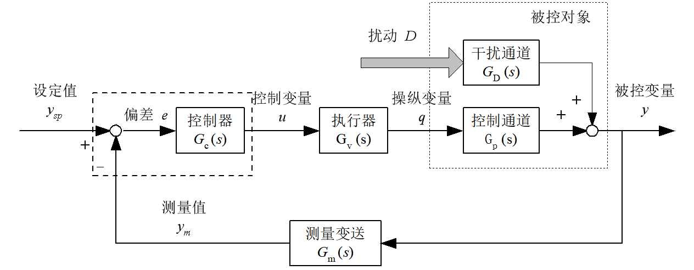
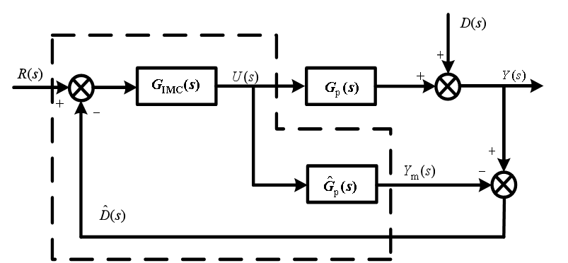
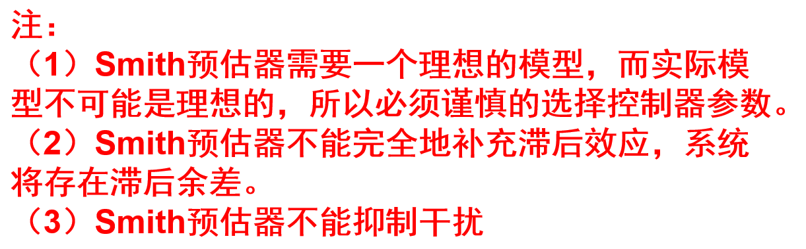

# 过程控制系统

该文档为过程控制系统课程内容总结，供期末总复习以及之后使用。

## 过程控制系统综述

### 过程控制系统的定义

过程控制系统是以表征生产过程的参量为被控变量，使之接近给定值或保持在给定范围内的自动控制系统。

注意：

1. 生产过程，要求出现物质和能量的交换。
2. 被控对象一般是工业生产过程中的各种生产装置和设备，例如锅炉、分馏塔、反应器等等。
3. 被控变量：**温度、压力、流量、液位或料位、成分与物性**六大参数。

### 过程控制系统的基本组成

下面的框图描述了过程控制系统的基本组成成分。

     
    过程控制系统的基本组成

注意：

1. 被控对象包括了干扰通道和控制通道两个通道。
2. 操纵变量：受执行机构操纵用于克服扰动影响的变量。

过程控制系统的被控对象和控制方案是多样的，并且对象的特性存在**滞后性**和**非线性**。

## PID控制

PID控制器的形式
$$
u=K_{C}\left(e+\frac{1}{T_{i}}\int_{0}^{t}e\text{d}t+T_{d}\frac{\text{d}e}{\text{d}t}\right)
$$

### P控制器

在P控制器中，注意到控制器增益$K_{C}$​与比例带/比例度$\delta$之间的关系：
$$
\delta=\frac{\frac{e}{|e_{\max}-e_{\min}|}}{\frac{\Delta u}{u_{\max}-u_{\min}}}\times 100\%=\frac{1}{K_{C}}\times 100\%
$$
其中，分子上的$e$，实际上就是控制器的输入，在闭环控制回路里表现为误差信号，或者是所谓观测装置的测量结果；分母上的$u$​，实际上就是控制器的输出，在闭环控制回路里表现为控制变量，一般是所谓调节阀的开度。

为了理解比例度的物理含义，取$\Delta u=u_{\max}-u_{\min}$，也就是令表达式里的分母为1，这个时候比例度的物理含义可以理解为：输出变化为$100\%$时所需输入变化的百分数。

## 复杂控制系统

### 直接合成法和内模控制

直接合成法：直接合成法适用于系统期望的闭环传递函数已知的情况。如果控制器的传递函数设为$G_{c}$，被控对象的传递函数为$G_{p}$，反馈增益为$1$，则系统的闭环传递函数为：
$$
G_{cl}=\frac{G_{c}G_{p}}{1+G_{c}G_{p}}
$$
如果$G_{cl}$为已知，那么可以反推出控制器的传递函数为
$$
G_{c}=\frac{1}{G_{p}}\frac{G_{cl}}{1-G_{cl}}
$$
直接合成法的优缺点：

内模控制：控制器背身包含被控对象的模型。设计思路是从理想控制器出发，考虑到某些特殊的限制条件，最终回到实际控制器。

     
    内模控制原理图

当$\hat{G_{p}(s)}$和$G_{p}(s)$相同的时候，可以得到系统的输出表达式为：
$$
Y(s)=G_{IMC}(s)G_{p}(s)R(s)+[1-G_{IMC}(s)G_{p}(s)]D(s)
$$
则只要令$G_{IMC}=\frac{1}{G_{p}(s)}$，可以实现完全的跟踪设定值和消除干扰。

内模控制的一些性质：

1. 对偶稳定性。内模控制系统的稳定性取决于前向通道上各个环节的稳定性，也就是说和被控对象和控制器的稳定性等价。因此，对于开环不稳定系统，在使用IMC之前需要先将其稳定下来。

2. 理想控制器。如果存在准确的模型，则可以设计出理想的控制器，实现在所有的时间内和任何的干扰下，系统的输出都等于设定值，保证对参考输入的无偏差跟踪。

3. 零稳态偏差特性。如果模型存在误差，分为以下两种情况：

   - 闭环系统稳定，控制器的稳态增益=模型稳态增益的倒数，也即$G_{IMC}(0)=\left(\hat{G_{p}(0)}\right)^{-1}$。此时对于阶跃输入和常值干扰均保证无稳态误差。（I型系统）

   - 闭环系统稳定，控制器的稳态增益=模型稳态增益的倒数，并且满足
     $$
     \left.\frac{\text{d}}{\text{d}s}\left[\hat{G_{p}(s)G_{IMC}(s)}\right]\right|_{s=0}=0
     $$
     此时对于所有的斜坡输入和常值干扰均不存在稳态误差。（II型系统）

以带有时延的系统的内模控制器的设计为例。在设计过程中，出现了模型不可逆的部分，这个时候需要将$\hat{G_{p}(s)}$中不可逆的部分$\hat{G_{p}(s)}^{-}$和可逆的部分$\hat{G_{p}(s)}^{+}$分离，并在$G_{IMC}(s)$之前添加滤波器$G_{f}(s)=\frac{1}{\lambda s+1}$​作为补偿。这样综合得出所需要的控制器。

### 时延系统的控制设计

对于时延系统的控制器设计，从大体上分为两类：常规的反馈控制器设计以及Smith预估器。

常规的反馈控制器设计分为直接综合法、内模法、ZN法等等，用来设计控制器或者整定PID控制器。

下面详细介绍Smith预估器方法。

     
    Smith预估器

在控制器的外围添加了一个反馈回路。这样，到达控制器的误差信号$e_2$就是一个经过校正的误差信号，不包含时延项。这样，设计控制器的时候可以按照无延迟的情况进行设计。具体的推导见参考资料。不同于上面的框图中所描述，新增的反馈回路中$a$也是估计值，实际上应该写成$a_m$​。

     
    关于Smith预估器的一些注解

对于Smith预估器的干扰抑制问题，人们提出了改进的Smith预估器方法。

### 开环不稳定系统的控制设计

